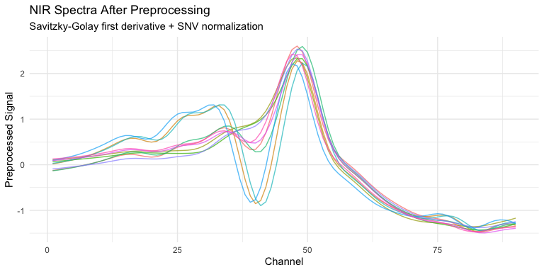

<!-- README.md is generated from README.Rmd. Please edit that file -->

# measure

<!-- badges: start -->

[](https://lifecycle.r-lib.org/articles/stages.html#experimental)
[](https://github.com/JamesHWade/measure/actions/workflows/R-CMD-check.yaml)
[](https://app.codecov.io/gh/JamesHWade/measure?branch=main)
<!-- badges: end -->

## Overview

measure extends [tidymodels](https://www.tidymodels.org/) with
preprocessing steps for analytical measurement data such as
spectroscopy, chromatography, and other instrument-generated signals. It
provides a [recipes](https://recipes.tidymodels.org/)-style interface
for common spectral preprocessing techniques.

measure helps you:

- **Convert** measurement data from wide or long formats into an
  internal representation
- **Preprocess** spectra using techniques like smoothing, derivatives,
  and normalization
- **Transform** data back to wide or long format for modeling or
  visualization

## Installation

You can install the development version of measure from
[GitHub](https://github.com/):

``` r
# install.packages("pak")
pak::pak("JamesHWade/measure")
```

## Usage

The measure workflow follows the familiar recipes pattern: define a
recipe, add steps, prep, and bake.

``` r
library(measure)
library(recipes)
library(ggplot2)

# NIR spectroscopy data for predicting meat composition
data(meats_long)
head(meats_long)
#> # A tibble: 6 × 6
#>      id water   fat protein channel transmittance
#>   <int> <dbl> <dbl>   <dbl>   <int>         <dbl>
#> 1     1  60.5  22.5    16.7       1          2.62
#> 2     1  60.5  22.5    16.7       2          2.62
#> 3     1  60.5  22.5    16.7       3          2.62
#> 4     1  60.5  22.5    16.7       4          2.62
#> 5     1  60.5  22.5    16.7       5          2.62
#> 6     1  60.5  22.5    16.7       6          2.62
```

### Building a preprocessing recipe

``` r
rec <- recipe(water + fat + protein ~ ., data = meats_long) |>
  # Assign sample ID role (not used as predictor)
  update_role(id, new_role = "id") |>
  # Convert long-format measurements to internal representation
  step_measure_input_long(transmittance, location = vars(channel)) |>
  # Apply Savitzky-Golay smoothing with first derivative
  step_measure_savitzky_golay(window_side = 5, differentiation_order = 1) |>
  # Standard Normal Variate normalization
  step_measure_snv() |>
  # Convert back to wide format for modeling
  step_measure_output_wide(prefix = "nir_")
```

### Preparing and applying the recipe

``` r
# Prep learns any parameters from training data
prepped <- prep(rec)

# Bake applies the transformations
processed <- bake(prepped, new_data = NULL)

# Result is ready for modeling
processed[1:5, 1:8]
#> # A tibble: 5 × 8
#>      id water   fat protein  nir_01  nir_02  nir_03  nir_04
#>   <int> <dbl> <dbl>   <dbl>   <dbl>   <dbl>   <dbl>   <dbl>
#> 1     1  60.5  22.5    16.7 -0.126  -0.110  -0.0928 -0.0745
#> 2     2  46    40.1    13.5  0.0184  0.0381  0.0601  0.0841
#> 3     3  71     8.4    20.5  0.105   0.114   0.125   0.136 
#> 4     4  72.8   5.9    20.7  0.0716  0.0786  0.0871  0.0974
#> 5     5  58.3  25.5    15.5 -0.132  -0.118  -0.101  -0.0817
```

### Visualizing the preprocessing

``` r
# Get data at intermediate step (before output conversion)
rec_for_viz <- recipe(water + fat + protein ~ ., data = meats_long) |>
update_role(id, new_role = "id") |>
  step_measure_input_long(transmittance, location = vars(channel)) |>
  step_measure_savitzky_golay(window_side = 5, differentiation_order = 1) |>
  step_measure_snv()

processed_long <- bake(prep(rec_for_viz), new_data = NULL)

# Extract and plot a few spectra
library(tidyr)
library(dplyr)

plot_data <- processed_long |>
  slice(1:10) |>
  mutate(sample_id = row_number()) |>
  unnest(.measures)

ggplot(plot_data, aes(x = location, y = value, group = sample_id, color = factor(sample_id))) +
  geom_line(alpha = 0.7) +
  labs(
    x = "Channel",
    y = "Preprocessed Signal",
    title = "NIR Spectra After Preprocessing",
    subtitle = "Savitzky-Golay first derivative + SNV normalization",
    color = "Sample"
  ) +
  theme_minimal() +
  theme(legend.position = "none")
```



## Available Steps

### Input/Output Steps

| Step | Description |
|----|----|
| `step_measure_input_wide()` | Convert wide format (measurements in columns) to internal format |
| `step_measure_input_long()` | Convert long format (measurements in rows) to internal format |
| `step_measure_output_wide()` | Convert back to wide format for modeling |
| `step_measure_output_long()` | Convert back to long format |

### Spectral Math

| Step | Description |
|----|----|
| `step_measure_absorbance()` | Convert transmittance to absorbance |
| `step_measure_transmittance()` | Convert absorbance to transmittance |
| `step_measure_log()` | Log transformation with configurable base/offset |
| `step_measure_kubelka_munk()` | Kubelka-Munk transformation for reflectance |
| `step_measure_derivative()` | Simple finite difference derivatives |
| `step_measure_derivative_gap()` | Gap (Norris-Williams) derivatives |

### Filtering & Scatter Correction

| Step                            | Description                           |
|---------------------------------|---------------------------------------|
| `step_measure_savitzky_golay()` | Smoothing and/or differentiation      |
| `step_measure_snv()`            | Standard Normal Variate normalization |
| `step_measure_msc()`            | Multiplicative Scatter Correction     |

### Smoothing & Noise Reduction

| Step                             | Description                          |
|----------------------------------|--------------------------------------|
| `step_measure_smooth_ma()`       | Moving average smoothing             |
| `step_measure_smooth_median()`   | Median filter (robust to spikes)     |
| `step_measure_smooth_gaussian()` | Gaussian kernel smoothing            |
| `step_measure_smooth_wavelet()`  | Wavelet denoising                    |
| `step_measure_filter_fourier()`  | Fourier low-pass/high-pass filtering |
| `step_measure_despike()`         | Spike/outlier detection and removal  |

### Sample-wise Normalization

| Step                              | Description                        |
|-----------------------------------|------------------------------------|
| `step_measure_normalize_sum()`    | Divide by sum (total intensity)    |
| `step_measure_normalize_max()`    | Divide by maximum value            |
| `step_measure_normalize_range()`  | Scale to 0-1 range                 |
| `step_measure_normalize_vector()` | L2/Euclidean normalization         |
| `step_measure_normalize_auc()`    | Divide by area under curve         |
| `step_measure_normalize_peak()`   | Normalize by peak region (tunable) |

### Variable-wise Scaling

| Step                          | Description            |
|-------------------------------|------------------------|
| `step_measure_center()`       | Mean centering         |
| `step_measure_scale_auto()`   | Auto-scaling (z-score) |
| `step_measure_scale_pareto()` | Pareto scaling         |
| `step_measure_scale_range()`  | Range scaling          |
| `step_measure_scale_vast()`   | VAST scaling           |

### Baseline Correction

| Step | Description |
|----|----|
| `step_measure_baseline_als()` | Asymmetric least squares |
| `step_measure_baseline_poly()` | Polynomial baseline fitting |
| `step_measure_baseline_rf()` | Rolling ball/LOESS baseline |
| `step_measure_baseline_rolling()` | Rolling ball algorithm |
| `step_measure_baseline_airpls()` | Adaptive Iteratively Reweighted PLS |
| `step_measure_baseline_arpls()` | Asymmetrically Reweighted PLS |
| `step_measure_baseline_snip()` | SNIP (Statistics-sensitive Non-linear Iterative Peak-clipping) |
| `step_measure_baseline_tophat()` | Top-hat morphological filter |
| `step_measure_baseline_morph()` | Iterative morphological correction |
| `step_measure_baseline_minima()` | Local minima interpolation |
| `step_measure_baseline_auto()` | Automatic method selection |
| `step_measure_detrend()` | Polynomial detrending |

### Reference Corrections

| Step                                | Description                         |
|-------------------------------------|-------------------------------------|
| `step_measure_subtract_blank()`     | Blank/background subtraction        |
| `step_measure_subtract_reference()` | Reference spectrum subtraction      |
| `step_measure_ratio_reference()`    | Reference ratio with optional blank |

### Region Operations

| Step                      | Description                                   |
|---------------------------|-----------------------------------------------|
| `step_measure_trim()`     | Keep measurements within specified x-range    |
| `step_measure_exclude()`  | Remove measurements within specified range(s) |
| `step_measure_resample()` | Interpolate to new regular grid               |

### Alignment & Registration

| Step                             | Description                             |
|----------------------------------|-----------------------------------------|
| `step_measure_align_shift()`     | Cross-correlation shift alignment       |
| `step_measure_align_reference()` | Align to external reference spectrum    |
| `step_measure_align_dtw()`       | Dynamic Time Warping alignment          |
| `step_measure_align_ptw()`       | Parametric Time Warping                 |
| `step_measure_align_cow()`       | Correlation Optimized Warping (tunable) |

### Quality Control

| Step                          | Description                     |
|-------------------------------|---------------------------------|
| `step_measure_qc_snr()`       | Calculate signal-to-noise ratio |
| `step_measure_qc_saturated()` | Detect saturated measurements   |
| `step_measure_qc_outlier()`   | Detect outlier samples          |
| `step_measure_impute()`       | Interpolate missing values      |

### Peak Operations

| Step | Description |
|----|----|
| `step_measure_peaks_detect()` | Detect peaks using prominence or derivative methods |
| `step_measure_peaks_integrate()` | Calculate peak areas |
| `step_measure_peaks_filter()` | Filter peaks by height, area, or count |
| `step_measure_peaks_deconvolve()` | Deconvolve overlapping peaks |
| `step_measure_peaks_to_table()` | Convert peaks to wide format for modeling |

### SEC/GPC Analysis

| Step | Description |
|----|----|
| `step_measure_mw_averages()` | Calculate Mn, Mw, Mz, Mp, and dispersity |
| `step_measure_mw_distribution()` | Generate molecular weight distribution curve |
| `step_measure_mw_fractions()` | Calculate molecular weight fractions |

## Learning more

- [Getting
  Started](https://jameshwade.github.io/measure/articles/measure.html) -
  A comprehensive introduction to measure
- [Preprocessing
  Techniques](https://jameshwade.github.io/measure/articles/preprocessing.html) -
  Deep dive into available preprocessing methods

## Related packages

measure builds on the [tidymodels](https://www.tidymodels.org/)
ecosystem:

- [recipes](https://recipes.tidymodels.org/) - The foundation for
  preprocessing pipelines
- [parsnip](https://parsnip.tidymodels.org/) - Unified modeling
  interface
- [workflows](https://workflows.tidymodels.org/) - Bundle preprocessing
  and modeling
- [tune](https://tune.tidymodels.org/) - Hyperparameter tuning (works
  with measure’s tunable steps!)

For spectral analysis in R, you might also find these packages useful:

- [prospectr](https://github.com/l-ramirez-lopez/prospectr) - Spectral
  preprocessing functions
- [ChemoSpec](https://bryanhanson.github.io/ChemoSpec/) - Exploratory
  chemometrics
- [mdatools](https://mdatools.com/) - Multivariate data analysis

## Contributing

This package is under active development. Contributions are welcome!
Please see the [contributing
guidelines](https://jameshwade.github.io/measure/CONTRIBUTING.html).

## Code of Conduct

Please note that the measure project is released with a [Contributor
Code of
Conduct](https://jameshwade.github.io/measure/CODE_OF_CONDUCT.html). By
contributing to this project, you agree to abide by its terms.
