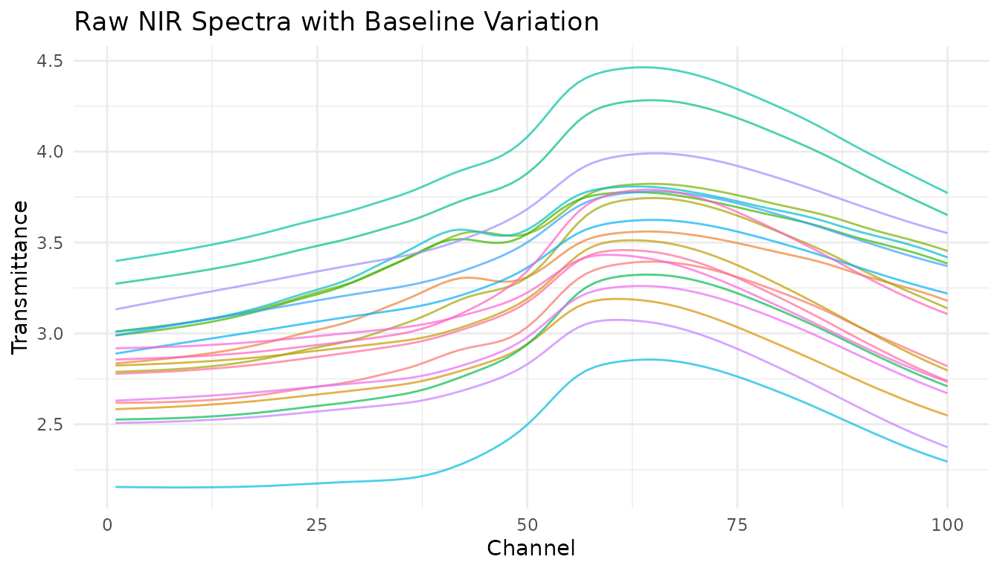
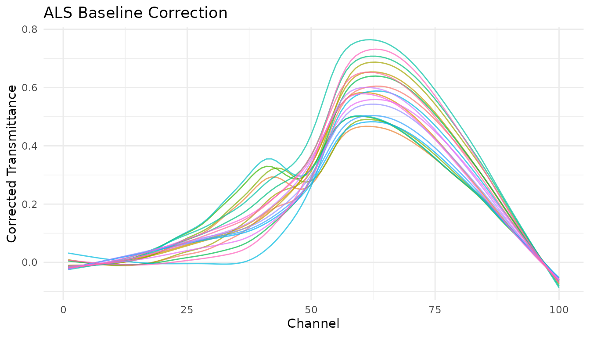
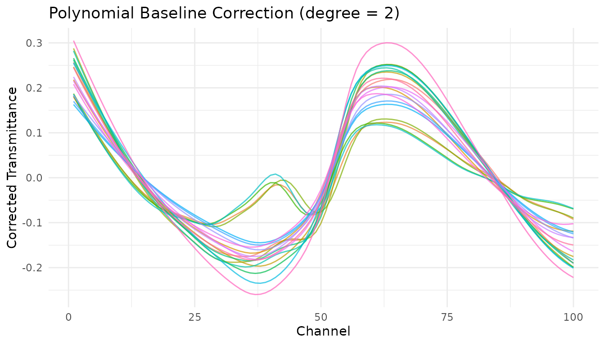

# Baseline Correction

``` r
library(measure)
library(recipes)
library(dplyr)
library(tidyr)
library(ggplot2)
library(modeldata)
```

## Introduction

Baseline correction is a fundamental preprocessing step for
spectroscopic and chromatographic data. Baselines can drift due to
instrument effects, sample scattering, fluorescence, or detector
response, obscuring the chemical information in your measurements.

The measure package provides several baseline correction methods as
recipe steps, plus the ability to use custom R functions or Python’s
pybaselines library.

## The problem: Baseline drift

Let’s visualize baseline issues in NIR spectra:

``` r
data(meats)

# Convert to long format for visualization
meats_viz <- meats |>
  mutate(id = row_number()) |>
  pivot_longer(
    cols = starts_with("x_"),
    names_to = "channel",
    values_to = "transmittance"
  ) |>
  mutate(channel = as.integer(gsub("x_", "", channel)))

# Plot raw spectra
meats_viz |>
  filter(id <= 20) |>
  ggplot(aes(x = channel, y = transmittance, group = id, color = factor(id))) +
  geom_line(alpha = 0.7) +
  labs(
    x = "Channel",
    y = "Transmittance",
    title = "Raw NIR Spectra with Baseline Variation"
  ) +
  theme_minimal() +
  theme(legend.position = "none")
```



Notice the vertical offset between spectra? This baseline shift isn’t
related to the chemical composition we want to model.

## Built-in baseline correction methods

### Asymmetric Least Squares (ALS)

[`step_measure_baseline_als()`](https://jameshwade.github.io/measure/dev/reference/step_measure_baseline_als.md)
uses the Asymmetric Least Squares algorithm, which is excellent for
spectra where peaks are predominantly in one direction (e.g., absorption
peaks going up or emission peaks going down).

``` r
rec_als <- recipe(water + fat + protein ~ ., data = meats) |>
  step_measure_input_wide(starts_with("x_")) |>
  step_measure_baseline_als(lambda = 1e6, p = 0.01)

processed_als <- bake(prep(rec_als), new_data = NULL)

# Visualize using unnest
plot_als <- processed_als |>
  slice(1:20) |>
  mutate(id = row_number()) |>
  unnest(.measures)

ggplot(plot_als, aes(x = location, y = value, group = id, color = factor(id))) +
  geom_line(alpha = 0.7) +
  labs(
    x = "Channel",
    y = "Corrected Transmittance",
    title = "ALS Baseline Correction"
  ) +
  theme_minimal() +
  theme(legend.position = "none")
```



**Key parameters:**

- `lambda`: Smoothness penalty (higher = smoother baseline). Try 10^4 to
  10^9.
- `p`: Asymmetry parameter (0-1). Lower values fit below the signal. Try
  0.001-0.1.

### Polynomial baseline

[`step_measure_baseline_poly()`](https://jameshwade.github.io/measure/dev/reference/step_measure_baseline_poly.md)
fits a polynomial to the spectrum and subtracts it. Simple and fast,
works well for gentle baseline curvature.

``` r
rec_poly <- recipe(water + fat + protein ~ ., data = meats) |>
  step_measure_input_wide(starts_with("x_")) |>
  step_measure_baseline_poly(degree = 2)

processed_poly <- bake(prep(rec_poly), new_data = NULL)

# Visualize using unnest
plot_poly <- processed_poly |>
  slice(1:20) |>
  mutate(id = row_number()) |>
  unnest(.measures)

ggplot(plot_poly, aes(x = location, y = value, group = id, color = factor(id))) +
  geom_line(alpha = 0.7) +
  labs(
    x = "Channel",
    y = "Corrected Transmittance",
    title = "Polynomial Baseline Correction (degree = 2)"
  ) +
  theme_minimal() +
  theme(legend.position = "none")
```



### Robust fitting baseline

[`step_measure_baseline_rf()`](https://jameshwade.github.io/measure/dev/reference/step_measure_baseline_rf.md)
uses robust local regression (LOESS with iterative reweighting) to
estimate the baseline. Good for complex baseline shapes.

``` r
rec_rf <- recipe(water + fat + protein ~ ., data = meats) |>
  step_measure_input_wide(starts_with("x_")) |>
  step_measure_baseline_rf(span = 0.5) |>
  step_measure_output_wide(prefix = "nir_")

processed_rf <- bake(prep(rec_rf), new_data = NULL)
#> Warning: Values from `value` are not uniquely identified; output will contain list-cols.
#> • Use `values_fn = list` to suppress this warning.
#> • Use `values_fn = {summary_fun}` to summarise duplicates.
#> • Use the following dplyr code to identify duplicates.
#>   {data} |>
#>   dplyr::summarise(n = dplyr::n(), .by = c(water, fat, protein, location)) |>
#>   dplyr::filter(n > 1L)
```

### Detrending

[`step_measure_detrend()`](https://jameshwade.github.io/measure/dev/reference/step_measure_detrend.md)
removes polynomial trends from spectra. The simplest baseline
correction - just removes the overall trend.

``` r
rec_detrend <- recipe(water + fat + protein ~ ., data = meats) |>
  step_measure_input_wide(starts_with("x_")) |>
  step_measure_detrend(degree = 1) |>
  step_measure_output_wide(prefix = "nir_")

processed_detrend <- bake(prep(rec_detrend), new_data = NULL)
#> Warning: Values from `value` are not uniquely identified; output will contain list-cols.
#> • Use `values_fn = list` to suppress this warning.
#> • Use `values_fn = {summary_fun}` to summarise duplicates.
#> • Use the following dplyr code to identify duplicates.
#>   {data} |>
#>   dplyr::summarise(n = dplyr::n(), .by = c(water, fat, protein, location)) |>
#>   dplyr::filter(n > 1L)
```

### GPC/SEC baseline correction

[`step_measure_baseline_gpc()`](https://jameshwade.github.io/measure/dev/reference/step_measure_baseline_gpc.md)
is specialized for chromatography data where baseline regions exist at
the start and end of the chromatogram.

``` r
# For chromatography data
rec_gpc <- recipe(outcome ~ ., data = chromatogram_data) |>

  step_measure_input_long(signal, location = vars(time)) |>
  step_measure_baseline_gpc(left_frac = 0.05, right_frac = 0.05, method = "linear")
```

## Custom baseline functions

[`step_measure_baseline_custom()`](https://jameshwade.github.io/measure/dev/reference/step_measure_baseline_custom.md)
lets you provide any R function for baseline estimation. Your function
receives a `measure_tbl` (tibble with `location` and `value` columns)
and should return a numeric vector of baseline values.

### Using a function

``` r
# Simple moving minimum baseline
moving_min_baseline <- function(x, window = 51) {
  y <- x$value
  n <- length(y)
  baseline <- numeric(n)
  half_win <- window %/% 2


  for (i in seq_len(n)) {
    start <- max(1, i - half_win)
    end <- min(n, i + half_win)
    baseline[i] <- min(y[start:end], na.rm = TRUE)
  }
  baseline
}

rec_custom <- recipe(water + fat + protein ~ ., data = meats) |>
  step_measure_input_wide(starts_with("x_")) |>
  step_measure_baseline_custom(.fn = moving_min_baseline, window = 101) |>
  step_measure_output_wide(prefix = "nir_")

processed_custom <- bake(prep(rec_custom), new_data = NULL)
#> Warning: Values from `value` are not uniquely identified; output will contain list-cols.
#> • Use `values_fn = list` to suppress this warning.
#> • Use `values_fn = {summary_fun}` to summarise duplicates.
#> • Use the following dplyr code to identify duplicates.
#>   {data} |>
#>   dplyr::summarise(n = dplyr::n(), .by = c(water, fat, protein, location)) |>
#>   dplyr::filter(n > 1L)
```

### Using a formula

For quick one-liners, use the formula interface where `.x` is the
`measure_tbl`:

``` r
# LOESS baseline using formula
rec_loess <- recipe(water + fat + protein ~ ., data = meats) |>
  step_measure_input_wide(starts_with("x_")) |>
  step_measure_baseline_custom(
    .fn = ~ stats::loess(.x$value ~ .x$location, span = span)$fitted,
    span = 0.3
  ) |>
  step_measure_output_wide(prefix = "nir_")

processed_loess <- bake(prep(rec_loess), new_data = NULL)
#> Warning: Values from `value` are not uniquely identified; output will contain list-cols.
#> • Use `values_fn = list` to suppress this warning.
#> • Use `values_fn = {summary_fun}` to summarise duplicates.
#> • Use the following dplyr code to identify duplicates.
#>   {data} |>
#>   dplyr::summarise(n = dplyr::n(), .by = c(water, fat, protein, location)) |>
#>   dplyr::filter(n > 1L)
```

### Extracting the baseline

With
[`step_measure_baseline_custom()`](https://jameshwade.github.io/measure/dev/reference/step_measure_baseline_custom.md)
and
[`step_measure_baseline_py()`](https://jameshwade.github.io/measure/dev/reference/step_measure_baseline_py.md),
set `subtract = FALSE` to get the baseline itself instead of the
corrected signal:

``` r
# Use custom baseline with subtract = FALSE to extract the baseline
rec_extract <- recipe(water + fat + protein ~ ., data = meats) |>
  step_measure_input_wide(starts_with("x_")) |>
  step_measure_baseline_custom(
    .fn = ~ stats::loess(.x$value ~ .x$location, span = 0.5)$fitted,
    subtract = FALSE
  )

baselines <- bake(prep(rec_extract), new_data = NULL)

# The .measures column now contains the estimated baselines
baselines |>
  slice(1) |>
  unnest(.measures) |>
  head()
#> # A tibble: 6 × 5
#>   water   fat protein location value
#>   <dbl> <dbl>   <dbl>    <dbl> <dbl>
#> 1  60.5  22.5    16.7        1  2.62
#> 2  60.5  22.5    16.7        2  2.62
#> 3  60.5  22.5    16.7        3  2.62
#> 4  60.5  22.5    16.7        4  2.62
#> 5  60.5  22.5    16.7        5  2.62
#> 6  60.5  22.5    16.7        6  2.62
```

## Python pybaselines integration

[`step_measure_baseline_py()`](https://jameshwade.github.io/measure/dev/reference/step_measure_baseline_py.md)
provides access to over 50 baseline correction algorithms from the
Python [pybaselines](https://pybaselines.readthedocs.io/) library.

### Setup

First, install pybaselines:

``` r
# Install reticulate if needed
install.packages("reticulate")

# Install pybaselines
reticulate::py_require("pybaselines")
```

### Using pybaselines methods

``` r
# Asymmetric Least Squares
rec_py_asls <- recipe(water + fat + protein ~ ., data = meats) |>
  step_measure_input_wide(starts_with("x_")) |>
  step_measure_baseline_py(method = "asls", lam = 1e6, p = 0.01) |>
  step_measure_output_wide(prefix = "nir_")

# SNIP algorithm (good for spectroscopy)
rec_py_snip <- recipe(water + fat + protein ~ ., data = meats) |>
  step_measure_input_wide(starts_with("x_")) |>
  step_measure_baseline_py(method = "snip", max_half_window = 40) |>
  step_measure_output_wide(prefix = "nir_")

# Modified polynomial
rec_py_modpoly <- recipe(water + fat + protein ~ ., data = meats) |>
  step_measure_input_wide(starts_with("x_")) |>
  step_measure_baseline_py(method = "modpoly", poly_order = 3) |>
  step_measure_output_wide(prefix = "nir_")

# Morphological (rolling ball)
rec_py_mor <- recipe(water + fat + protein ~ ., data = meats) |>
  step_measure_input_wide(starts_with("x_")) |>
  step_measure_baseline_py(method = "rolling_ball", half_window = 30) |>
  step_measure_output_wide(prefix = "nir_")
```

### Available pybaselines methods

| Category       | Methods                                               |
|----------------|-------------------------------------------------------|
| Whittaker      | `asls`, `iasls`, `airpls`, `arpls`, `drpls`, `psalsa` |
| Polynomial     | `poly`, `modpoly`, `imodpoly`, `loess`, `quant_reg`   |
| Morphological  | `mor`, `imor`, `rolling_ball`, `tophat`               |
| Spline         | `pspline_asls`, `pspline_airpls`, `mixture_model`     |
| Smooth         | `snip`, `swima`, `noise_median`                       |
| Classification | `dietrich`, `golotvin`, `fastchrom`                   |

See the [pybaselines documentation](https://pybaselines.readthedocs.io/)
for the full list and parameter details.

## Using derivatives for baseline correction

Savitzky-Golay derivatives remain a powerful approach for baseline
correction, especially in NIR spectroscopy:

``` r
# First derivative removes constant baseline
rec_d1 <- recipe(water + fat + protein ~ ., data = meats) |>
  step_measure_input_wide(starts_with("x_")) |>
  step_measure_savitzky_golay(window_side = 7, differentiation_order = 1) |>
  step_measure_output_wide(prefix = "nir_")

# Second derivative removes linear baseline
rec_d2 <- recipe(water + fat + protein ~ ., data = meats) |>
  step_measure_input_wide(starts_with("x_")) |>
  step_measure_savitzky_golay(window_side = 7, differentiation_order = 2) |>
  step_measure_output_wide(prefix = "nir_")
```

## Choosing a method

| Method                                                                                                                 | Best for            | Tunable  | Notes                           |
|------------------------------------------------------------------------------------------------------------------------|---------------------|----------|---------------------------------|
| [`step_measure_baseline_als()`](https://jameshwade.github.io/measure/dev/reference/step_measure_baseline_als.md)       | Most spectroscopy   | Yes      | Good general-purpose choice     |
| [`step_measure_baseline_poly()`](https://jameshwade.github.io/measure/dev/reference/step_measure_baseline_poly.md)     | Gentle curvature    | Yes      | Simple and fast                 |
| [`step_measure_baseline_rf()`](https://jameshwade.github.io/measure/dev/reference/step_measure_baseline_rf.md)         | Complex baselines   | Yes      | Robust to outliers              |
| [`step_measure_detrend()`](https://jameshwade.github.io/measure/dev/reference/step_measure_detrend.md)                 | Simple trends       | Yes      | Fastest option                  |
| [`step_measure_baseline_gpc()`](https://jameshwade.github.io/measure/dev/reference/step_measure_baseline_gpc.md)       | Chromatography      | No       | Uses baseline regions           |
| [`step_measure_baseline_custom()`](https://jameshwade.github.io/measure/dev/reference/step_measure_baseline_custom.md) | Special cases       | Optional | Maximum flexibility             |
| [`step_measure_baseline_py()`](https://jameshwade.github.io/measure/dev/reference/step_measure_baseline_py.md)         | Advanced algorithms | Yes      | 50+ methods available           |
| [`step_measure_savitzky_golay()`](https://jameshwade.github.io/measure/dev/reference/step_measure_savitzky_golay.md)   | NIR/IR spectra      | Yes      | Also smooths and differentiates |

## Hyperparameter tuning

Most baseline correction steps are tunable with the tidymodels tuning
framework:

``` r
library(tune)

# Create tunable recipe
rec_tunable <- recipe(water ~ ., data = meats) |>
  step_measure_input_wide(starts_with("x_")) |>
  step_measure_baseline_als(
    lambda = tune(),  # Will be tuned
    p = tune()        # Will be tuned
  ) |>
  step_measure_output_wide(prefix = "nir_")

# The tunable parameters are automatically detected
tunable(rec_tunable)
```

For
[`step_measure_baseline_custom()`](https://jameshwade.github.io/measure/dev/reference/step_measure_baseline_custom.md),
you can declare tunable parameters explicitly:

``` r
rec_custom_tunable <- recipe(water ~ ., data = meats) |>
  step_measure_input_wide(starts_with("x_")) |>
  step_measure_baseline_custom(
    .fn = ~ stats::loess(.x$value ~ .x$location, span = span)$fitted,
    span = 0.5,
    tunable = list(
      span = list(pkg = "dials", fun = "degree", range = c(0.1, 0.9))
    )
  )
```

## Complete preprocessing pipeline

Baseline correction often works best as part of a complete preprocessing
pipeline:

``` r
rec_complete <- recipe(water + fat + protein ~ ., data = meats) |>
  step_measure_input_wide(starts_with("x_")) |>
  # Baseline correction
  step_measure_baseline_als(lambda = 1e6, p = 0.01) |>
  # Scatter correction
  step_measure_snv() |>
  # Smoothing with mild derivative
  step_measure_savitzky_golay(window_side = 5, differentiation_order = 1) |>
  # Output for modeling
  step_measure_output_wide(prefix = "nir_")

final_data <- bake(prep(rec_complete), new_data = NULL)
#> Warning: Values from `value` are not uniquely identified; output will contain list-cols.
#> • Use `values_fn = list` to suppress this warning.
#> • Use `values_fn = {summary_fun}` to summarise duplicates.
#> • Use the following dplyr code to identify duplicates.
#>   {data} |>
#>   dplyr::summarise(n = dplyr::n(), .by = c(water, fat, protein, location)) |>
#>   dplyr::filter(n > 1L)
final_data[1:5, 1:8]
#> # A tibble: 5 × 8
#>   water   fat protein nir_01    nir_02    nir_03    nir_04    nir_05   
#>   <dbl> <dbl>   <dbl> <list>    <list>    <list>    <list>    <list>   
#> 1  60.5  22.5    16.7 <dbl [1]> <dbl [1]> <dbl [1]> <dbl [1]> <dbl [1]>
#> 2  46    40.1    13.5 <dbl [1]> <dbl [1]> <dbl [1]> <dbl [1]> <dbl [1]>
#> 3  71     8.4    20.5 <dbl [1]> <dbl [1]> <dbl [1]> <dbl [1]> <dbl [1]>
#> 4  72.8   5.9    20.7 <dbl [2]> <dbl [2]> <dbl [2]> <dbl [2]> <dbl [2]>
#> 5  58.3  25.5    15.5 <dbl [2]> <dbl [2]> <dbl [2]> <dbl [2]> <dbl [2]>
```

## Summary

- **ALS**
  ([`step_measure_baseline_als()`](https://jameshwade.github.io/measure/dev/reference/step_measure_baseline_als.md))
  is a good default for most spectroscopy applications
- **Polynomial**
  ([`step_measure_baseline_poly()`](https://jameshwade.github.io/measure/dev/reference/step_measure_baseline_poly.md))
  works well for simple baseline shapes
- **Derivatives** via
  [`step_measure_savitzky_golay()`](https://jameshwade.github.io/measure/dev/reference/step_measure_savitzky_golay.md)
  are effective for NIR/IR when peak shapes aren’t critical
- **Custom functions**
  ([`step_measure_baseline_custom()`](https://jameshwade.github.io/measure/dev/reference/step_measure_baseline_custom.md))
  provide maximum flexibility
- **pybaselines**
  ([`step_measure_baseline_py()`](https://jameshwade.github.io/measure/dev/reference/step_measure_baseline_py.md))
  offers 50+ advanced algorithms when R options aren’t sufficient
- Combine baseline correction with normalization (SNV/MSC) for best
  results
