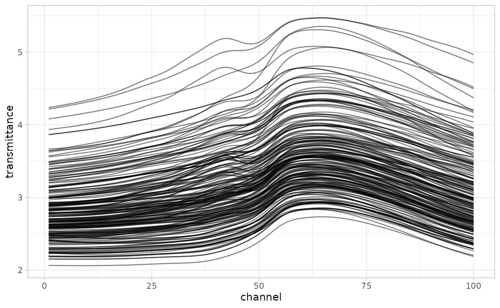
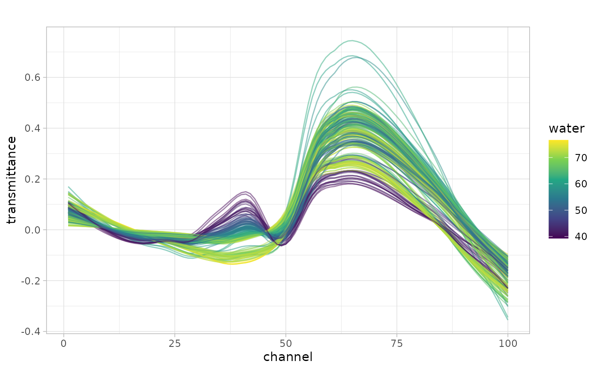

# baseline

Let’s use the
[`meats`](https://modeldata.tidymodels.org/reference/meats.html) data
from [`{modeldata}`](https://modeldata.tidymodels.org/) to demonstrate
baseline correction.

``` r
library(tidyverse)
library(tidymodels)
library(measure)
tidymodels_prefer()
theme_set(theme_light())
```

## Data Cleanup

Before we can perform baseline correction, we need to reshape the data.
It is in a wide format where the columns represent the wavelength and
the value is transmittance. The
[`step_baseline()`](https://jameshwade.github.io/measure/dev/reference/step_baseline.md)
function operates on long format data. We can reshape this data with
[tidyr](https://tidyr.tidyverse.org).

``` r
meats2 <-
  meats %>%
  rowid_to_column(var = "id") %>%
  pivot_longer(
    cols = starts_with("x_"),
    names_to = "channel",
    values_to = "transmittance"
  ) %>%
  mutate(channel = str_extract(channel, "[:digit:]+") %>% as.integer())
```

``` r
meats2 %>%
  ggplot(aes(x = channel, y = transmittance, group = id)) +
  geom_line(alpha = 0.5) +
  theme_light()
```



``` r
meats2 %>%
  group_by(id) %>%
  subtract_rf_baseline(yvar = transmittance, span = 0.8) %>%
  ggplot(aes(x = channel, color = water, group = id)) +
  geom_line(aes(y = transmittance), alpha = 0.5) +
  scale_color_viridis_c() +
  ggtitle("")
```


