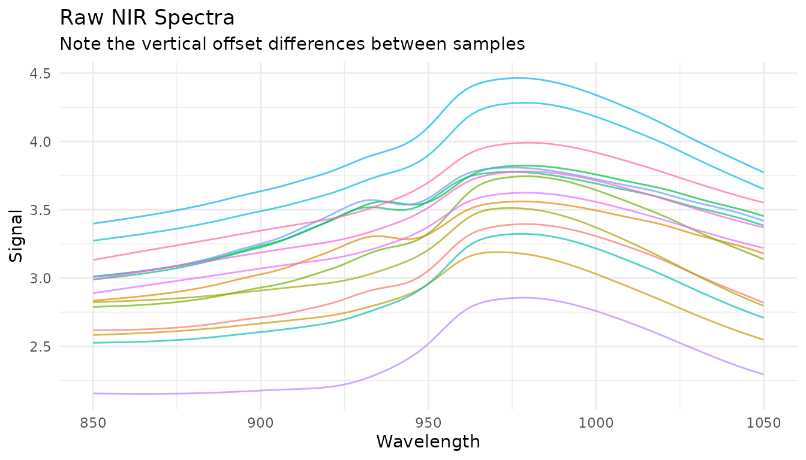
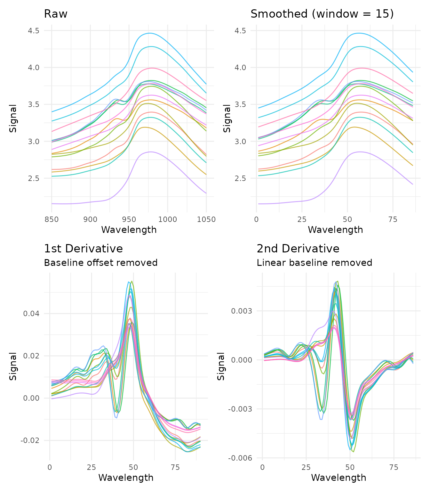
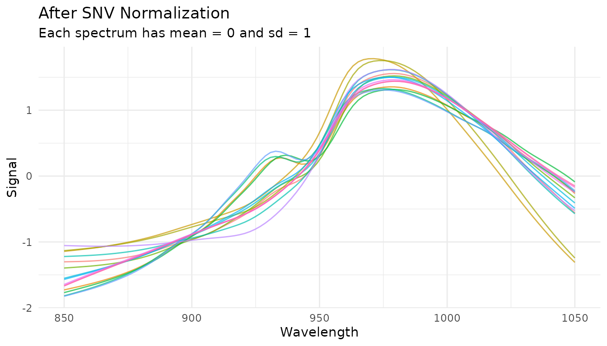
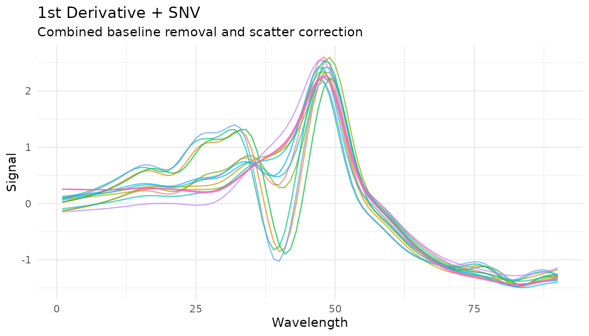
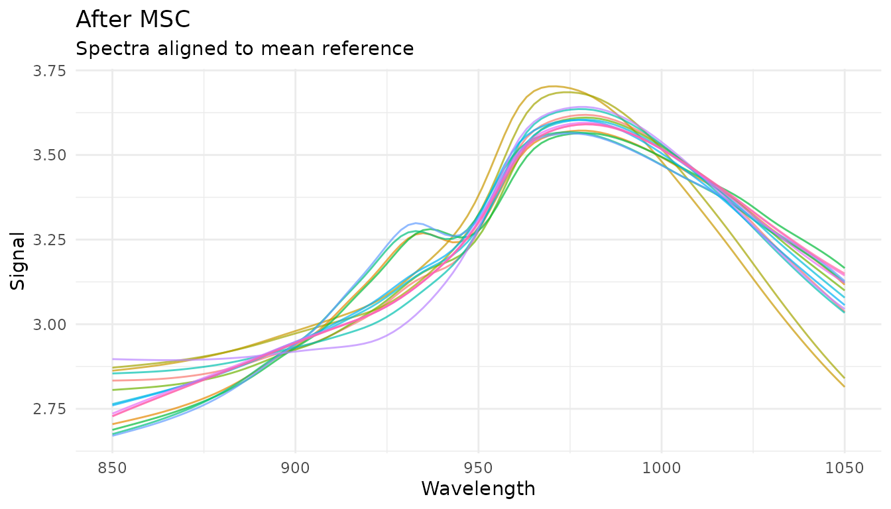
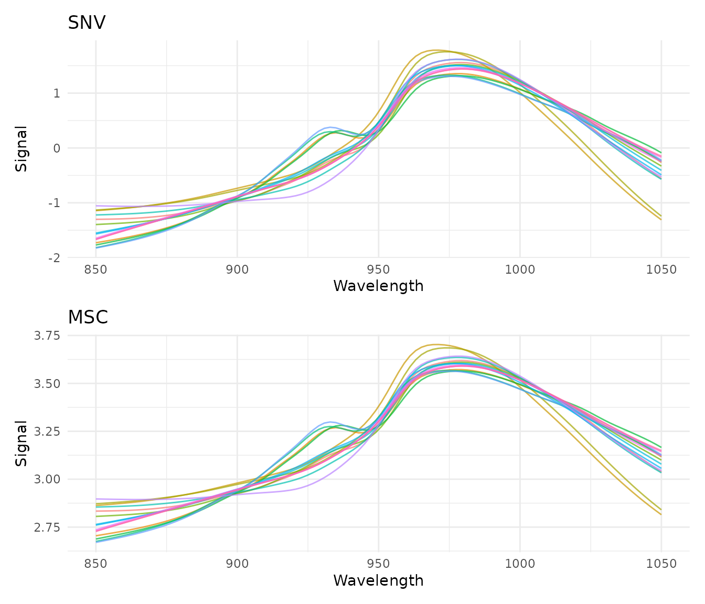
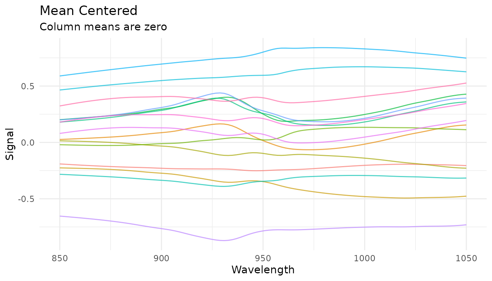
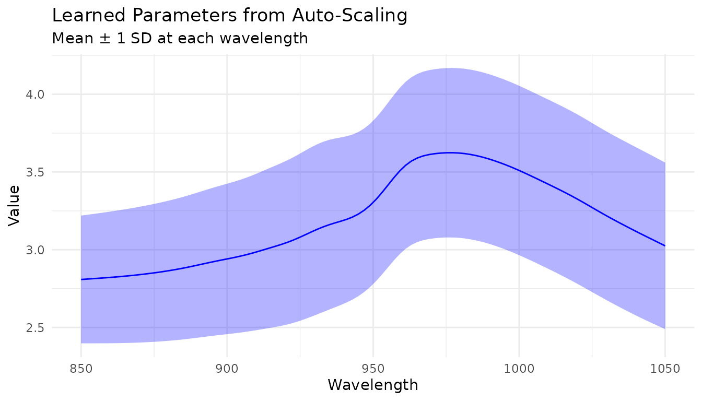
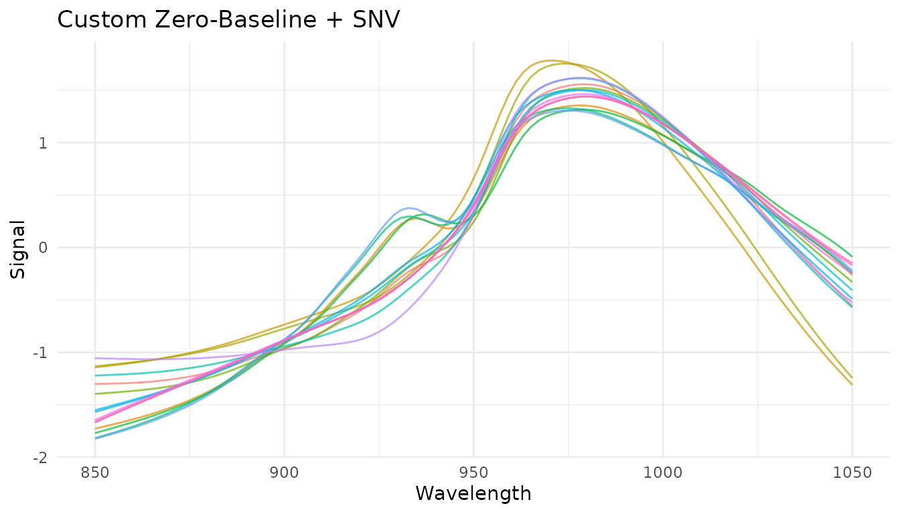
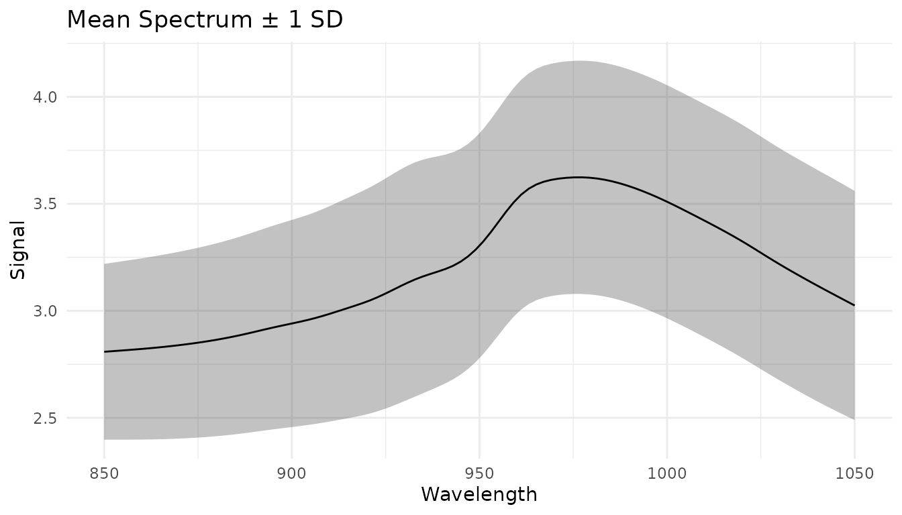

# Preprocessing Techniques

``` r
library(measure)
library(recipes)
library(dplyr)
library(tidyr)
library(ggplot2)
library(modeldata)

# Helper function to process and plot spectra
plot_spectra <- function(data, title, subtitle = NULL) {
  ggplot(data, aes(x = location, y = value, group = sample_id, color = factor(sample_id))) +
    geom_line(alpha = 0.7, linewidth = 0.5) +
    labs(x = "Wavelength", y = "Signal", title = title, subtitle = subtitle) +
    theme_minimal() +
    theme(legend.position = "none")
}

# Prepare sample data
data(meats)
wavelengths <- seq(850, 1050, length.out = 100)

# Get spectra in internal format for demonstrations
get_internal <- function(rec) {
  bake(prep(rec), new_data = NULL) |>
    slice(1:15) |>
    mutate(sample_id = row_number()) |>
    unnest(.measures)
}
```

## Introduction

Spectral preprocessing is essential for building accurate chemometric
models. Raw spectra often contain unwanted variation from physical
effects (scatter, baseline drift) that obscure the chemical information
we’re trying to model. This vignette covers each preprocessing technique
available in measure and when to use them.

## Why preprocess spectra?

Before diving into specific techniques, let’s understand what we’re
dealing with. Here are raw NIR spectra from the meats dataset:

``` r
rec_raw <- recipe(water ~ ., data = meats) |>
  step_measure_input_wide(starts_with("x_"), location_values = wavelengths)

raw_data <- get_internal(rec_raw)

plot_spectra(raw_data, "Raw NIR Spectra", "Note the vertical offset differences between samples")
```



Notice how spectra are shifted vertically relative to each other? This
offset isn’t due to chemical differences - it’s caused by physical
factors like particle size, path length, and light scatter. Our
preprocessing goal is to remove these unwanted effects while preserving
the chemical information.

## Savitzky-Golay Filtering

### What it does

The Savitzky-Golay filter performs polynomial smoothing and can compute
derivatives. It fits a polynomial to a sliding window of points, using
the polynomial’s value (or derivative) at the center point as the
output.

### When to use it

- **Smoothing (order = 0)**: Reduce random noise while preserving peak
  shapes
- **First derivative (order = 1)**: Remove constant baseline offsets,
  enhance peak differences
- **Second derivative (order = 2)**: Remove linear baseline trends,
  further enhance peak resolution

### Parameters

- `window_side`: Number of points on each side of the center point
  (total window = 2 \* window_side + 1)
- `differentiation_order`: 0 for smoothing, 1 for first derivative, 2
  for second derivative
- `degree`: Polynomial degree (defaults to differentiation_order + 1)

### Examples

``` r
# Just smoothing
rec_smooth <- recipe(water ~ ., data = meats) |>
  step_measure_input_wide(starts_with("x_"), location_values = wavelengths) |>
  step_measure_savitzky_golay(window_side = 7, differentiation_order = 0)

# First derivative
rec_d1 <- recipe(water ~ ., data = meats) |>
  step_measure_input_wide(starts_with("x_"), location_values = wavelengths) |>
  step_measure_savitzky_golay(window_side = 5, differentiation_order = 1)

# Second derivative
rec_d2 <- recipe(water ~ ., data = meats) |>
  step_measure_input_wide(starts_with("x_"), location_values = wavelengths) |>
  step_measure_savitzky_golay(window_side = 7, differentiation_order = 2)
```

``` r
library(patchwork)

p1 <- plot_spectra(raw_data, "Raw")
p2 <- plot_spectra(get_internal(rec_smooth), "Smoothed (window = 15)")
p3 <- plot_spectra(get_internal(rec_d1), "1st Derivative", "Baseline offset removed")
p4 <- plot_spectra(get_internal(rec_d2), "2nd Derivative", "Linear baseline removed")

(p1 + p2) / (p3 + p4)
```



### Choosing window size

The window size is a bias-variance trade-off: - **Smaller window**: Less
smoothing, preserves sharp features, more noise - **Larger window**:
More smoothing, may blur sharp peaks, less noise

A good starting point is a window that spans the narrowest feature you
want to preserve.

``` r
windows <- c(3, 7, 15)

window_data <- lapply(windows, function(w) {
  rec <- recipe(water ~ ., data = meats) |>
    step_measure_input_wide(starts_with("x_"), location_values = wavelengths) |>
    step_measure_savitzky_golay(window_side = w, differentiation_order = 1)

  get_internal(rec) |>
    filter(sample_id == 1) |>
    mutate(window = paste0("window_side = ", w))
}) |>
  bind_rows()

ggplot(window_data, aes(x = location, y = value, color = window)) +
  geom_line() +
  labs(
    x = "Wavelength",
    y = "Signal",
    title = "Effect of Window Size on First Derivative",
    color = NULL
  ) +
  theme_minimal()
```


### Tuning with dials

The Savitzky-Golay step is tunable! This means you can use
[`tune()`](https://hardhat.tidymodels.org/reference/tune.html) to find
optimal parameters:

``` r
library(tune)
library(workflows)

rec_tunable <- recipe(water ~ ., data = meats) |>
  step_measure_input_wide(starts_with("x_")) |>
  step_measure_savitzky_golay(
    window_side = tune(),
    differentiation_order = tune()
  ) |>
  step_measure_output_wide()

# The tunable parameters are:
tunable(rec_tunable)
```

## Standard Normal Variate (SNV)

### What it does

SNV normalizes each spectrum independently by centering and scaling:

$$SNV(x) = \frac{x - \bar{x}}{s_{x}}$$

where $\bar{x}$ is the spectrum’s mean and $s_{x}$ is its standard
deviation.

### When to use it

- Remove multiplicative scatter effects
- Correct for path length variations
- Normalize spectra to similar magnitude

SNV is particularly effective for diffuse reflectance spectra where
particle size causes scatter variations.

### Example

``` r
rec_snv <- recipe(water ~ ., data = meats) |>
  step_measure_input_wide(starts_with("x_"), location_values = wavelengths) |>
  step_measure_snv()

snv_data <- get_internal(rec_snv)
plot_spectra(snv_data, "After SNV Normalization", "Each spectrum has mean = 0 and sd = 1")
```



### Combining with derivatives

SNV is often combined with Savitzky-Golay derivatives. The order
matters:

``` r
# Derivative then SNV (more common)
rec_d1_snv <- recipe(water ~ ., data = meats) |>
  step_measure_input_wide(starts_with("x_"), location_values = wavelengths) |>
  step_measure_savitzky_golay(window_side = 5, differentiation_order = 1) |>
  step_measure_snv()

plot_spectra(get_internal(rec_d1_snv), "1st Derivative + SNV",
             "Combined baseline removal and scatter correction")
```



## Multiplicative Scatter Correction (MSC)

### What it does

MSC aligns each spectrum to a reference spectrum (typically the mean of
all training spectra) by correcting for additive and multiplicative
effects:

1.  Fit each spectrum $x_{i}$ to the reference $x_{r}$:
    $x_{i} = m_{i} \cdot x_{r} + a_{i}$
2.  Correct: $MSC\left( x_{i} \right) = \frac{x_{i} - a_{i}}{m_{i}}$

### When to use it

- Similar applications to SNV
- When you have a good reference spectrum
- Often slightly better than SNV for scatter correction

### How it differs from SNV

- **SNV**: Each spectrum normalized independently (no reference needed)
- **MSC**: All spectra aligned to a common reference (learns reference
  during prep)

This means MSC is a *trained* step - it learns the reference spectrum
from training data and applies the same reference to new data.

### Example

``` r
rec_msc <- recipe(water ~ ., data = meats) |>
  step_measure_input_wide(starts_with("x_"), location_values = wavelengths) |>
  step_measure_msc()

msc_data <- get_internal(rec_msc)
plot_spectra(msc_data, "After MSC", "Spectra aligned to mean reference")
```



### Comparing SNV and MSC

``` r
p_snv <- plot_spectra(get_internal(rec_snv), "SNV")
p_msc <- plot_spectra(get_internal(rec_msc), "MSC")

p_snv / p_msc
```



Both methods produce similar results for this dataset. In practice, try
both and compare model performance.

## Sample-wise Normalization

The measure package provides several sample-wise normalization methods
that normalize each spectrum independently. Unlike SNV/MSC which address
scatter, these methods adjust for differences in total signal intensity.

### Available methods

| Step                                                                                                                     | Formula                                              | Use case                          |
|--------------------------------------------------------------------------------------------------------------------------|------------------------------------------------------|-----------------------------------|
| [`step_measure_normalize_sum()`](https://jameshwade.github.io/measure/dev/reference/step_measure_normalize_sum.md)       | $x/\sum x$                                           | Total intensity normalization     |
| [`step_measure_normalize_max()`](https://jameshwade.github.io/measure/dev/reference/step_measure_normalize_max.md)       | $x/\max(x)$                                          | Peak-focused analysis             |
| [`step_measure_normalize_range()`](https://jameshwade.github.io/measure/dev/reference/step_measure_normalize_range.md)   | $\left( x - \min \right)/\left( \max - \min \right)$ | Scale to 0-1 range                |
| [`step_measure_normalize_vector()`](https://jameshwade.github.io/measure/dev/reference/step_measure_normalize_vector.md) | $x/ \parallel x \parallel_{2}$                       | L2/Euclidean normalization        |
| [`step_measure_normalize_auc()`](https://jameshwade.github.io/measure/dev/reference/step_measure_normalize_auc.md)       | $x/AUC$                                              | Chromatography (area under curve) |
| [`step_measure_normalize_peak()`](https://jameshwade.github.io/measure/dev/reference/step_measure_normalize_peak.md)     | $x/f\left( \text{region} \right)$                    | Internal standard normalization   |

### Sum normalization

Divides each spectrum by its total intensity. After transformation, all
spectra sum to 1:

``` r
rec_norm_sum <- recipe(water ~ ., data = meats) |>
  step_measure_input_wide(starts_with("x_"), location_values = wavelengths) |>
  step_measure_normalize_sum()

plot_spectra(get_internal(rec_norm_sum), "Sum Normalized",
             "Each spectrum sums to 1")
```


### Max normalization

Divides each spectrum by its maximum value, useful for peak-focused
analysis:

``` r
rec_norm_max <- recipe(water ~ ., data = meats) |>
  step_measure_input_wide(starts_with("x_"), location_values = wavelengths) |>
  step_measure_normalize_max()

plot_spectra(get_internal(rec_norm_max), "Max Normalized",
             "Each spectrum has maximum = 1")
```


### Peak region normalization (tunable)

When you have an internal standard at a known location, use
[`step_measure_normalize_peak()`](https://jameshwade.github.io/measure/dev/reference/step_measure_normalize_peak.md)
to normalize by a specific region:

``` r
rec_norm_peak <- recipe(water ~ ., data = meats) |>
  step_measure_input_wide(starts_with("x_"), location_values = wavelengths) |>
  step_measure_normalize_peak(
    location_min = 900,
    location_max = 950,
    method = "mean"  # or "max" or "integral"
  )

plot_spectra(get_internal(rec_norm_peak), "Peak Region Normalized",
             "Normalized by mean of region 900-950")
```


The `location_min` and `location_max` parameters are tunable:

``` r
rec_tunable_peak <- recipe(water ~ ., data = meats) |>
  step_measure_input_wide(starts_with("x_")) |>
  step_measure_normalize_peak(
    location_min = tune(),
    location_max = tune(),
    method = "mean"
  ) |>
  step_measure_output_wide()
```

## Variable-wise Scaling

While sample-wise methods normalize each spectrum independently,
variable-wise scaling operates across samples at each measurement
location. These methods **learn statistics from training data** and
apply them consistently to new data.

### When to use variable-wise scaling

- **Before PCA/PLS**: Centering is essential; scaling equalizes variable
  importance
- **When variables have different scales**: Auto-scaling gives equal
  weight to all locations
- **For metabolomics data**: Pareto scaling is common practice

### Mean centering

[`step_measure_center()`](https://jameshwade.github.io/measure/dev/reference/step_measure_center.md)
subtracts the column mean at each location:

``` r
rec_center <- recipe(water ~ ., data = meats) |>
  step_measure_input_wide(starts_with("x_"), location_values = wavelengths) |>
  step_measure_center()

center_data <- get_internal(rec_center)
plot_spectra(center_data, "Mean Centered",
             "Column means are zero")
```



### Auto-scaling (z-score)

[`step_measure_scale_auto()`](https://jameshwade.github.io/measure/dev/reference/step_measure_scale_auto.md)
centers and scales to unit variance at each location:

``` r
rec_auto <- recipe(water ~ ., data = meats) |>
  step_measure_input_wide(starts_with("x_"), location_values = wavelengths) |>
  step_measure_scale_auto()

auto_data <- get_internal(rec_auto)
plot_spectra(auto_data, "Auto-Scaled (Z-Score)",
             "Column means = 0, SDs = 1")
```


### Pareto scaling

[`step_measure_scale_pareto()`](https://jameshwade.github.io/measure/dev/reference/step_measure_scale_pareto.md)
divides by the square root of the standard deviation - a compromise
between no scaling and auto-scaling:

``` r
rec_pareto <- recipe(water ~ ., data = meats) |>
  step_measure_input_wide(starts_with("x_"), location_values = wavelengths) |>
  step_measure_scale_pareto()

pareto_data <- get_internal(rec_pareto)
plot_spectra(pareto_data, "Pareto Scaled",
             "Reduces influence of large values while preserving fold changes")
```


### Comparing scaling methods

``` r
p_raw <- plot_spectra(raw_data, "Raw")
p_center <- plot_spectra(center_data, "Centered")
p_auto <- plot_spectra(auto_data, "Auto-Scaled")
p_pareto <- plot_spectra(pareto_data, "Pareto Scaled")

(p_raw + p_center) / (p_auto + p_pareto)
```


### Learned parameters

Variable-wise scaling steps store learned parameters that can be
examined after training:

``` r
rec_prepped <- prep(rec_auto)

# View learned parameters
tidy_params <- tidy(rec_prepped, number = 2)
head(tidy_params)
#> # A tibble: 6 × 5
#>   terms     location  mean    sd id                      
#>   <chr>        <dbl> <dbl> <dbl> <chr>                   
#> 1 .measures     850   2.81 0.411 measure_scale_auto_ZQdHO
#> 2 .measures     852.  2.81 0.413 measure_scale_auto_ZQdHO
#> 3 .measures     854.  2.81 0.416 measure_scale_auto_ZQdHO
#> 4 .measures     856.  2.82 0.418 measure_scale_auto_ZQdHO
#> 5 .measures     858.  2.82 0.421 measure_scale_auto_ZQdHO
#> 6 .measures     860.  2.82 0.424 measure_scale_auto_ZQdHO

# Plot the learned means and SDs
ggplot(tidy_params, aes(x = location)) +
  geom_line(aes(y = mean), color = "blue") +
  geom_ribbon(aes(ymin = mean - sd, ymax = mean + sd), alpha = 0.3, fill = "blue") +
  labs(x = "Wavelength", y = "Value",
       title = "Learned Parameters from Auto-Scaling",
       subtitle = "Mean ± 1 SD at each wavelength") +
  theme_minimal()
```



## Custom Transformations

### When built-in steps aren’t enough

The built-in preprocessing steps cover the most common operations, but
you may need domain-specific transformations:

- Custom baseline correction algorithms
- Instrument-specific corrections
- Experimental preprocessing techniques
- Transformations from specialized packages

[`step_measure_map()`](https://jameshwade.github.io/measure/dev/reference/step_measure_map.md)
provides an “escape hatch” for applying any custom function to your
measurements while staying within the recipes framework.

### Using step_measure_map()

The function you provide must accept a tibble with `location` and
`value` columns and return a tibble with the same structure:

``` r
# Example: Shift spectra to start at zero
zero_baseline <- function(x) {

x$value <- x$value - min(x$value)
x
}

rec_custom <- recipe(water ~ ., data = meats) |>
step_measure_input_wide(starts_with("x_"), location_values = wavelengths) |>
step_measure_map(zero_baseline) |>
step_measure_snv()

plot_spectra(get_internal(rec_custom), "Custom Zero-Baseline + SNV")
```



### Formula syntax for inline transformations

For simple transformations, use formula syntax instead of defining a
separate function:

``` r
rec_inline <- recipe(water ~ ., data = meats) |>
step_measure_input_wide(starts_with("x_"), location_values = wavelengths) |>
step_measure_map(~ {
# Log transform (common for absorbance data)
.x$value <- log1p(.x$value)
.x
})
```

### Passing additional arguments

You can pass extra arguments to your transformation function:

``` r
# A function with configurable parameters
robust_scale <- function(x, center_fn = median, scale_fn = mad) {
x$value <- (x$value - center_fn(x$value)) / scale_fn(x$value)
x
}

# Use with custom parameters
rec <- recipe(water ~ ., data = meats) |>
step_measure_input_wide(starts_with("x_")) |>
step_measure_map(robust_scale, center_fn = mean, scale_fn = sd)
```

### Prototyping with measure_map()

When developing a custom transformation, it helps to prototype
interactively before putting it in a recipe. Use
[`measure_map()`](https://jameshwade.github.io/measure/dev/reference/measure_map.md)
for exploration:

``` r
# First, get data in internal format
rec_internal <- recipe(water ~ ., data = meats) |>
step_measure_input_wide(starts_with("x_"), location_values = wavelengths) |>
prep()

baked_data <- bake(rec_internal, new_data = NULL)

# Prototype your transformation
result <- measure_map(baked_data, ~ {
# Experiment with different approaches
.x$value <- .x$value - median(.x$value)
.x
})

# Check results
result$.measures[[1]]
#> <measure_tbl [100 x 2]>
#> # A tibble: 100 × 2
#>    location  value
#>       <dbl>  <dbl>
#>  1     850  -0.317
#>  2     852. -0.316
#>  3     854. -0.316
#>  4     856. -0.315
#>  5     858. -0.314
#>  6     860. -0.314
#>  7     862. -0.312
#>  8     864. -0.311
#>  9     866. -0.309
#> 10     868. -0.307
#> # ℹ 90 more rows
```

Once your transformation works correctly, move it into
[`step_measure_map()`](https://jameshwade.github.io/measure/dev/reference/step_measure_map.md)
for production use. This ensures the transformation is:

- Applied consistently during
  [`prep()`](https://recipes.tidymodels.org/reference/prep.html) and
  [`bake()`](https://recipes.tidymodels.org/reference/bake.html)
- Included when bundling recipes into workflows
- Reproducible across sessions

### Handling problematic samples

Use
[`measure_map_safely()`](https://jameshwade.github.io/measure/dev/reference/measure_map_safely.md)
when exploring data that might have problematic samples:

``` r
# A transformation that might fail for some samples
risky_transform <- function(x) {
if (any(x$value <= 0)) stop("Non-positive values!")
x$value <- log(x$value)
x
}

# Errors are captured, not thrown
result <- measure_map_safely(baked_data, risky_transform)

# Check which samples failed
if (nrow(result$errors) > 0) {
print(result$errors)
}

# result$result contains the data with successful transforms
# (failed samples keep their original values)
```

### Understanding your data with measure_summarize()

Before preprocessing, it’s often helpful to compute summary statistics
across samples:

``` r
# Compute mean and SD at each wavelength
summary_stats <- measure_summarize(baked_data)
summary_stats
#> # A tibble: 100 × 3
#>    location  mean    sd
#>       <dbl> <dbl> <dbl>
#>  1     850   2.81 0.411
#>  2     852.  2.81 0.413
#>  3     854.  2.81 0.416
#>  4     856.  2.82 0.418
#>  5     858.  2.82 0.421
#>  6     860.  2.82 0.424
#>  7     862.  2.83 0.426
#>  8     864.  2.83 0.429
#>  9     866.  2.83 0.432
#> 10     868.  2.84 0.434
#> # ℹ 90 more rows

# Visualize the mean spectrum with variability
ggplot(summary_stats, aes(x = location)) +
geom_ribbon(aes(ymin = mean - sd, ymax = mean + sd), alpha = 0.3) +
geom_line(aes(y = mean)) +
labs(x = "Wavelength", y = "Signal", title = "Mean Spectrum ± 1 SD") +
theme_minimal()
```



This can help identify: - Wavelength regions with high variability -
Potential outliers - Reference spectra for custom corrections

## Preprocessing pipelines

### Common combinations

Here are some commonly used preprocessing pipelines:

``` r
# Pipeline 1: Basic scatter correction
pipe1 <- recipe(water ~ ., data = meats) |>
  step_measure_input_wide(starts_with("x_")) |>
  step_measure_snv() |>
  step_measure_output_wide()

# Pipeline 2: Derivative + normalization
pipe2 <- recipe(water ~ ., data = meats) |>
  step_measure_input_wide(starts_with("x_")) |>
  step_measure_savitzky_golay(window_side = 5, differentiation_order = 1) |>
  step_measure_snv() |>
  step_measure_output_wide()

# Pipeline 3: Second derivative (often enough on its own)
pipe3 <- recipe(water ~ ., data = meats) |>
  step_measure_input_wide(starts_with("x_")) |>
  step_measure_savitzky_golay(window_side = 7, differentiation_order = 2) |>
  step_measure_output_wide()

# Pipeline 4: MSC + smoothing
pipe4 <- recipe(water ~ ., data = meats) |>
  step_measure_input_wide(starts_with("x_")) |>
  step_measure_msc() |>
  step_measure_savitzky_golay(window_side = 5, differentiation_order = 0) |>
  step_measure_output_wide()

# Pipeline 5: For PCA/PLS - SNV + centering
pipe5 <- recipe(water ~ ., data = meats) |>
  step_measure_input_wide(starts_with("x_")) |>
  step_measure_snv() |>
  step_measure_center() |>
  step_measure_output_wide()

# Pipeline 6: Metabolomics-style with Pareto scaling
pipe6 <- recipe(water ~ ., data = meats) |>
  step_measure_input_wide(starts_with("x_")) |>
  step_measure_normalize_sum() |>
  step_measure_scale_pareto() |>
  step_measure_output_wide()
```

### Order of operations

The order of preprocessing steps matters. General guidelines:

1.  **Derivatives first**: Apply Savitzky-Golay derivatives before other
    transformations
2.  **Sample-wise normalization before variable-wise scaling**:
    Normalize spectra (SNV, MSC, normalize\_\*) before centering/scaling
3.  **Center/scale last**: Variable-wise scaling should typically be the
    final step before modeling
4.  **Keep it simple**: Often, a single well-chosen step outperforms
    complex pipelines

A typical order might be:

    Derivatives → Sample normalization (SNV/MSC) → Variable scaling (center/auto-scale)

## Summary table

### Filtering and Scatter Correction

| Step                                                                                           | Effect             | Use when             |
|------------------------------------------------------------------------------------------------|--------------------|----------------------|
| `step_measure_savitzky_golay(order=0)`                                                         | Smoothing          | High-frequency noise |
| `step_measure_savitzky_golay(order=1)`                                                         | 1st derivative     | Baseline offsets     |
| `step_measure_savitzky_golay(order=2)`                                                         | 2nd derivative     | Linear baselines     |
| [`step_measure_snv()`](https://jameshwade.github.io/measure/dev/reference/step_measure_snv.md) | Row normalization  | Scatter, path length |
| [`step_measure_msc()`](https://jameshwade.github.io/measure/dev/reference/step_measure_msc.md) | Align to reference | Scatter (supervised) |

### Sample-wise Normalization

| Step                                                                                                                     | Effect           | Use when                       |
|--------------------------------------------------------------------------------------------------------------------------|------------------|--------------------------------|
| [`step_measure_normalize_sum()`](https://jameshwade.github.io/measure/dev/reference/step_measure_normalize_sum.md)       | Divide by sum    | Total intensity differences    |
| [`step_measure_normalize_max()`](https://jameshwade.github.io/measure/dev/reference/step_measure_normalize_max.md)       | Divide by max    | Peak-focused analysis          |
| [`step_measure_normalize_range()`](https://jameshwade.github.io/measure/dev/reference/step_measure_normalize_range.md)   | Scale to 0-1     | Neural networks, visualization |
| [`step_measure_normalize_vector()`](https://jameshwade.github.io/measure/dev/reference/step_measure_normalize_vector.md) | L2 normalization | Euclidean distance methods     |
| [`step_measure_normalize_auc()`](https://jameshwade.github.io/measure/dev/reference/step_measure_normalize_auc.md)       | Divide by AUC    | Chromatography                 |
| [`step_measure_normalize_peak()`](https://jameshwade.github.io/measure/dev/reference/step_measure_normalize_peak.md)     | Divide by region | Internal standard              |

### Variable-wise Scaling

| Step                                                                                                             | Effect         | Use when                   |
|------------------------------------------------------------------------------------------------------------------|----------------|----------------------------|
| [`step_measure_center()`](https://jameshwade.github.io/measure/dev/reference/step_measure_center.md)             | Subtract mean  | Before PCA/PLS (essential) |
| [`step_measure_scale_auto()`](https://jameshwade.github.io/measure/dev/reference/step_measure_scale_auto.md)     | Z-score        | Equal variable importance  |
| [`step_measure_scale_pareto()`](https://jameshwade.github.io/measure/dev/reference/step_measure_scale_pareto.md) | Pareto scaling | Metabolomics               |
| [`step_measure_scale_range()`](https://jameshwade.github.io/measure/dev/reference/step_measure_scale_range.md)   | Range scaling  | Bounded scaling            |
| [`step_measure_scale_vast()`](https://jameshwade.github.io/measure/dev/reference/step_measure_scale_vast.md)     | VAST scaling   | Variable stability focus   |

### Custom

| Step                   | Effect                | Use when              |
|------------------------|-----------------------|-----------------------|
| `step_measure_map(fn)` | Custom transformation | Domain-specific needs |

## Tips for choosing preprocessing

1.  **Start simple**: Try SNV or first derivative alone before complex
    pipelines
2.  **Visualize**: Always plot preprocessed spectra to check for
    artifacts
3.  **Validate**: Use cross-validation to compare preprocessing
    strategies
4.  **Domain knowledge**: Consider the physics of your measurement
    system
5.  **Tune**: Use
    [`tune()`](https://hardhat.tidymodels.org/reference/tune.html) to
    optimize Savitzky-Golay parameters

## References

- Savitzky, A., and Golay, M. J. E. (1964). Smoothing and
  Differentiation of Data by Simplified Least Squares Procedures.
  *Analytical Chemistry*, 36(8), 1627-1639.
- Barnes, R. J., Dhanoa, M. S., and Lister, S. J. (1989). Standard
  Normal Variate Transformation and De-Trending of Near-Infrared Diffuse
  Reflectance Spectra. *Applied Spectroscopy*, 43(5), 772-777.
- Geladi, P., MacDougall, D., and Martens, H. (1985). Linearization and
  Scatter-Correction for Near-Infrared Reflectance Spectra of Meat.
  *Applied Spectroscopy*, 39(3), 491-500.
