# Reference: Preprocessing Techniques

``` r
library(measure)
library(recipes)
library(dplyr)
library(tidyr)
library(ggplot2)
library(modeldata)

# Helper function to process and plot spectra
plot_spectra <- function(data, title, subtitle = NULL) {
  ggplot(data, aes(x = location, y = value, group = sample_id, color = factor(sample_id))) +
    geom_line(alpha = 0.7, linewidth = 0.5) +
    labs(x = "Wavelength", y = "Signal", title = title, subtitle = subtitle) +
    theme_minimal() +
    theme(legend.position = "none")
}

# Prepare sample data
data(meats)
wavelengths <- seq(850, 1050, length.out = 100)

# Get spectra in internal format for demonstrations
get_internal <- function(rec) {
  bake(prep(rec), new_data = NULL) |>
    slice(1:15) |>
    mutate(sample_id = row_number()) |>
    unnest(.measures)
}
```

## Introduction

Spectral preprocessing is essential for building accurate chemometric
models. Raw spectra often contain unwanted variation from physical
effects (scatter, baseline drift) that obscure the chemical information
we’re trying to model. This vignette covers each preprocessing technique
available in measure and when to use them.

## Why preprocess spectra?

Before diving into specific techniques, let’s understand what we’re
dealing with. Here are raw NIR spectra from the meats dataset:

``` r
rec_raw <- recipe(water ~ ., data = meats) |>
  step_measure_input_wide(starts_with("x_"), location_values = wavelengths)

raw_data <- get_internal(rec_raw)

plot_spectra(raw_data, "Raw NIR Spectra", "Note the vertical offset differences between samples")
```


Notice how spectra are shifted vertically relative to each other? This
offset isn’t due to chemical differences - it’s caused by physical
factors like particle size, path length, and light scatter. Our
preprocessing goal is to remove these unwanted effects while preserving
the chemical information.

## Savitzky-Golay Filtering

### What it does

The Savitzky-Golay filter performs polynomial smoothing and can compute
derivatives. It fits a polynomial to a sliding window of points, using
the polynomial’s value (or derivative) at the center point as the
output.

### When to use it

- **Smoothing (order = 0)**: Reduce random noise while preserving peak
  shapes
- **First derivative (order = 1)**: Remove constant baseline offsets,
  enhance peak differences
- **Second derivative (order = 2)**: Remove linear baseline trends,
  further enhance peak resolution

### Parameters

- `window_side`: Number of points on each side of the center point
  (total window = 2 \* window_side + 1)
- `differentiation_order`: 0 for smoothing, 1 for first derivative, 2
  for second derivative
- `degree`: Polynomial degree (defaults to differentiation_order + 1)

### Examples

``` r
# Just smoothing
rec_smooth <- recipe(water ~ ., data = meats) |>
  step_measure_input_wide(starts_with("x_"), location_values = wavelengths) |>
  step_measure_savitzky_golay(window_side = 7, differentiation_order = 0)

# First derivative
rec_d1 <- recipe(water ~ ., data = meats) |>
  step_measure_input_wide(starts_with("x_"), location_values = wavelengths) |>
  step_measure_savitzky_golay(window_side = 5, differentiation_order = 1)

# Second derivative
rec_d2 <- recipe(water ~ ., data = meats) |>
  step_measure_input_wide(starts_with("x_"), location_values = wavelengths) |>
  step_measure_savitzky_golay(window_side = 7, differentiation_order = 2)
```

``` r
library(patchwork)

p1 <- plot_spectra(raw_data, "Raw")
p2 <- plot_spectra(get_internal(rec_smooth), "Smoothed (window = 15)")
p3 <- plot_spectra(get_internal(rec_d1), "1st Derivative", "Baseline offset removed")
p4 <- plot_spectra(get_internal(rec_d2), "2nd Derivative", "Linear baseline removed")

(p1 + p2) / (p3 + p4)
```


### Choosing window size

The window size is a bias-variance trade-off: - **Smaller window**: Less
smoothing, preserves sharp features, more noise - **Larger window**:
More smoothing, may blur sharp peaks, less noise

A good starting point is a window that spans the narrowest feature you
want to preserve.

``` r
windows <- c(3, 7, 15)

window_data <- lapply(windows, function(w) {
  rec <- recipe(water ~ ., data = meats) |>
    step_measure_input_wide(starts_with("x_"), location_values = wavelengths) |>
    step_measure_savitzky_golay(window_side = w, differentiation_order = 1)

  get_internal(rec) |>
    filter(sample_id == 1) |>
    mutate(window = paste0("window_side = ", w))
}) |>
  bind_rows()

ggplot(window_data, aes(x = location, y = value, color = window)) +
  geom_line() +
  labs(
    x = "Wavelength",
    y = "Signal",
    title = "Effect of Window Size on First Derivative",
    color = NULL
  ) +
  theme_minimal()
```


### Tuning with dials

The Savitzky-Golay step is tunable! This means you can use
[`tune()`](https://hardhat.tidymodels.org/reference/tune.html) to find
optimal parameters:

``` r
library(tune)
library(workflows)

rec_tunable <- recipe(water ~ ., data = meats) |>
  step_measure_input_wide(starts_with("x_")) |>
  step_measure_savitzky_golay(
    window_side = tune(),
    differentiation_order = tune()
  ) |>
  step_measure_output_wide()

# The tunable parameters are:
tunable(rec_tunable)
```

## Spectral Math Transformations

The measure package includes mathematical transformations commonly used
in spectroscopy and chemometrics.

### Absorbance and Transmittance

Convert between transmittance and absorbance using the Beer-Lambert
relationship:

- **Absorbance**: $A = - \log_{10}(T)$
- **Transmittance**: $T = 10^{- A}$

``` r
# Convert transmittance to absorbance
rec_abs <- recipe(water ~ ., data = meats) |>
  step_measure_input_wide(starts_with("x_"), location_values = wavelengths) |>
  step_measure_absorbance()

plot_spectra(get_internal(rec_abs), "Absorbance", "Converted from transmittance")
```


These transformations are inverses - a round-trip preserves values:

``` r
rec_roundtrip <- recipe(water ~ ., data = meats) |>
  step_measure_input_wide(starts_with("x_")) |>
  step_measure_absorbance() |>
  step_measure_transmittance()  # Back to original
```

### Log Transformation

Apply logarithmic transformation with configurable base and offset:

``` r
# Natural log (base e)
rec_log <- recipe(water ~ ., data = meats) |>
  step_measure_input_wide(starts_with("x_"), location_values = wavelengths) |>
  step_measure_log()

# Log base 10 with offset for handling zeros
rec_log10 <- recipe(water ~ ., data = meats) |>
  step_measure_input_wide(starts_with("x_"), location_values = wavelengths) |>
  step_measure_log(base = 10, offset = 1)

plot_spectra(get_internal(rec_log), "Natural Log Transform")
```

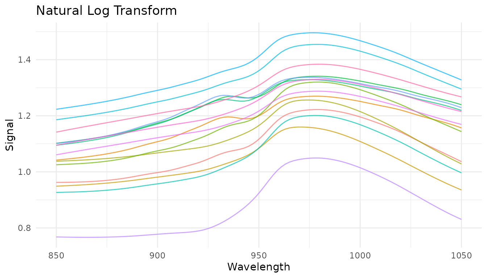

### Kubelka-Munk Transformation

For diffuse reflectance data, the Kubelka-Munk transformation converts
reflectance to a quantity proportional to concentration:

$$f(R) = \frac{(1 - R)^{2}}{2R}$$

``` r
# For reflectance data (values between 0 and 1)
rec_km <- recipe(concentration ~ ., data = reflectance_data) |>
  step_measure_input_wide(starts_with("r_")) |>
  step_measure_kubelka_munk()
```

### Simple Finite Difference Derivatives

For quick derivatives without smoothing, use
[`step_measure_derivative()`](https://jameshwade.github.io/measure/dev/reference/step_measure_derivative.md):

``` r
# First derivative - removes constant baseline offsets
rec_fd1 <- recipe(water ~ ., data = meats) |>
  step_measure_input_wide(starts_with("x_"), location_values = wavelengths) |>
  step_measure_derivative(order = 1)

# Second derivative - removes linear baseline trends
rec_fd2 <- recipe(water ~ ., data = meats) |>
  step_measure_input_wide(starts_with("x_"), location_values = wavelengths) |>
  step_measure_derivative(order = 2)
```

**Note**: Derivatives reduce spectrum length (first derivative: n-1
points, second derivative: n-2 points). The `order` parameter is
tunable.

### Gap (Norris-Williams) Derivatives

Gap derivatives compute differences between points separated by a gap,
commonly used in NIR chemometrics:

``` r
# Gap derivative with gap=5
rec_gap <- recipe(water ~ ., data = meats) |>
  step_measure_input_wide(starts_with("x_"), location_values = wavelengths) |>
  step_measure_derivative_gap(gap = 5)

# Norris-Williams with segment averaging for noise reduction
rec_nw <- recipe(water ~ ., data = meats) |>
  step_measure_input_wide(starts_with("x_"), location_values = wavelengths) |>
  step_measure_derivative_gap(gap = 5, segment = 3)

plot_spectra(get_internal(rec_gap), "Gap Derivative (gap=5)")
```


Both `gap` and `segment` parameters are tunable with dials.

### When to use each derivative method

| Method                                                                                                               | Smoothing          | Speed     | Use when                           |
|----------------------------------------------------------------------------------------------------------------------|--------------------|-----------|------------------------------------|
| [`step_measure_savitzky_golay()`](https://jameshwade.github.io/measure/dev/reference/step_measure_savitzky_golay.md) | Yes (polynomial)   | Fast      | Noisy data, need smoothing         |
| [`step_measure_derivative()`](https://jameshwade.github.io/measure/dev/reference/step_measure_derivative.md)         | No                 | Very fast | Clean data, unsmoothed derivative  |
| [`step_measure_derivative_gap()`](https://jameshwade.github.io/measure/dev/reference/step_measure_derivative_gap.md) | Optional (segment) | Fast      | NIR chemometrics, configurable gap |

## Region Operations

Region operations allow you to select, exclude, or resample specific
portions of your measurements. These are essential for chromatographic
workflows and useful for focusing analysis on regions of interest.

### Trimming to a range

[`step_measure_trim()`](https://jameshwade.github.io/measure/dev/reference/step_measure_trim.md)
keeps only measurements within a specified x-axis range:

``` r
# Keep only wavelengths 880-1020
rec_trim <- recipe(water ~ ., data = meats) |>
  step_measure_input_wide(starts_with("x_"), location_values = wavelengths) |>
  step_measure_trim(range = c(880, 1020))

trim_data <- get_internal(rec_trim)
plot_spectra(trim_data, "Trimmed to 880-1020 nm",
             "Removed noisy edge regions")
```


Common use cases: - Remove noisy regions at measurement edges - Focus on
spectral region of interest - Define integration windows for
chromatography

### Excluding ranges

[`step_measure_exclude()`](https://jameshwade.github.io/measure/dev/reference/step_measure_exclude.md)
removes measurements within one or more specified ranges:

``` r
# Exclude water absorption bands
rec_exclude <- recipe(water ~ ., data = meats) |>
  step_measure_input_wide(starts_with("x_"), location_values = wavelengths) |>
  step_measure_exclude(ranges = list(c(920, 940), c(980, 1000)))

exclude_data <- get_internal(rec_exclude)
plot_spectra(exclude_data, "Excluded Regions",
             "Removed wavelength ranges 920-940 and 980-1000")
```


Common use cases: - Remove solvent peaks in chromatography - Exclude
detector saturation regions - Remove known interference regions

### Resampling to a new grid

[`step_measure_resample()`](https://jameshwade.github.io/measure/dev/reference/step_measure_resample.md)
interpolates measurements to a new regular grid:

``` r
# Resample to 50 evenly spaced points
rec_resample <- recipe(water ~ ., data = meats) |>
  step_measure_input_wide(starts_with("x_"), location_values = wavelengths) |>
  step_measure_resample(n = 50, method = "spline")

resample_data <- get_internal(rec_resample)
plot_spectra(resample_data, "Resampled to 50 Points",
             "Spline interpolation to regular grid")
```


You can also specify the spacing between points:

``` r
# Resample with 5 nm spacing
rec_resample_spacing <- recipe(water ~ ., data = meats) |>
  step_measure_input_wide(starts_with("x_"), location_values = wavelengths) |>
  step_measure_resample(spacing = 5, method = "linear")
```

Common use cases: - Align data from different instruments with different
sampling rates - Reduce data density for faster processing - Ensure
uniform spacing for methods that require it

### Combining region operations

Region operations are often used together at the start of a
preprocessing pipeline:

``` r
rec_regions <- recipe(water ~ ., data = meats) |>
  step_measure_input_wide(starts_with("x_"), location_values = wavelengths) |>
  # First trim to region of interest
  step_measure_trim(range = c(860, 1040)) |>
  # Then resample to regular grid
  step_measure_resample(n = 50, method = "spline") |>
  # Now apply spectral preprocessing
  step_measure_savitzky_golay(window_side = 3, differentiation_order = 1) |>
  step_measure_snv()

region_pipeline_data <- get_internal(rec_regions)
plot_spectra(region_pipeline_data, "Region Selection + Preprocessing",
             "Trim → Resample → SG derivative → SNV")
```


## Baseline Correction

Baseline correction is critical for removing unwanted background signals
from spectral data. The measure package provides several algorithms
suited for different situations.

### Available methods

| Step                                                                                                                     | Algorithm                           | Best for                          |
|--------------------------------------------------------------------------------------------------------------------------|-------------------------------------|-----------------------------------|
| [`step_measure_baseline_als()`](https://jameshwade.github.io/measure/dev/reference/step_measure_baseline_als.md)         | Asymmetric Least Squares            | General purpose, smooth baselines |
| [`step_measure_baseline_poly()`](https://jameshwade.github.io/measure/dev/reference/step_measure_baseline_poly.md)       | Polynomial fitting                  | Simple, predictable baselines     |
| [`step_measure_baseline_rolling()`](https://jameshwade.github.io/measure/dev/reference/step_measure_baseline_rolling.md) | Rolling ball                        | Wide peaks, chromatography        |
| [`step_measure_baseline_airpls()`](https://jameshwade.github.io/measure/dev/reference/step_measure_baseline_airpls.md)   | Adaptive Iteratively Reweighted PLS | Complex baselines                 |
| [`step_measure_baseline_snip()`](https://jameshwade.github.io/measure/dev/reference/step_measure_baseline_snip.md)       | SNIP algorithm                      | Spectroscopy with sharp peaks     |
| [`step_measure_detrend()`](https://jameshwade.github.io/measure/dev/reference/step_measure_detrend.md)                   | Polynomial detrending               | Linear/quadratic drift            |

### Rolling ball baseline

The rolling ball algorithm “rolls” a ball of specified radius under the
spectrum to estimate the baseline:

``` r
rec_rolling <- recipe(water ~ ., data = meats) |>
  step_measure_input_wide(starts_with("x_"), location_values = wavelengths) |>
  step_measure_baseline_rolling(window_size = 50)

rolling_data <- get_internal(rec_rolling)
plot_spectra(rolling_data, "Rolling Ball Baseline Correction",
             "Window size = 50")
```

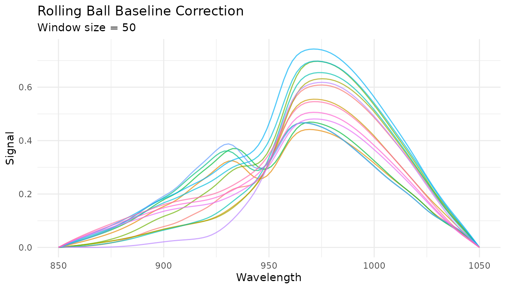

Key parameters: - `window_size`: Diameter of the rolling ball (larger =
smoother baseline) - `smoothing`: Amount of smoothing applied to the
estimated baseline

### airPLS baseline

Adaptive Iteratively Reweighted Penalized Least Squares adapts to
complex, varying baselines:

``` r
rec_airpls <- recipe(water ~ ., data = meats) |>
  step_measure_input_wide(starts_with("x_"), location_values = wavelengths) |>
  step_measure_baseline_airpls(lambda = 1e5, max_iter = 20)

airpls_data <- get_internal(rec_airpls)
plot_spectra(airpls_data, "airPLS Baseline Correction",
             "lambda = 1e5")
```


The `lambda` parameter controls smoothness (larger = smoother baseline)
and is tunable with dials.

### SNIP baseline

Statistics-sensitive Non-linear Iterative Peak-clipping (SNIP) is
well-suited for spectroscopy with sharp peaks:

``` r
rec_snip <- recipe(water ~ ., data = meats) |>
  step_measure_input_wide(starts_with("x_"), location_values = wavelengths) |>
  step_measure_baseline_snip(iterations = 30)

snip_data <- get_internal(rec_snip)
plot_spectra(snip_data, "SNIP Baseline Correction",
             "30 iterations, decreasing window")
```

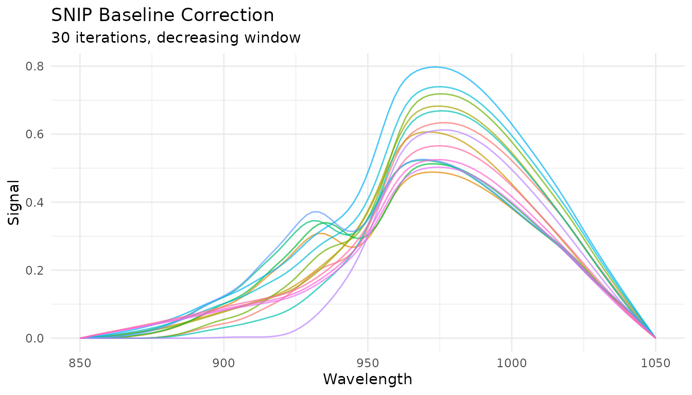

Key parameters: - `iterations`: Number of clipping iterations (more =
more aggressive baseline removal) - `decreasing`: Whether to decrease
window size with iterations (recommended for peaks)

## Standard Normal Variate (SNV)

### What it does

SNV normalizes each spectrum independently by centering and scaling:

$$SNV(x) = \frac{x - \bar{x}}{s_{x}}$$

where $\bar{x}$ is the spectrum’s mean and $s_{x}$ is its standard
deviation.

### When to use it

- Remove multiplicative scatter effects
- Correct for path length variations
- Normalize spectra to similar magnitude

SNV is particularly effective for diffuse reflectance spectra where
particle size causes scatter variations.

### Example

``` r
rec_snv <- recipe(water ~ ., data = meats) |>
  step_measure_input_wide(starts_with("x_"), location_values = wavelengths) |>
  step_measure_snv()

snv_data <- get_internal(rec_snv)
plot_spectra(snv_data, "After SNV Normalization", "Each spectrum has mean = 0 and sd = 1")
```


### Combining with derivatives

SNV is often combined with Savitzky-Golay derivatives. The order
matters:

``` r
# Derivative then SNV (more common)
rec_d1_snv <- recipe(water ~ ., data = meats) |>
  step_measure_input_wide(starts_with("x_"), location_values = wavelengths) |>
  step_measure_savitzky_golay(window_side = 5, differentiation_order = 1) |>
  step_measure_snv()

plot_spectra(get_internal(rec_d1_snv), "1st Derivative + SNV",
             "Combined baseline removal and scatter correction")
```


## Multiplicative Scatter Correction (MSC)

### What it does

MSC aligns each spectrum to a reference spectrum (typically the mean of
all training spectra) by correcting for additive and multiplicative
effects:

1.  Fit each spectrum $x_{i}$ to the reference $x_{r}$:
    $x_{i} = m_{i} \cdot x_{r} + a_{i}$
2.  Correct: $MSC\left( x_{i} \right) = \frac{x_{i} - a_{i}}{m_{i}}$

### When to use it

- Similar applications to SNV
- When you have a good reference spectrum
- Often slightly better than SNV for scatter correction

### How it differs from SNV

- **SNV**: Each spectrum normalized independently (no reference needed)
- **MSC**: All spectra aligned to a common reference (learns reference
  during prep)

This means MSC is a *trained* step - it learns the reference spectrum
from training data and applies the same reference to new data.

### Example

``` r
rec_msc <- recipe(water ~ ., data = meats) |>
  step_measure_input_wide(starts_with("x_"), location_values = wavelengths) |>
  step_measure_msc()

msc_data <- get_internal(rec_msc)
plot_spectra(msc_data, "After MSC", "Spectra aligned to mean reference")
```


### Comparing SNV and MSC

``` r
p_snv <- plot_spectra(get_internal(rec_snv), "SNV")
p_msc <- plot_spectra(get_internal(rec_msc), "MSC")

p_snv / p_msc
```


Both methods produce similar results for this dataset. In practice, try
both and compare model performance.

## Extended Scatter Correction

For more complex scatter effects, measure provides advanced scatter
correction methods.

### Extended MSC (EMSC)

EMSC extends standard MSC by modeling wavelength-dependent scatter
effects using polynomial terms:

``` r
rec_emsc <- recipe(water ~ ., data = meats) |>
  step_measure_input_wide(starts_with("x_"), location_values = wavelengths) |>
  step_measure_emsc(degree = 2)

emsc_data <- get_internal(rec_emsc)
plot_spectra(emsc_data, "After EMSC (degree=2)", "Wavelength-dependent scatter correction")
```


The `degree` parameter controls the polynomial order for wavelength
terms (0 = standard MSC, higher = more flexibility). This parameter is
tunable.

### Orthogonal Signal Correction (OSC)

OSC removes variation in spectra that is orthogonal (uncorrelated) to
the response variable. This is a supervised technique that requires
outcome variables:

``` r
rec_osc <- recipe(water ~ ., data = meats) |>
  step_measure_input_wide(starts_with("x_"), location_values = wavelengths) |>
  step_measure_osc(n_components = 2)

osc_data <- get_internal(rec_osc)
plot_spectra(osc_data, "After OSC", "Removed 2 orthogonal components")
```

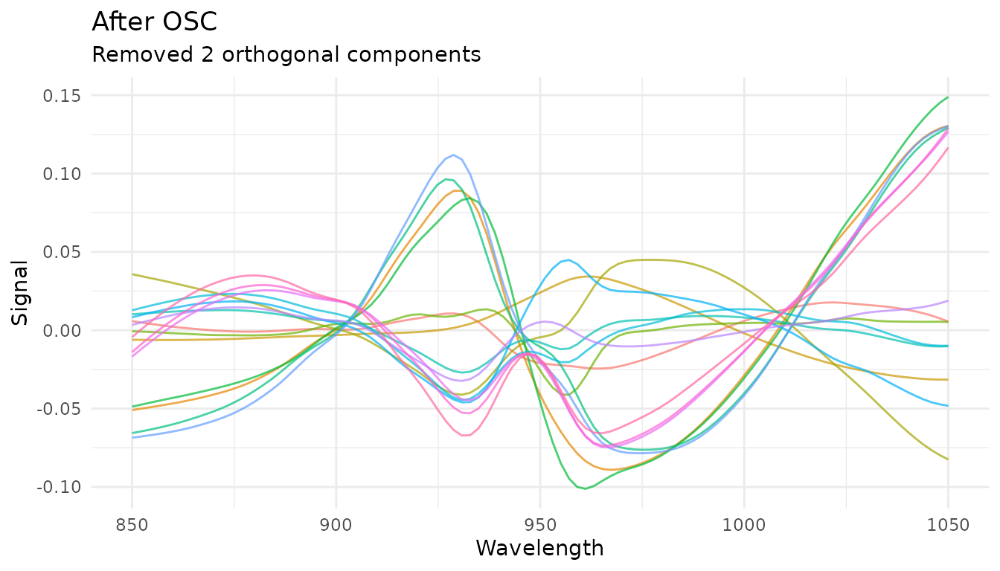

OSC automatically detects outcome variables from the recipe formula. The
`n_components` parameter controls how many orthogonal components to
remove and is tunable.

**When to use EMSC vs OSC:** - **EMSC**: Physical scatter effects that
vary with wavelength - **OSC**: Systematic variation unrelated to your
response (supervised)

## Feature Engineering

Feature engineering steps extract scalar features from spectral data,
creating new predictor columns useful for modeling.

### Region Integration

[`step_measure_integrals()`](https://jameshwade.github.io/measure/dev/reference/step_measure_integrals.md)
calculates integrated areas for specified regions, useful for
quantifying peak areas:

``` r
rec_integrals <- recipe(water ~ ., data = meats) |>
  step_measure_input_wide(starts_with("x_"), location_values = wavelengths) |>
  step_measure_integrals(
    regions = list(
      region_a = c(870, 920),
      region_b = c(950, 1000)
    ),
    method = "trapezoid"
  )

# View extracted features
bake(prep(rec_integrals), new_data = NULL) |>
  select(starts_with("integral_")) |>
  head()
#> # A tibble: 6 × 2
#>   integral_region_a integral_region_b
#>               <dbl>             <dbl>
#> 1              131.              161.
#> 2              146.              170.
#> 3              129.              152.
#> 4              140.              167.
#> 5              141.              177.
#> 6              155.              183.
```

### Region Ratios

[`step_measure_ratios()`](https://jameshwade.github.io/measure/dev/reference/step_measure_ratios.md)
calculates ratios between integrated regions, often used for internal
calibration:

``` r
rec_ratios <- recipe(water ~ ., data = meats) |>
  step_measure_input_wide(starts_with("x_"), location_values = wavelengths) |>
  step_measure_ratios(
    numerator = c(870, 920),
    denominator = c(950, 1000),
    name = "peak_ratio"
  )

bake(prep(rec_ratios), new_data = NULL) |>
  select(peak_ratio) |>
  head()
#> # A tibble: 6 × 1
#>   peak_ratio
#>        <dbl>
#> 1      0.810
#> 2      0.855
#> 3      0.849
#> 4      0.841
#> 5      0.795
#> 6      0.851
```

### Statistical Moments

[`step_measure_moments()`](https://jameshwade.github.io/measure/dev/reference/step_measure_moments.md)
extracts statistical moments from spectra:

``` r
rec_moments <- recipe(water ~ ., data = meats) |>
  step_measure_input_wide(starts_with("x_"), location_values = wavelengths) |>
  step_measure_moments(moments = c("mean", "sd", "skewness", "kurtosis"))

bake(prep(rec_moments), new_data = NULL) |>
  select(starts_with("moment_")) |>
  head()
#> # A tibble: 6 × 4
#>   moment_mean moment_sd moment_skewness moment_kurtosis
#>         <dbl>     <dbl>           <dbl>           <dbl>
#> 1        2.97     0.270           0.222           -1.38
#> 2        3.24     0.234          -0.311           -1.19
#> 3        2.82     0.206           0.536           -1.15
#> 4        3.09     0.238           0.540           -1.19
#> 5        3.25     0.326           0.102           -1.37
#> 6        3.48     0.262          -0.387           -1.17
```

### Spectral Binning

[`step_measure_bin()`](https://jameshwade.github.io/measure/dev/reference/step_measure_bin.md)
reduces spectral resolution by averaging or summing bins. This can
reduce noise and dimensionality:

``` r
rec_bin <- recipe(water ~ ., data = meats) |>
  step_measure_input_wide(starts_with("x_"), location_values = wavelengths) |>
  step_measure_bin(n_bins = 20, method = "mean")

bin_data <- get_internal(rec_bin)
plot_spectra(bin_data, "Binned to 20 Points", "Reduced dimensionality")
```

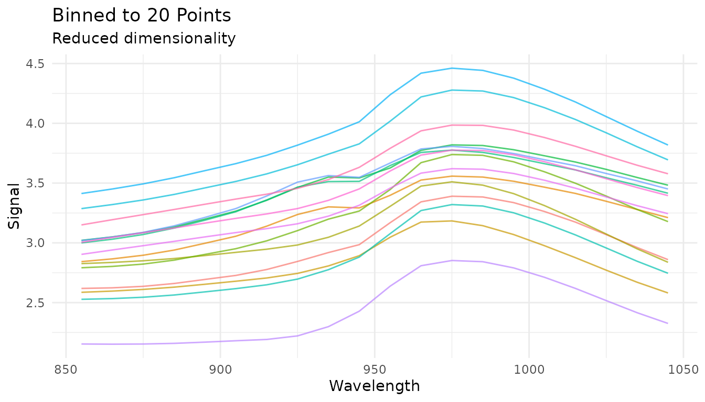

The `bin_width` parameter is tunable:

``` r
rec_tunable_bin <- recipe(water ~ ., data = meats) |>
  step_measure_input_wide(starts_with("x_")) |>
  step_measure_bin(bin_width = tune()) |>
  step_measure_output_wide()
```

## Sample-wise Normalization

The measure package provides several sample-wise normalization methods
that normalize each spectrum independently. Unlike SNV/MSC which address
scatter, these methods adjust for differences in total signal intensity.

### Available methods

| Step                                                                                                                     | Formula                                              | Use case                          |
|--------------------------------------------------------------------------------------------------------------------------|------------------------------------------------------|-----------------------------------|
| [`step_measure_normalize_sum()`](https://jameshwade.github.io/measure/dev/reference/step_measure_normalize_sum.md)       | $x/\sum x$                                           | Total intensity normalization     |
| [`step_measure_normalize_max()`](https://jameshwade.github.io/measure/dev/reference/step_measure_normalize_max.md)       | $x/\max(x)$                                          | Peak-focused analysis             |
| [`step_measure_normalize_range()`](https://jameshwade.github.io/measure/dev/reference/step_measure_normalize_range.md)   | $\left( x - \min \right)/\left( \max - \min \right)$ | Scale to 0-1 range                |
| [`step_measure_normalize_vector()`](https://jameshwade.github.io/measure/dev/reference/step_measure_normalize_vector.md) | $x/ \parallel x \parallel_{2}$                       | L2/Euclidean normalization        |
| [`step_measure_normalize_auc()`](https://jameshwade.github.io/measure/dev/reference/step_measure_normalize_auc.md)       | $x/AUC$                                              | Chromatography (area under curve) |
| [`step_measure_normalize_peak()`](https://jameshwade.github.io/measure/dev/reference/step_measure_normalize_peak.md)     | $x/f\left( \text{region} \right)$                    | Internal standard normalization   |

### Sum normalization

Divides each spectrum by its total intensity. After transformation, all
spectra sum to 1:

``` r
rec_norm_sum <- recipe(water ~ ., data = meats) |>
  step_measure_input_wide(starts_with("x_"), location_values = wavelengths) |>
  step_measure_normalize_sum()

plot_spectra(get_internal(rec_norm_sum), "Sum Normalized",
             "Each spectrum sums to 1")
```

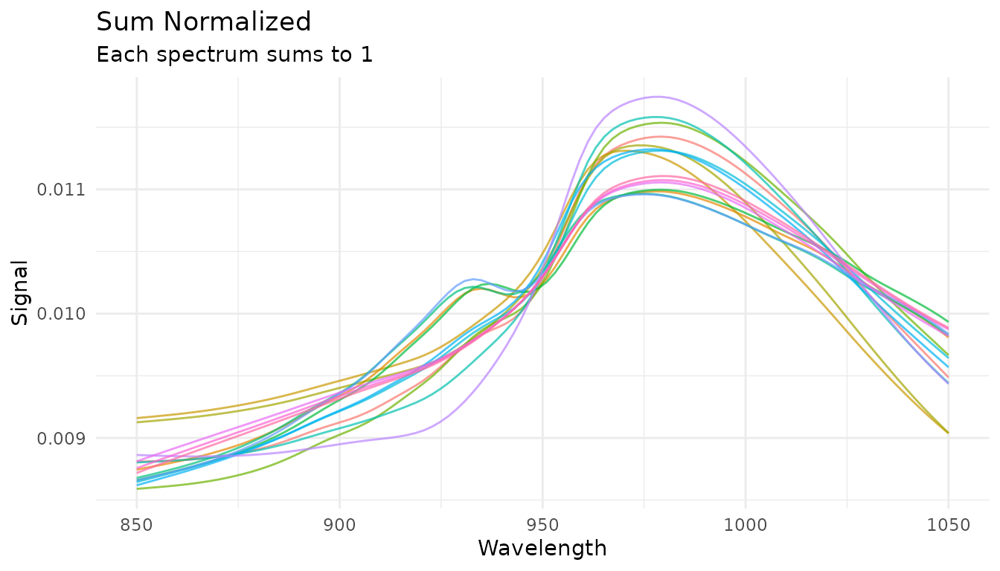

### Max normalization

Divides each spectrum by its maximum value, useful for peak-focused
analysis:

``` r
rec_norm_max <- recipe(water ~ ., data = meats) |>
  step_measure_input_wide(starts_with("x_"), location_values = wavelengths) |>
  step_measure_normalize_max()

plot_spectra(get_internal(rec_norm_max), "Max Normalized",
             "Each spectrum has maximum = 1")
```

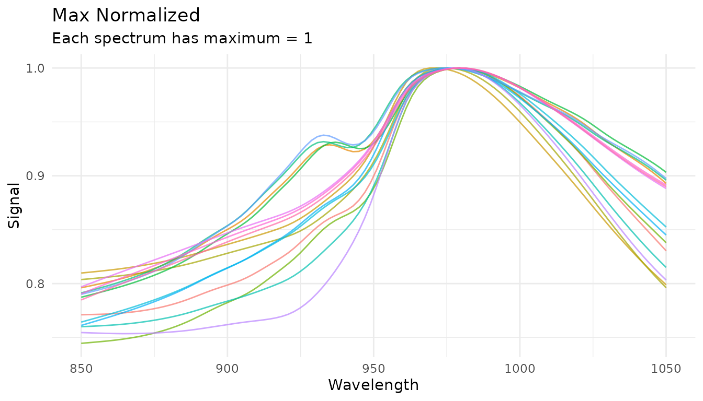

### Peak region normalization (tunable)

When you have an internal standard at a known location, use
[`step_measure_normalize_peak()`](https://jameshwade.github.io/measure/dev/reference/step_measure_normalize_peak.md)
to normalize by a specific region:

``` r
rec_norm_peak <- recipe(water ~ ., data = meats) |>
  step_measure_input_wide(starts_with("x_"), location_values = wavelengths) |>
  step_measure_normalize_peak(
    location_min = 900,
    location_max = 950,
    method = "mean"  # or "max" or "integral"
  )

plot_spectra(get_internal(rec_norm_peak), "Peak Region Normalized",
             "Normalized by mean of region 900-950")
```

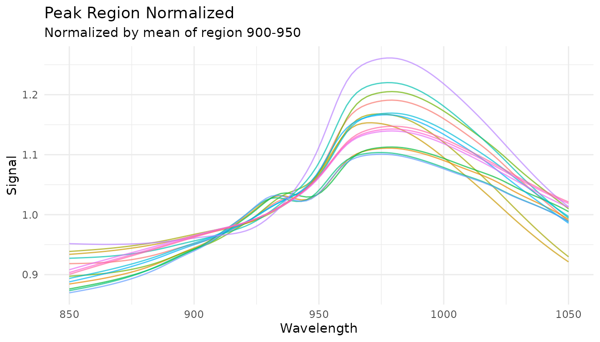

The `location_min` and `location_max` parameters are tunable:

``` r
rec_tunable_peak <- recipe(water ~ ., data = meats) |>
  step_measure_input_wide(starts_with("x_")) |>
  step_measure_normalize_peak(
    location_min = tune(),
    location_max = tune(),
    method = "mean"
  ) |>
  step_measure_output_wide()
```

## Variable-wise Scaling

While sample-wise methods normalize each spectrum independently,
variable-wise scaling operates across samples at each measurement
location. These methods **learn statistics from training data** and
apply them consistently to new data.

### When to use variable-wise scaling

- **Before PCA/PLS**: Centering is essential; scaling equalizes variable
  importance
- **When variables have different scales**: Auto-scaling gives equal
  weight to all locations
- **For metabolomics data**: Pareto scaling is common practice

### Mean centering

[`step_measure_center()`](https://jameshwade.github.io/measure/dev/reference/step_measure_center.md)
subtracts the column mean at each location:

``` r
rec_center <- recipe(water ~ ., data = meats) |>
  step_measure_input_wide(starts_with("x_"), location_values = wavelengths) |>
  step_measure_center()

center_data <- get_internal(rec_center)
plot_spectra(center_data, "Mean Centered",
             "Column means are zero")
```


### Auto-scaling (z-score)

[`step_measure_scale_auto()`](https://jameshwade.github.io/measure/dev/reference/step_measure_scale_auto.md)
centers and scales to unit variance at each location:

``` r
rec_auto <- recipe(water ~ ., data = meats) |>
  step_measure_input_wide(starts_with("x_"), location_values = wavelengths) |>
  step_measure_scale_auto()

auto_data <- get_internal(rec_auto)
plot_spectra(auto_data, "Auto-Scaled (Z-Score)",
             "Column means = 0, SDs = 1")
```

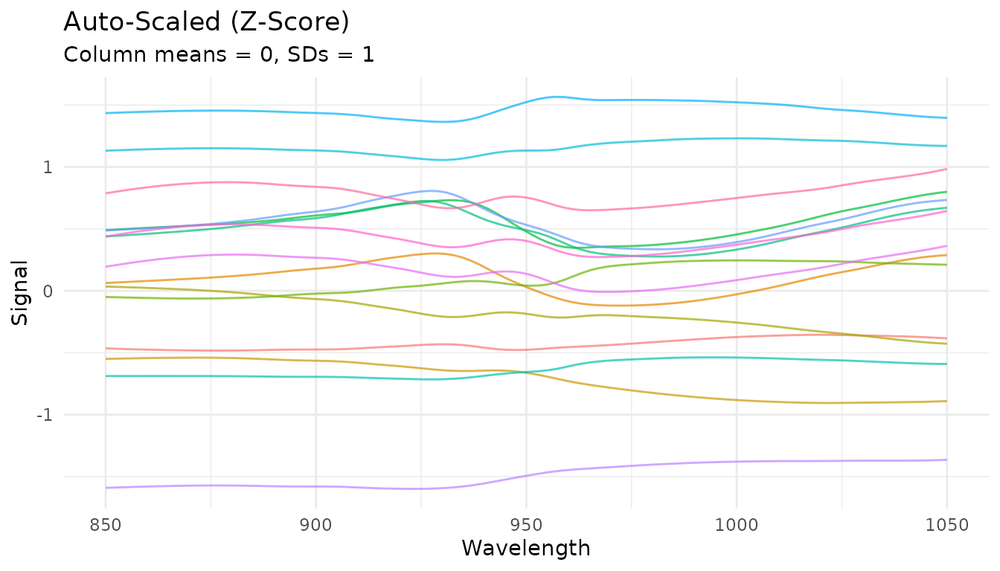

### Pareto scaling

[`step_measure_scale_pareto()`](https://jameshwade.github.io/measure/dev/reference/step_measure_scale_pareto.md)
divides by the square root of the standard deviation - a compromise
between no scaling and auto-scaling:

``` r
rec_pareto <- recipe(water ~ ., data = meats) |>
  step_measure_input_wide(starts_with("x_"), location_values = wavelengths) |>
  step_measure_scale_pareto()

pareto_data <- get_internal(rec_pareto)
plot_spectra(pareto_data, "Pareto Scaled",
             "Reduces influence of large values while preserving fold changes")
```

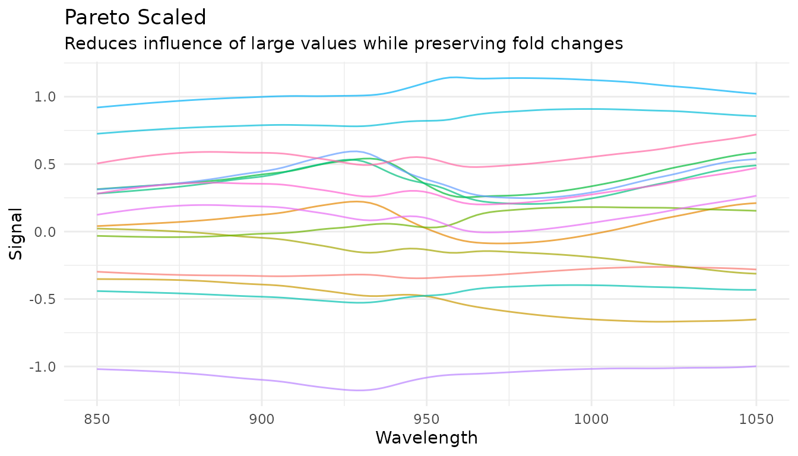

### Comparing scaling methods

``` r
p_raw <- plot_spectra(raw_data, "Raw")
p_center <- plot_spectra(center_data, "Centered")
p_auto <- plot_spectra(auto_data, "Auto-Scaled")
p_pareto <- plot_spectra(pareto_data, "Pareto Scaled")

(p_raw + p_center) / (p_auto + p_pareto)
```

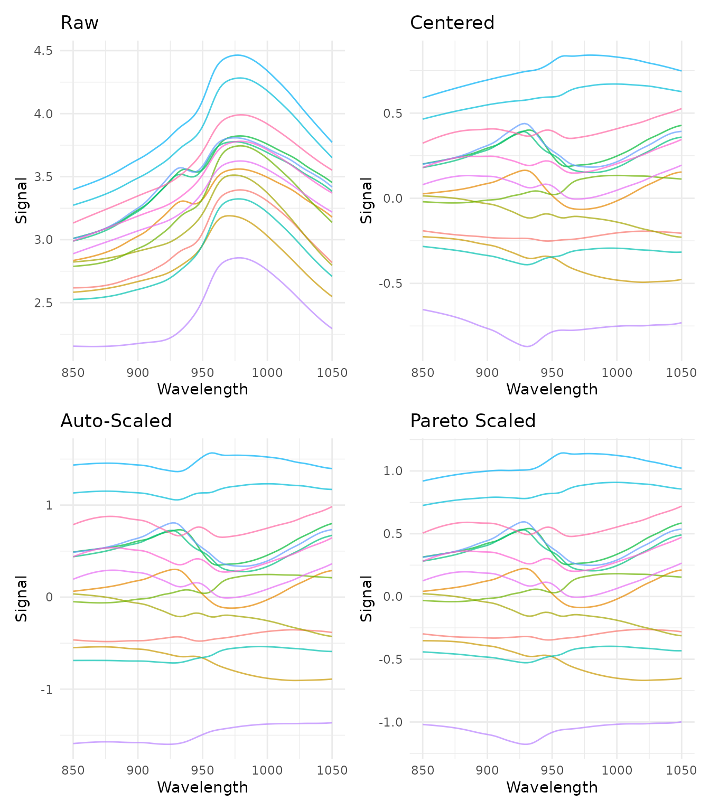

### Learned parameters

Variable-wise scaling steps store learned parameters that can be
examined after training:

``` r
rec_prepped <- prep(rec_auto)

# View learned parameters
tidy_params <- tidy(rec_prepped, number = 2)
head(tidy_params)
#> # A tibble: 6 × 5
#>   terms     location  mean    sd id                      
#>   <chr>        <dbl> <dbl> <dbl> <chr>                   
#> 1 .measures     850   2.81 0.411 measure_scale_auto_uVs7T
#> 2 .measures     852.  2.81 0.413 measure_scale_auto_uVs7T
#> 3 .measures     854.  2.81 0.416 measure_scale_auto_uVs7T
#> 4 .measures     856.  2.82 0.418 measure_scale_auto_uVs7T
#> 5 .measures     858.  2.82 0.421 measure_scale_auto_uVs7T
#> 6 .measures     860.  2.82 0.424 measure_scale_auto_uVs7T

# Plot the learned means and SDs
ggplot(tidy_params, aes(x = location)) +
  geom_line(aes(y = mean), color = "blue") +
  geom_ribbon(aes(ymin = mean - sd, ymax = mean + sd), alpha = 0.3, fill = "blue") +
  labs(x = "Wavelength", y = "Value",
       title = "Learned Parameters from Auto-Scaling",
       subtitle = "Mean ± 1 SD at each wavelength") +
  theme_minimal()
```


## Custom Transformations

### When built-in steps aren’t enough

The built-in preprocessing steps cover the most common operations, but
you may need domain-specific transformations:

- Custom baseline correction algorithms
- Instrument-specific corrections
- Experimental preprocessing techniques
- Transformations from specialized packages

[`step_measure_map()`](https://jameshwade.github.io/measure/dev/reference/step_measure_map.md)
provides an “escape hatch” for applying any custom function to your
measurements while staying within the recipes framework.

### Using step_measure_map()

The function you provide must accept a tibble with `location` and
`value` columns and return a tibble with the same structure:

``` r
# Example: Shift spectra to start at zero
zero_baseline <- function(x) {

x$value <- x$value - min(x$value)
x
}

rec_custom <- recipe(water ~ ., data = meats) |>
step_measure_input_wide(starts_with("x_"), location_values = wavelengths) |>
step_measure_map(zero_baseline) |>
step_measure_snv()

plot_spectra(get_internal(rec_custom), "Custom Zero-Baseline + SNV")
```


### Formula syntax for inline transformations

For simple transformations, use formula syntax instead of defining a
separate function:

``` r
rec_inline <- recipe(water ~ ., data = meats) |>
step_measure_input_wide(starts_with("x_"), location_values = wavelengths) |>
step_measure_map(~ {
# Log transform (common for absorbance data)
.x$value <- log1p(.x$value)
.x
})
```

### Passing additional arguments

You can pass extra arguments to your transformation function:

``` r
# A function with configurable parameters
robust_scale <- function(x, center_fn = median, scale_fn = mad) {
x$value <- (x$value - center_fn(x$value)) / scale_fn(x$value)
x
}

# Use with custom parameters
rec <- recipe(water ~ ., data = meats) |>
step_measure_input_wide(starts_with("x_")) |>
step_measure_map(robust_scale, center_fn = mean, scale_fn = sd)
```

### Prototyping with measure_map()

When developing a custom transformation, it helps to prototype
interactively before putting it in a recipe. Use
[`measure_map()`](https://jameshwade.github.io/measure/dev/reference/measure_map.md)
for exploration:

``` r
# First, get data in internal format
rec_internal <- recipe(water ~ ., data = meats) |>
step_measure_input_wide(starts_with("x_"), location_values = wavelengths) |>
prep()

baked_data <- bake(rec_internal, new_data = NULL)

# Prototype your transformation
result <- measure_map(baked_data, ~ {
# Experiment with different approaches
.x$value <- .x$value - median(.x$value)
.x
})

# Check results
result$.measures[[1]]
#> <measure_tbl [100 x 2]>
#> # A tibble: 100 × 2
#>    location  value
#>       <dbl>  <dbl>
#>  1     850  -0.317
#>  2     852. -0.316
#>  3     854. -0.316
#>  4     856. -0.315
#>  5     858. -0.314
#>  6     860. -0.314
#>  7     862. -0.312
#>  8     864. -0.311
#>  9     866. -0.309
#> 10     868. -0.307
#> # ℹ 90 more rows
```

Once your transformation works correctly, move it into
[`step_measure_map()`](https://jameshwade.github.io/measure/dev/reference/step_measure_map.md)
for production use. This ensures the transformation is:

- Applied consistently during
  [`prep()`](https://recipes.tidymodels.org/reference/prep.html) and
  [`bake()`](https://recipes.tidymodels.org/reference/bake.html)
- Included when bundling recipes into workflows
- Reproducible across sessions

### Handling problematic samples

Use
[`measure_map_safely()`](https://jameshwade.github.io/measure/dev/reference/measure_map_safely.md)
when exploring data that might have problematic samples:

``` r
# A transformation that might fail for some samples
risky_transform <- function(x) {
if (any(x$value <= 0)) stop("Non-positive values!")
x$value <- log(x$value)
x
}

# Errors are captured, not thrown
result <- measure_map_safely(baked_data, risky_transform)

# Check which samples failed
if (nrow(result$errors) > 0) {
print(result$errors)
}

# result$result contains the data with successful transforms
# (failed samples keep their original values)
```

### Understanding your data with measure_summarize()

Before preprocessing, it’s often helpful to compute summary statistics
across samples:

``` r
# Compute mean and SD at each wavelength
summary_stats <- measure_summarize(baked_data)
summary_stats
#> # A tibble: 100 × 3
#>    location  mean    sd
#>       <dbl> <dbl> <dbl>
#>  1     850   2.81 0.411
#>  2     852.  2.81 0.413
#>  3     854.  2.81 0.416
#>  4     856.  2.82 0.418
#>  5     858.  2.82 0.421
#>  6     860.  2.82 0.424
#>  7     862.  2.83 0.426
#>  8     864.  2.83 0.429
#>  9     866.  2.83 0.432
#> 10     868.  2.84 0.434
#> # ℹ 90 more rows

# Visualize the mean spectrum with variability
ggplot(summary_stats, aes(x = location)) +
geom_ribbon(aes(ymin = mean - sd, ymax = mean + sd), alpha = 0.3) +
geom_line(aes(y = mean)) +
labs(x = "Wavelength", y = "Signal", title = "Mean Spectrum ± 1 SD") +
theme_minimal()
```


This can help identify: - Wavelength regions with high variability -
Potential outliers - Reference spectra for custom corrections

## Preprocessing pipelines

### Common combinations

Here are some commonly used preprocessing pipelines:

``` r
# Pipeline 1: Basic scatter correction
pipe1 <- recipe(water ~ ., data = meats) |>
  step_measure_input_wide(starts_with("x_")) |>
  step_measure_snv() |>
  step_measure_output_wide()

# Pipeline 2: Derivative + normalization
pipe2 <- recipe(water ~ ., data = meats) |>
  step_measure_input_wide(starts_with("x_")) |>
  step_measure_savitzky_golay(window_side = 5, differentiation_order = 1) |>
  step_measure_snv() |>
  step_measure_output_wide()

# Pipeline 3: Second derivative (often enough on its own)
pipe3 <- recipe(water ~ ., data = meats) |>
  step_measure_input_wide(starts_with("x_")) |>
  step_measure_savitzky_golay(window_side = 7, differentiation_order = 2) |>
  step_measure_output_wide()

# Pipeline 4: MSC + smoothing
pipe4 <- recipe(water ~ ., data = meats) |>
  step_measure_input_wide(starts_with("x_")) |>
  step_measure_msc() |>
  step_measure_savitzky_golay(window_side = 5, differentiation_order = 0) |>
  step_measure_output_wide()

# Pipeline 5: For PCA/PLS - SNV + centering
pipe5 <- recipe(water ~ ., data = meats) |>
  step_measure_input_wide(starts_with("x_")) |>
  step_measure_snv() |>
  step_measure_center() |>
  step_measure_output_wide()

# Pipeline 6: Metabolomics-style with Pareto scaling
pipe6 <- recipe(water ~ ., data = meats) |>
  step_measure_input_wide(starts_with("x_")) |>
  step_measure_normalize_sum() |>
  step_measure_scale_pareto() |>
  step_measure_output_wide()
```

### Order of operations

The order of preprocessing steps matters. General guidelines:

1.  **Derivatives first**: Apply Savitzky-Golay derivatives before other
    transformations
2.  **Sample-wise normalization before variable-wise scaling**:
    Normalize spectra (SNV, MSC, normalize\_\*) before centering/scaling
3.  **Center/scale last**: Variable-wise scaling should typically be the
    final step before modeling
4.  **Keep it simple**: Often, a single well-chosen step outperforms
    complex pipelines

A typical order might be:

    Derivatives → Sample normalization (SNV/MSC) → Variable scaling (center/auto-scale)

## Data Augmentation

Data augmentation steps add controlled variations to training data,
helping models generalize better. These steps default to `skip = TRUE`,
meaning they only apply during training (via
[`prep()`](https://recipes.tidymodels.org/reference/prep.html)) and are
skipped when applying the recipe to new data (via
[`bake()`](https://recipes.tidymodels.org/reference/bake.html) with
`new_data`).

### Adding Random Noise

[`step_measure_augment_noise()`](https://jameshwade.github.io/measure/dev/reference/step_measure_augment_noise.md)
adds random noise to simulate measurement uncertainty:

``` r
rec_noise <- recipe(water ~ ., data = meats) |>
  step_measure_input_wide(starts_with("x_")) |>
  step_measure_augment_noise(
    sd = 0.01,              # Noise level (relative to signal range)
    distribution = "gaussian",
    relative = TRUE         # TRUE = sd is relative to signal range
  ) |>
  step_measure_output_wide()
```

### Random X-axis Shifts

[`step_measure_augment_shift()`](https://jameshwade.github.io/measure/dev/reference/step_measure_augment_shift.md)
applies small random shifts along the x-axis, helping models become
shift-invariant:

``` r
rec_shift <- recipe(water ~ ., data = meats) |>
  step_measure_input_wide(starts_with("x_")) |>
  step_measure_augment_shift(max_shift = 2) |>  # Max shift in location units
  step_measure_output_wide()
```

### Random Intensity Scaling

[`step_measure_augment_scale()`](https://jameshwade.github.io/measure/dev/reference/step_measure_augment_scale.md)
applies random scaling factors to intensities:

``` r
rec_scale <- recipe(water ~ ., data = meats) |>
  step_measure_input_wide(starts_with("x_")) |>
  step_measure_augment_scale(range = c(0.9, 1.1)) |>  # Scale between 90-110%
  step_measure_output_wide()
```

### Combining Augmentations

Multiple augmentation steps can be combined. Augmentations are
reproducible - applying the same recipe to the same data produces
identical results:

``` r
rec_augment <- recipe(water ~ ., data = meats) |>
  step_measure_input_wide(starts_with("x_")) |>
  step_measure_augment_noise(sd = 0.005) |>
  step_measure_augment_shift(max_shift = 1) |>
  step_measure_augment_scale(range = c(0.95, 1.05)) |>
  step_measure_snv() |>
  step_measure_output_wide()

# Augmentation only applies during training
prepped <- prep(rec_augment)
training_data <- bake(prepped, new_data = NULL)  # Augmented
new_data <- bake(prepped, new_data = meats[1:5, ])  # Not augmented
```

**When to use augmentation:** - Training deep learning models - Small
training sets where more variation helps - Building
shift/scale-invariant models

## Summary table

### Filtering and Scatter Correction

| Step                                                                                             | Effect                     | Use when                 |
|--------------------------------------------------------------------------------------------------|----------------------------|--------------------------|
| `step_measure_savitzky_golay(order=0)`                                                           | Smoothing                  | High-frequency noise     |
| `step_measure_savitzky_golay(order=1)`                                                           | 1st derivative             | Baseline offsets         |
| `step_measure_savitzky_golay(order=2)`                                                           | 2nd derivative             | Linear baselines         |
| [`step_measure_snv()`](https://jameshwade.github.io/measure/dev/reference/step_measure_snv.md)   | Row normalization          | Scatter, path length     |
| [`step_measure_msc()`](https://jameshwade.github.io/measure/dev/reference/step_measure_msc.md)   | Align to reference         | Scatter (supervised)     |
| [`step_measure_emsc()`](https://jameshwade.github.io/measure/dev/reference/step_measure_emsc.md) | Wavelength-dependent MSC   | Complex scatter effects  |
| [`step_measure_osc()`](https://jameshwade.github.io/measure/dev/reference/step_measure_osc.md)   | Remove orthogonal variance | Supervised noise removal |

### Spectral Math

| Step                                                                                                                 | Effect            | Use when                   |
|----------------------------------------------------------------------------------------------------------------------|-------------------|----------------------------|
| [`step_measure_absorbance()`](https://jameshwade.github.io/measure/dev/reference/step_measure_absorbance.md)         | T → A             | Convert transmittance      |
| [`step_measure_transmittance()`](https://jameshwade.github.io/measure/dev/reference/step_measure_transmittance.md)   | A → T             | Convert absorbance         |
| [`step_measure_log()`](https://jameshwade.github.io/measure/dev/reference/step_measure_log.md)                       | Log transform     | Variance stabilization     |
| [`step_measure_kubelka_munk()`](https://jameshwade.github.io/measure/dev/reference/step_measure_kubelka_munk.md)     | K-M transform     | Diffuse reflectance        |
| [`step_measure_derivative()`](https://jameshwade.github.io/measure/dev/reference/step_measure_derivative.md)         | Finite difference | Fast unsmoothed derivative |
| [`step_measure_derivative_gap()`](https://jameshwade.github.io/measure/dev/reference/step_measure_derivative_gap.md) | Gap derivative    | NIR chemometrics           |

### Sample-wise Normalization

| Step                                                                                                                     | Effect           | Use when                       |
|--------------------------------------------------------------------------------------------------------------------------|------------------|--------------------------------|
| [`step_measure_normalize_sum()`](https://jameshwade.github.io/measure/dev/reference/step_measure_normalize_sum.md)       | Divide by sum    | Total intensity differences    |
| [`step_measure_normalize_max()`](https://jameshwade.github.io/measure/dev/reference/step_measure_normalize_max.md)       | Divide by max    | Peak-focused analysis          |
| [`step_measure_normalize_range()`](https://jameshwade.github.io/measure/dev/reference/step_measure_normalize_range.md)   | Scale to 0-1     | Neural networks, visualization |
| [`step_measure_normalize_vector()`](https://jameshwade.github.io/measure/dev/reference/step_measure_normalize_vector.md) | L2 normalization | Euclidean distance methods     |
| [`step_measure_normalize_auc()`](https://jameshwade.github.io/measure/dev/reference/step_measure_normalize_auc.md)       | Divide by AUC    | Chromatography                 |
| [`step_measure_normalize_peak()`](https://jameshwade.github.io/measure/dev/reference/step_measure_normalize_peak.md)     | Divide by region | Internal standard              |

### Variable-wise Scaling

| Step                                                                                                             | Effect         | Use when                   |
|------------------------------------------------------------------------------------------------------------------|----------------|----------------------------|
| [`step_measure_center()`](https://jameshwade.github.io/measure/dev/reference/step_measure_center.md)             | Subtract mean  | Before PCA/PLS (essential) |
| [`step_measure_scale_auto()`](https://jameshwade.github.io/measure/dev/reference/step_measure_scale_auto.md)     | Z-score        | Equal variable importance  |
| [`step_measure_scale_pareto()`](https://jameshwade.github.io/measure/dev/reference/step_measure_scale_pareto.md) | Pareto scaling | Metabolomics               |
| [`step_measure_scale_range()`](https://jameshwade.github.io/measure/dev/reference/step_measure_scale_range.md)   | Range scaling  | Bounded scaling            |
| [`step_measure_scale_vast()`](https://jameshwade.github.io/measure/dev/reference/step_measure_scale_vast.md)     | VAST scaling   | Variable stability focus   |

### Region Operations

| Step                                                                                                     | Effect              | Use when                          |
|----------------------------------------------------------------------------------------------------------|---------------------|-----------------------------------|
| [`step_measure_trim()`](https://jameshwade.github.io/measure/dev/reference/step_measure_trim.md)         | Keep x-range        | Focus on region of interest       |
| [`step_measure_exclude()`](https://jameshwade.github.io/measure/dev/reference/step_measure_exclude.md)   | Remove x-ranges     | Remove solvent peaks, artifacts   |
| [`step_measure_resample()`](https://jameshwade.github.io/measure/dev/reference/step_measure_resample.md) | Interpolate to grid | Align instruments, reduce density |

### Smoothing & Noise Reduction

| Step                                                                                                                   | Effect              | Use when                        |
|------------------------------------------------------------------------------------------------------------------------|---------------------|---------------------------------|
| [`step_measure_smooth_ma()`](https://jameshwade.github.io/measure/dev/reference/step_measure_smooth_ma.md)             | Moving average      | Simple noise reduction          |
| [`step_measure_smooth_median()`](https://jameshwade.github.io/measure/dev/reference/step_measure_smooth_median.md)     | Median filter       | Spike removal, robust smoothing |
| [`step_measure_smooth_gaussian()`](https://jameshwade.github.io/measure/dev/reference/step_measure_smooth_gaussian.md) | Gaussian kernel     | Preserve peak shapes            |
| [`step_measure_smooth_wavelet()`](https://jameshwade.github.io/measure/dev/reference/step_measure_smooth_wavelet.md)   | Wavelet denoising   | Complex noise patterns          |
| [`step_measure_filter_fourier()`](https://jameshwade.github.io/measure/dev/reference/step_measure_filter_fourier.md)   | Frequency filtering | Periodic noise removal          |
| [`step_measure_despike()`](https://jameshwade.github.io/measure/dev/reference/step_measure_despike.md)                 | Spike removal       | Cosmic rays, detector glitches  |

### Alignment & Registration

| Step                                                                                                                   | Effect                        | Use when                      |
|------------------------------------------------------------------------------------------------------------------------|-------------------------------|-------------------------------|
| [`step_measure_align_shift()`](https://jameshwade.github.io/measure/dev/reference/step_measure_align_shift.md)         | Cross-correlation alignment   | Simple linear shifts          |
| [`step_measure_align_reference()`](https://jameshwade.github.io/measure/dev/reference/step_measure_align_reference.md) | Align to reference            | External calibration standard |
| [`step_measure_align_dtw()`](https://jameshwade.github.io/measure/dev/reference/step_measure_align_dtw.md)             | Dynamic time warping          | Non-linear distortions        |
| [`step_measure_align_ptw()`](https://jameshwade.github.io/measure/dev/reference/step_measure_align_ptw.md)             | Parametric time warping       | Polynomial warping functions  |
| [`step_measure_align_cow()`](https://jameshwade.github.io/measure/dev/reference/step_measure_align_cow.md)             | Correlation optimized warping | Piecewise segment alignment   |

### Quality Control

| Step                                                                                                             | Effect              | Use when              |
|------------------------------------------------------------------------------------------------------------------|---------------------|-----------------------|
| [`step_measure_qc_snr()`](https://jameshwade.github.io/measure/dev/reference/step_measure_qc_snr.md)             | Calculate SNR       | Quality filtering     |
| [`step_measure_qc_saturated()`](https://jameshwade.github.io/measure/dev/reference/step_measure_qc_saturated.md) | Detect saturation   | Identify clipped data |
| [`step_measure_qc_outlier()`](https://jameshwade.github.io/measure/dev/reference/step_measure_qc_outlier.md)     | Detect outliers     | Sample screening      |
| [`step_measure_impute()`](https://jameshwade.github.io/measure/dev/reference/step_measure_impute.md)             | Fill missing values | Gap interpolation     |

### Baseline Correction

| Step                                                                                                                     | Effect                     | Use when                          |
|--------------------------------------------------------------------------------------------------------------------------|----------------------------|-----------------------------------|
| [`step_measure_baseline_als()`](https://jameshwade.github.io/measure/dev/reference/step_measure_baseline_als.md)         | Asymmetric LS              | Smooth baselines, general purpose |
| [`step_measure_baseline_poly()`](https://jameshwade.github.io/measure/dev/reference/step_measure_baseline_poly.md)       | Polynomial fit             | Simple, predictable baselines     |
| [`step_measure_baseline_rolling()`](https://jameshwade.github.io/measure/dev/reference/step_measure_baseline_rolling.md) | Rolling ball               | Wide peaks, chromatography        |
| [`step_measure_baseline_airpls()`](https://jameshwade.github.io/measure/dev/reference/step_measure_baseline_airpls.md)   | Adaptive weights           | Complex, varying baselines        |
| [`step_measure_baseline_arpls()`](https://jameshwade.github.io/measure/dev/reference/step_measure_baseline_arpls.md)     | Asymmetric reweighted PLS  | Robust to outliers                |
| [`step_measure_baseline_snip()`](https://jameshwade.github.io/measure/dev/reference/step_measure_baseline_snip.md)       | Iterative clipping         | Sharp peaks, spectroscopy         |
| [`step_measure_baseline_tophat()`](https://jameshwade.github.io/measure/dev/reference/step_measure_baseline_tophat.md)   | Top-hat filter             | Morphological baseline            |
| [`step_measure_baseline_morph()`](https://jameshwade.github.io/measure/dev/reference/step_measure_baseline_morph.md)     | Iterative morphological    | Gradual baselines                 |
| [`step_measure_baseline_minima()`](https://jameshwade.github.io/measure/dev/reference/step_measure_baseline_minima.md)   | Local minima interpolation | Simple chromatography             |
| [`step_measure_baseline_auto()`](https://jameshwade.github.io/measure/dev/reference/step_measure_baseline_auto.md)       | Automatic selection        | Unknown baseline type             |
| [`step_measure_detrend()`](https://jameshwade.github.io/measure/dev/reference/step_measure_detrend.md)                   | Polynomial detrend         | Linear/quadratic drift            |

### Peak Operations

| Step                                                                                                                     | Effect                     | Use when                           |
|--------------------------------------------------------------------------------------------------------------------------|----------------------------|------------------------------------|
| [`step_measure_peaks_detect()`](https://jameshwade.github.io/measure/dev/reference/step_measure_peaks_detect.md)         | Find peaks                 | Chromatography, feature extraction |
| [`step_measure_peaks_integrate()`](https://jameshwade.github.io/measure/dev/reference/step_measure_peaks_integrate.md)   | Calculate areas            | Quantitative analysis              |
| [`step_measure_peaks_filter()`](https://jameshwade.github.io/measure/dev/reference/step_measure_peaks_filter.md)         | Remove small peaks         | Focus on major peaks               |
| [`step_measure_peaks_deconvolve()`](https://jameshwade.github.io/measure/dev/reference/step_measure_peaks_deconvolve.md) | Separate overlapping peaks | Resolve co-eluting peaks           |
| [`step_measure_peaks_to_table()`](https://jameshwade.github.io/measure/dev/reference/step_measure_peaks_to_table.md)     | Wide format output         | Modeling with peak features        |

### SEC/GPC Analysis

| Step                                                                                                                   | Effect                         | Use when                 |
|------------------------------------------------------------------------------------------------------------------------|--------------------------------|--------------------------|
| [`step_measure_mw_averages()`](https://jameshwade.github.io/measure/dev/reference/step_measure_mw_averages.md)         | Calculate Mn, Mw, Mz, Mp, Đ    | Polymer characterization |
| [`step_measure_mw_distribution()`](https://jameshwade.github.io/measure/dev/reference/step_measure_mw_distribution.md) | Generate MW distribution curve | Distribution analysis    |
| [`step_measure_mw_fractions()`](https://jameshwade.github.io/measure/dev/reference/step_measure_mw_fractions.md)       | Calculate MW fractions         | Size-based fractionation |

### Feature Engineering

| Step                                                                                                       | Effect                      | Use when                 |
|------------------------------------------------------------------------------------------------------------|-----------------------------|--------------------------|
| [`step_measure_integrals()`](https://jameshwade.github.io/measure/dev/reference/step_measure_integrals.md) | Calculate region areas      | Quantify peak regions    |
| [`step_measure_ratios()`](https://jameshwade.github.io/measure/dev/reference/step_measure_ratios.md)       | Calculate region ratios     | Internal calibration     |
| [`step_measure_moments()`](https://jameshwade.github.io/measure/dev/reference/step_measure_moments.md)     | Extract statistical moments | Shape characterization   |
| [`step_measure_bin()`](https://jameshwade.github.io/measure/dev/reference/step_measure_bin.md)             | Reduce spectral resolution  | Dimensionality reduction |

### Data Augmentation

| Step                                                                                                               | Effect                   | Use when            |
|--------------------------------------------------------------------------------------------------------------------|--------------------------|---------------------|
| [`step_measure_augment_noise()`](https://jameshwade.github.io/measure/dev/reference/step_measure_augment_noise.md) | Add random noise         | Training robustness |
| [`step_measure_augment_shift()`](https://jameshwade.github.io/measure/dev/reference/step_measure_augment_shift.md) | Random x-axis shifts     | Shift invariance    |
| [`step_measure_augment_scale()`](https://jameshwade.github.io/measure/dev/reference/step_measure_augment_scale.md) | Random intensity scaling | Scale invariance    |

### Custom

| Step                   | Effect                | Use when              |
|------------------------|-----------------------|-----------------------|
| `step_measure_map(fn)` | Custom transformation | Domain-specific needs |

## Tips for choosing preprocessing

1.  **Start simple**: Try SNV or first derivative alone before complex
    pipelines
2.  **Visualize**: Always plot preprocessed spectra to check for
    artifacts
3.  **Validate**: Use cross-validation to compare preprocessing
    strategies
4.  **Domain knowledge**: Consider the physics of your measurement
    system
5.  **Tune**: Use
    [`tune()`](https://hardhat.tidymodels.org/reference/tune.html) to
    optimize Savitzky-Golay parameters

## References

- Savitzky, A., and Golay, M. J. E. (1964). Smoothing and
  Differentiation of Data by Simplified Least Squares Procedures.
  *Analytical Chemistry*, 36(8), 1627-1639.
- Barnes, R. J., Dhanoa, M. S., and Lister, S. J. (1989). Standard
  Normal Variate Transformation and De-Trending of Near-Infrared Diffuse
  Reflectance Spectra. *Applied Spectroscopy*, 43(5), 772-777.
- Geladi, P., MacDougall, D., and Martens, H. (1985). Linearization and
  Scatter-Correction for Near-Infrared Reflectance Spectra of Meat.
  *Applied Spectroscopy*, 39(3), 491-500.

## See Also

- [Getting
  Started](https://jameshwade.github.io/measure/dev/articles/tutorial-getting-started.md) -
  Introduction to measure workflows
- [Baseline
  Correction](https://jameshwade.github.io/measure/dev/articles/howto-baseline.md) -
  Detailed guide to baseline methods
- [Integrating with
  tidymodels](https://jameshwade.github.io/measure/dev/articles/howto-tidymodels.md) -
  Use preprocessing in modeling workflows
