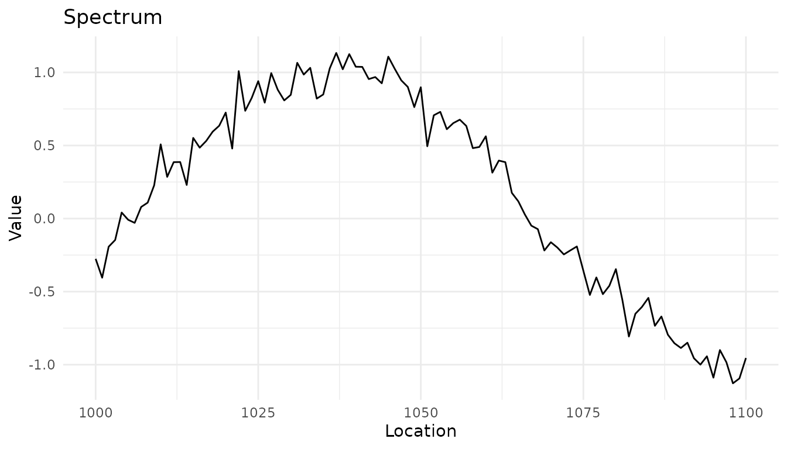
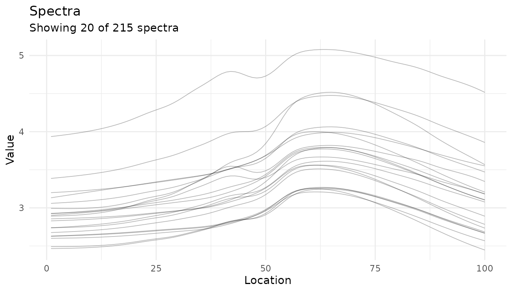
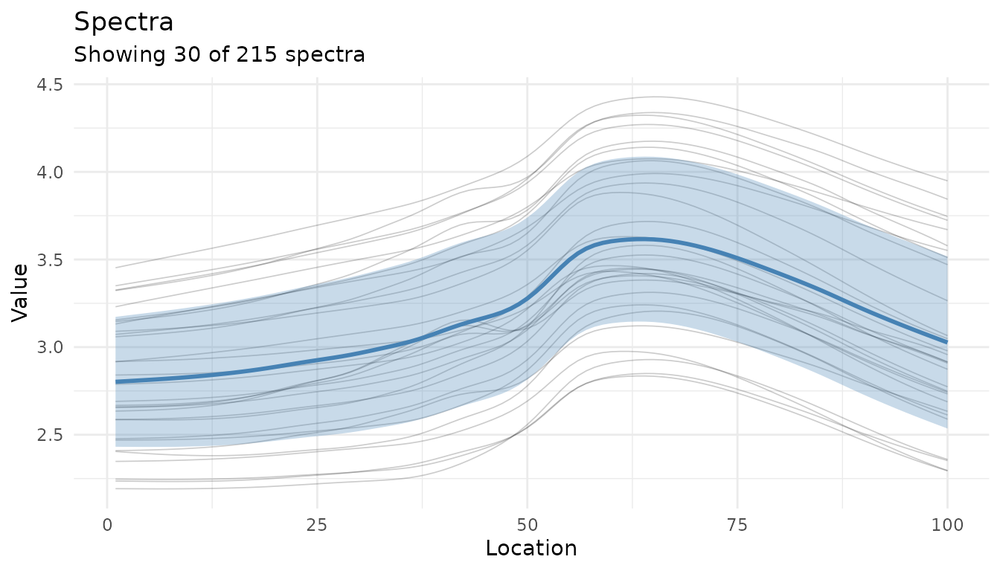
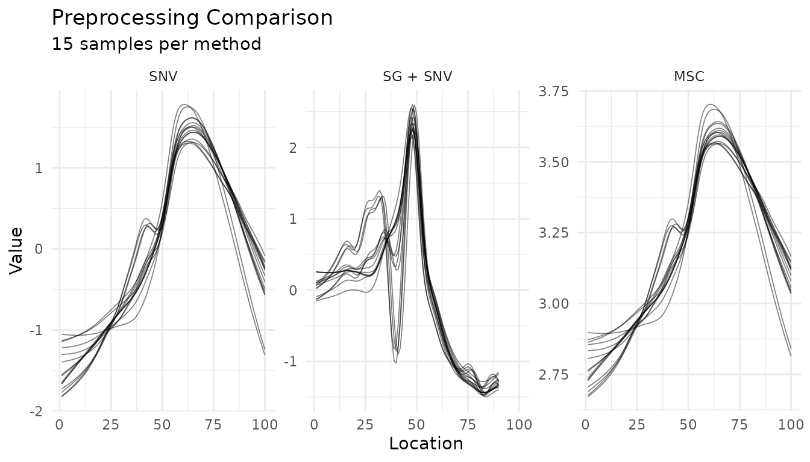
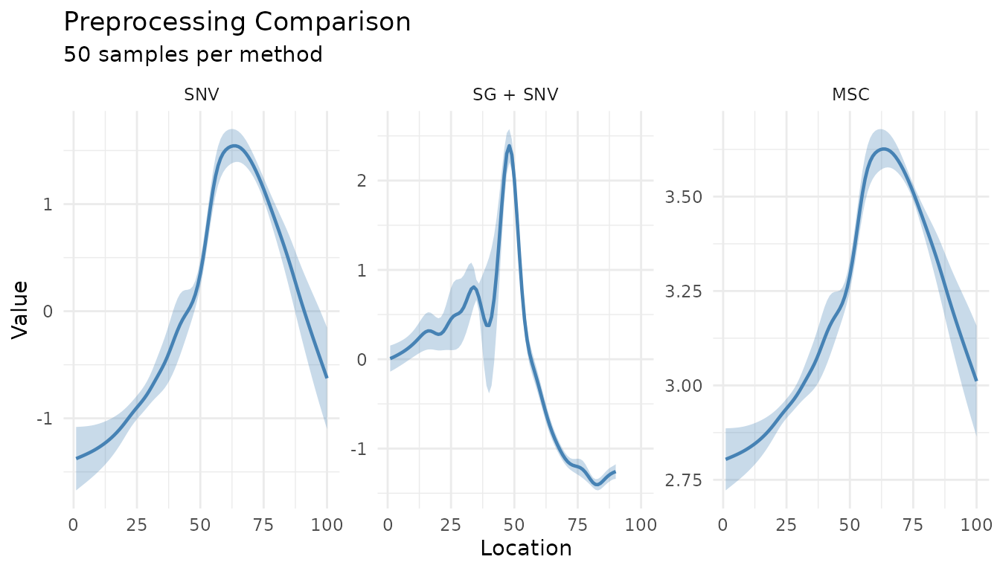

# Data Organization and Diagnostic Plots

``` r
library(measure)
library(recipes)
library(dplyr)
library(ggplot2)
```

## Introduction

When working with analytical data, proper organization and visualization
are essential for building effective preprocessing pipelines. The
measure package provides tools to:

1.  **Detect column types** automatically based on naming conventions
2.  **Assign roles** to columns for use in recipes
3.  **Validate recipes** before running them
4.  **Visualize spectra** and preprocessing effects

This vignette covers these data organization and diagnostic
capabilities.

## Detecting Column Types

Analytical data often follows naming conventions that indicate what each
column represents. The
[`measure_identify_columns()`](https://jameshwade.github.io/measure/dev/reference/measure_identify_columns.md)
function automatically detects these patterns:

| Prefix  | Type           | Description              |
|---------|----------------|--------------------------|
| `wn_*`  | wavenumber     | IR spectroscopy (cm⁻¹)   |
| `nm_*`  | wavelength     | UV-Vis, NIR spectroscopy |
| `rt_*`  | retention_time | Chromatography           |
| `mz_*`  | mz             | Mass spectrometry        |
| `ppm_*` | ppm            | NMR chemical shift       |
| `ch_*`  | channel        | Generic channel data     |
| `x_*`   | generic        | Generic measurements     |

### Example: Identifying columns in wide-format data

``` r
# Create example wide-format spectral data
spec_data <- data.frame(
 sample_id = paste0("S", 1:5),
  concentration = c(10.2, 25.1, 50.3, 75.0, 100.5),
  batch = c("A", "A", "B", "B", "B"),
  wn_1000 = rnorm(5),
  wn_1001 = rnorm(5),
  wn_1002 = rnorm(5),
  wn_1003 = rnorm(5),
  wn_1004 = rnorm(5)
)

# Identify column types
col_info <- measure_identify_columns(spec_data)
col_info
#> # A tibble: 8 × 5
#>   column        type       suggested_role n_values class    
#>   <chr>         <chr>      <chr>             <int> <chr>    
#> 1 sample_id     other      id                    5 character
#> 2 concentration other      outcome               5 numeric  
#> 3 batch         other      predictor             5 character
#> 4 wn_1000       wavenumber predictor             5 numeric  
#> 5 wn_1001       wavenumber predictor             5 numeric  
#> 6 wn_1002       wavenumber predictor             5 numeric  
#> 7 wn_1003       wavenumber predictor             5 numeric  
#> 8 wn_1004       wavenumber predictor             5 numeric
```

The function returns a tibble with: - **column**: Column name -
**type**: Detected type (or “other” if no pattern matched) -
**suggested_role**: Recommended recipe role - **n_values**: Count of
non-NA values - **class**: R class of the column

### Summarizing by type

For a quick overview, use
[`measure_column_summary()`](https://jameshwade.github.io/measure/dev/reference/measure_column_summary.md):

``` r
measure_column_summary(spec_data)
#> # A tibble: 2 × 3
#>   type       n_columns example_cols                   
#>   <chr>          <int> <chr>                          
#> 1 wavenumber         5 wn_1000, wn_1001, wn_1002      
#> 2 other              3 sample_id, concentration, batch
```

## Assigning Roles in Recipes

Recipes use roles to determine how columns should be treated. Common
roles include:

| Role        | Purpose                                    |
|-------------|--------------------------------------------|
| `predictor` | Used as model input                        |
| `outcome`   | Target variable for modeling               |
| `id`        | Sample identifier (excluded from modeling) |
| `blank`     | Blank/background samples                   |
| `qc`        | Quality control samples                    |
| `standard`  | Calibration standards                      |
| `metadata`  | Sample metadata (excluded from modeling)   |

### Using set_measure_roles()

The
[`set_measure_roles()`](https://jameshwade.github.io/measure/dev/reference/set_measure_roles.md)
function provides a convenient way to assign multiple roles at once:

``` r
rec <- recipe(concentration ~ ., data = spec_data) |>
  set_measure_roles(
    id_cols = sample_id,
    metadata_cols = batch
  )

# Check the assigned roles
rec$var_info
#> # A tibble: 8 × 4
#>   variable      type      role      source  
#>   <chr>         <list>    <chr>     <chr>   
#> 1 sample_id     <chr [3]> id        original
#> 2 batch         <chr [3]> metadata  original
#> 3 wn_1000       <chr [2]> predictor original
#> 4 wn_1001       <chr [2]> predictor original
#> 5 wn_1002       <chr [2]> predictor original
#> 6 wn_1003       <chr [2]> predictor original
#> 7 wn_1004       <chr [2]> predictor original
#> 8 concentration <chr [2]> outcome   original
```

This is equivalent to calling
[`update_role()`](https://recipes.tidymodels.org/reference/roles.html)
multiple times, but more concise for common analytical data patterns.

### Custom roles for analytical workflows

For analytical chemistry workflows, you might want to identify special
sample types:

``` r
# Example with QC and blank samples
analytical_data <- data.frame(
  sample_id = c("blank_1", "QC_1", "S1", "S2", "QC_2", "S3"),
  sample_type = c("blank", "qc", "sample", "sample", "qc", "sample"),
  concentration = c(NA, 50, 10, 25, 50, 75),
  wn_1000 = rnorm(6),
  wn_1001 = rnorm(6)
)

rec <- recipe(concentration ~ ., data = analytical_data) |>
  set_measure_roles(
    id_cols = sample_id,
    blank_cols = starts_with("blank"),
    qc_cols = starts_with("QC")
  )
```

## Validating Recipe Structure

Before running a preprocessing pipeline,
[`check_measure_recipe()`](https://jameshwade.github.io/measure/dev/reference/check_measure_recipe.md)
validates the recipe structure and identifies potential issues:

``` r
# A well-structured recipe
data(meats_long)

good_rec <- recipe(water + fat + protein ~ ., data = meats_long) |>
  update_role(id, new_role = "id") |>
  step_measure_input_long(transmittance, location = vars(channel)) |>
  step_measure_snv() |>
  step_measure_output_wide()

issues <- check_measure_recipe(good_rec)
issues
#> # A tibble: 0 × 3
#> # ℹ 3 variables: level <chr>, check <chr>, message <chr>
```

### Detecting common issues

The function checks for:

**Errors** (will cause failures): - No input step - Multiple input
steps - Output step before input step

**Warnings** (may cause issues): - No output step - Processing steps
after output step

**Info** (suggestions): - No ID column - Large number of predictors

``` r
# A recipe with issues
bad_rec <- recipe(water ~ ., data = meats_long) |>
  step_measure_snv()  # Missing input step!

issues <- check_measure_recipe(bad_rec)
issues
#> # A tibble: 3 × 3
#>   level   check     message                                                     
#>   <chr>   <chr>     <chr>                                                       
#> 1 error   no_input  Recipe has no input step. Add step_measure_input_wide() or …
#> 2 warning no_output Recipe has no output step. Data will remain in internal .me…
#> 3 info    no_id     No ID column identified. Consider using update_role(col, ne…
```

### Interactive mode

Use `strict = FALSE` for interactive feedback:

``` r
check_measure_recipe(bad_rec, strict = FALSE)
# ✖ Recipe has no input step. Add step_measure_input_wide() or step_measure_input_long().
```

## Visualizing Spectra

The measure package provides
[`autoplot()`](https://ggplot2.tidyverse.org/reference/autoplot.html)
methods for quick visualization of spectral data.

### Plotting a single spectrum

``` r
# Create a single spectrum
spec <- new_measure_tbl(
  location = seq(1000, 1100, by = 1),
  value = sin(seq(1000, 1100, by = 1) / 20) + rnorm(101, sd = 0.1)
)

autoplot(spec)
```



### Plotting multiple spectra

``` r
# Process some data to get a measure_list
rec <- recipe(water + fat + protein ~ ., data = meats_long) |>
  update_role(id, new_role = "id") |>
  step_measure_input_long(transmittance, location = vars(channel)) |>
  prep(retain = TRUE)

baked <- bake(rec, new_data = NULL)

# Plot the spectra
autoplot(baked$.measures, max_spectra = 20)
```



### Adding summary statistics

Use `summary = TRUE` to overlay mean ± standard deviation:

``` r
autoplot(baked$.measures, summary = TRUE, max_spectra = 30, alpha = 0.2)
```



## Visualizing Preprocessing Effects

### Before/after comparison

The
[`autoplot()`](https://ggplot2.tidyverse.org/reference/autoplot.html)
method for recipes shows preprocessing effects:

``` r
# Create a preprocessing recipe
rec <- recipe(water + fat + protein ~ ., data = meats_long) |>
  update_role(id, new_role = "id") |>
  step_measure_input_long(transmittance, location = vars(channel)) |>
  step_measure_savitzky_golay(window_side = 5, differentiation_order = 1) |>
  step_measure_snv() |>
  prep(retain = TRUE)

autoplot(rec, n_samples = 10)
#> Warning: Could not extract 'before' data for comparison.
#> ℹ Showing processed data only.
#> ✖ ℹ In argument: `dplyr::all_of(rename_map)`. Caused by error in
#>   `dplyr::all_of()`: ! Can't subset elements that don't exist. ✖ Elements
#>   `transmittance` and `channel` don't exist.
```


### Summary statistics view

``` r
autoplot(rec, which = "summary", n_samples = 50)
```


## Comparing Preprocessing Strategies

Use
[`plot_measure_comparison()`](https://jameshwade.github.io/measure/dev/reference/plot_measure_comparison.md)
to compare different preprocessing approaches side-by-side:

``` r
# Define different preprocessing strategies
base_rec <- recipe(water + fat + protein ~ ., data = meats_long) |>
  update_role(id, new_role = "id") |>
  step_measure_input_long(transmittance, location = vars(channel))

# Strategy 1: Just SNV
snv_rec <- base_rec |>
  step_measure_snv() |>
  prep(retain = TRUE)

# Strategy 2: Savitzky-Golay + SNV
sg_snv_rec <- base_rec |>
  step_measure_savitzky_golay(window_side = 5, differentiation_order = 1) |>
  step_measure_snv() |>
  prep(retain = TRUE)

# Strategy 3: MSC
msc_rec <- base_rec |>
  step_measure_msc() |>
  prep(retain = TRUE)

# Compare all three
plot_measure_comparison(
  "SNV" = snv_rec,
  "SG + SNV" = sg_snv_rec,
  "MSC" = msc_rec,
  n_samples = 15
)
```



### Summary comparison

For a cleaner comparison, use `summary_only = TRUE`:

``` r
plot_measure_comparison(
  "SNV" = snv_rec,
  "SG + SNV" = sg_snv_rec,
  "MSC" = msc_rec,
  n_samples = 50,
  summary_only = TRUE
)
```



## Summary Plot for Processed Data

The
[`measure_plot_summary()`](https://jameshwade.github.io/measure/dev/reference/measure_plot_summary.md)
function creates publication-ready summary plots:

``` r
baked <- bake(sg_snv_rec, new_data = NULL)
measure_plot_summary(baked)
```


Show the full range with `show_range = TRUE`:

``` r
measure_plot_summary(baked, show_range = TRUE)
```


## Best Practices

1.  **Always check your recipe** with
    [`check_measure_recipe()`](https://jameshwade.github.io/measure/dev/reference/check_measure_recipe.md)
    before running long preprocessing pipelines

2.  **Use
    [`measure_identify_columns()`](https://jameshwade.github.io/measure/dev/reference/measure_identify_columns.md)**
    to understand your data structure before building recipes

3.  **Assign roles explicitly** for ID columns, metadata, and special
    sample types

4.  **Visualize at each stage** - use
    [`autoplot()`](https://ggplot2.tidyverse.org/reference/autoplot.html)
    to verify preprocessing effects

5.  **Compare strategies** with
    [`plot_measure_comparison()`](https://jameshwade.github.io/measure/dev/reference/plot_measure_comparison.md)
    before committing to a preprocessing approach

## Next Steps

- See
  [`vignette("preprocessing")`](https://jameshwade.github.io/measure/dev/articles/preprocessing.md)
  for details on all preprocessing steps
- See
  [`vignette("recipes")`](https://jameshwade.github.io/measure/dev/articles/recipes.md)
  for integration with tidymodels workflows
- Explore hyperparameter tuning for preprocessing steps with `tune`
