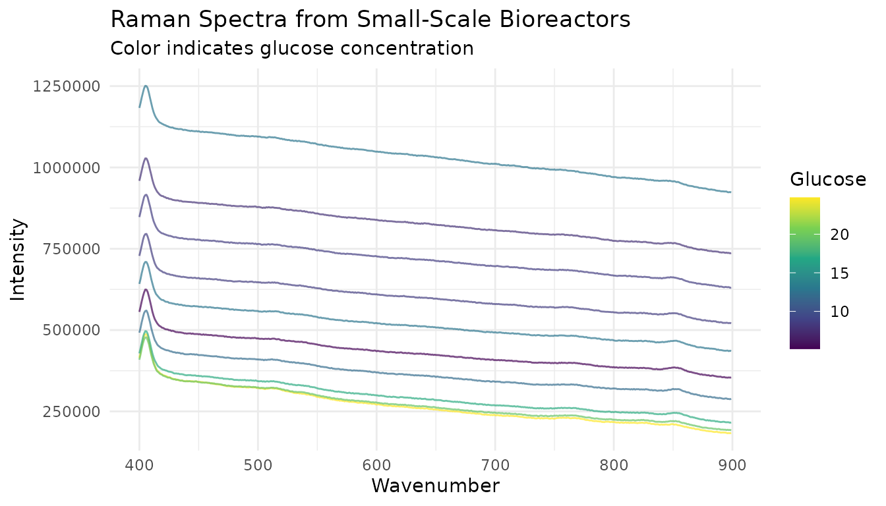
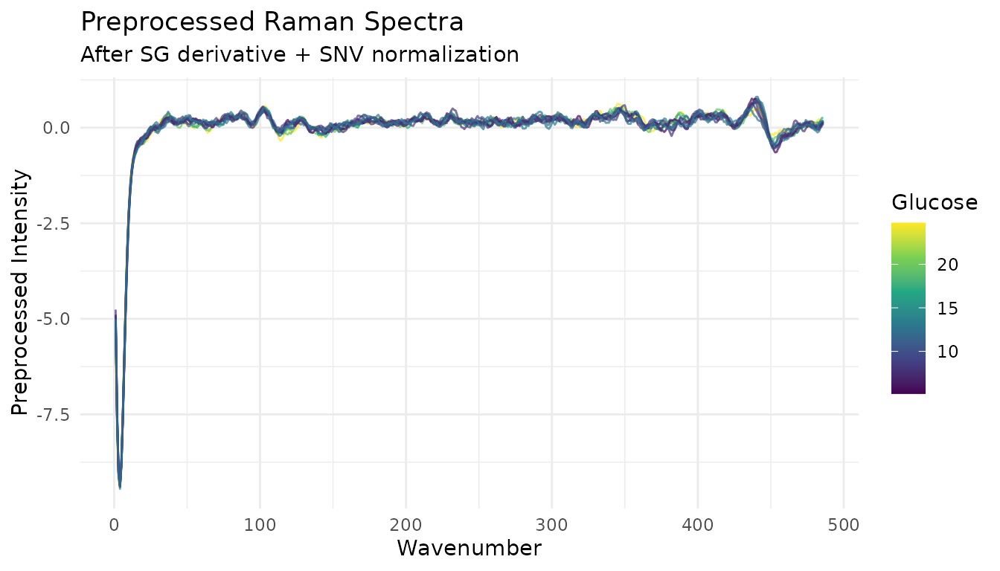
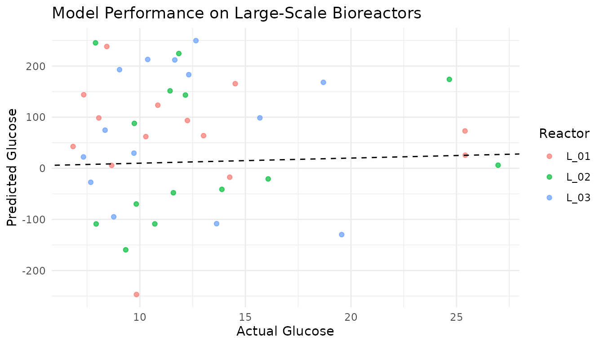

# Tutorial: Bioreactor Glucose Prediction

``` r
library(measure)
library(recipes)
library(dplyr)
library(tidyr)
library(ggplot2)
```

## Introduction

This vignette demonstrates a complete chemometric modeling workflow
using measure. We’ll predict glucose concentration in bioreactors using
Raman spectroscopy data.

## The dataset

The `glucose_bioreactors` dataset contains Raman spectra from bioreactor
experiments described in Kuhn and Johnson’s *Feature Engineering and
Selection* (2020).

``` r
data(glucose_bioreactors)

# Small-scale bioreactors (15 reactors, 14 days)
dim(bioreactors_small)
#> [1]  210 2655

# Large-scale bioreactors (3 reactors, 14 days)
dim(bioreactors_large)
#> [1]   42 2655
```

Each dataset has: - 2,651 spectral channels (Raman wavenumbers) -
`glucose`: the target variable to predict - `day`: sampling day (1-14) -
`batch_id` and `batch_sample`: reactor identifiers

## Exploratory visualization

Let’s visualize some spectra from the small-scale reactors:

``` r
# Get spectral column names (numeric wavenumbers)
spec_cols <- names(bioreactors_small)[sapply(names(bioreactors_small), function(x) !is.na(suppressWarnings(as.numeric(x))))]

# Convert a few samples to long format for plotting
viz_data <- bioreactors_small |>
  slice(1:10) |>
  mutate(sample_id = row_number()) |>
  select(sample_id, glucose, all_of(spec_cols[1:500])) |>  # First 500 channels
  pivot_longer(
    cols = -c(sample_id, glucose),
    names_to = "wavenumber",
    values_to = "intensity"
  ) |>
  mutate(wavenumber = as.numeric(wavenumber))

ggplot(viz_data, aes(x = wavenumber, y = intensity, group = sample_id, color = glucose)) +
  geom_line(alpha = 0.7) +
  scale_color_viridis_c() +
  labs(
    x = "Wavenumber",
    y = "Intensity",
    title = "Raman Spectra from Small-Scale Bioreactors",
    subtitle = "Color indicates glucose concentration",
    color = "Glucose"
  ) +
  theme_minimal()
```



## Building a preprocessing recipe

For Raman spectroscopy, a typical preprocessing pipeline includes:

1.  Smoothing to reduce noise
2.  Baseline correction (via derivatives)
3.  Normalization for instrument variations

``` r
# Use first 500 spectral columns for faster example
spec_cols_subset <- spec_cols[1:500]
wavenumbers <- as.numeric(spec_cols_subset)

# Prepare training data
train_data <- bioreactors_small |>
  select(glucose, day, batch_id, all_of(spec_cols_subset))

# Create preprocessing recipe
rec <- recipe(glucose ~ ., data = train_data) |>
  # Don't use day and batch_id as predictors
  update_role(day, batch_id, new_role = "id") |>
  # Convert wide spectral columns to internal format
  step_measure_input_wide(
    all_of(spec_cols_subset),
    location_values = wavenumbers
  ) |>
  # Savitzky-Golay smoothing + first derivative
  step_measure_savitzky_golay(
    window_side = 7,
    differentiation_order = 1
  ) |>
  # Standard Normal Variate normalization
  step_measure_snv() |>
  # Convert back to wide format
  step_measure_output_wide(prefix = "raman_")

rec
#> 
#> ── Recipe ──────────────────────────────────────────────────────────────────────
#> 
#> ── Inputs
#> Number of variables by role
#> outcome:     1
#> predictor: 500
#> id:          2
#> 
#> ── Operations
#> • Collate wide analytical measurements: all_of(spec_cols_subset)
#> Savitzky-Golay preprocessing on 
#> SNV transformation on
#> • Restructure analytical measurements to wide format: "<internal data>"
```

## Preparing the data

``` r
# Prep the recipe (learns parameters from training data)
rec_prepped <- prep(rec)

# Bake to get preprocessed data
train_processed <- bake(rec_prepped, new_data = NULL)

# Check dimensions
dim(train_processed)
#> [1] 210 489
```

The preprocessed data has fewer columns because: - The `day` and
`batch_id` columns are preserved as ID columns - The 500 spectral
columns have been transformed and renamed with prefix `raman_`

## Visualize preprocessed spectra

``` r
# Get preprocessed spectral columns
proc_cols <- names(train_processed)[grepl("^raman_", names(train_processed))]

proc_viz <- train_processed |>
  slice(1:10) |>
  mutate(sample_id = row_number()) |>
  select(sample_id, glucose, all_of(proc_cols)) |>
  pivot_longer(
    cols = starts_with("raman_"),
    names_to = "feature",
    values_to = "value"
  ) |>
  mutate(wavenumber = as.numeric(gsub("raman_", "", feature)))

ggplot(proc_viz, aes(x = wavenumber, y = value, group = sample_id, color = glucose)) +
  geom_line(alpha = 0.7) +
  scale_color_viridis_c() +
  labs(
    x = "Wavenumber",
    y = "Preprocessed Intensity",
    title = "Preprocessed Raman Spectra",
    subtitle = "After SG derivative + SNV normalization",
    color = "Glucose"
  ) +
  theme_minimal()
```



## Fitting a model

Now we can fit a model to predict glucose:

``` r
library(parsnip)

# Simple linear model (PLS would be better for real applications)
lm_spec <- linear_reg() |>
  set_engine("lm")

# Fit model
model <- lm_spec |>
  fit(glucose ~ ., data = train_processed |> select(-day, -batch_id))

# Training performance
train_preds <- predict(model, train_processed) |>
  bind_cols(train_processed |> select(glucose))

train_preds |>
  summarize(
    rmse = sqrt(mean((glucose - .pred)^2)),
    r_squared = cor(glucose, .pred)^2
  )
#> # A tibble: 1 × 2
#>       rmse r_squared
#>      <dbl>     <dbl>
#> 1 8.23e-13         1
```

## Applying to new data

The key advantage of the recipes framework is consistent preprocessing
of new data:

``` r
# Prepare test data from large-scale bioreactors
test_data <- bioreactors_large |>
  select(glucose, day, batch_id, all_of(spec_cols_subset))

# Apply the same preprocessing
test_processed <- bake(rec_prepped, new_data = test_data)

# Predict
test_preds <- predict(model, test_processed) |>
  bind_cols(test_processed |> select(glucose, batch_id, day))
#> Warning in predict.lm(object = object$fit, newdata = new_data, type =
#> "response", : prediction from rank-deficient fit; consider predict(.,
#> rankdeficient="NA")

# Plot predictions vs actual
ggplot(test_preds, aes(x = glucose, y = .pred, color = batch_id)) +
  geom_point(alpha = 0.7) +
  geom_abline(slope = 1, intercept = 0, linetype = "dashed") +
  labs(
    x = "Actual Glucose",
    y = "Predicted Glucose",
    title = "Model Performance on Large-Scale Bioreactors",
    color = "Reactor"
  ) +
  theme_minimal()
```



## Summary

This case study demonstrated:

1.  Loading and exploring spectral data from bioreactors
2.  Building a preprocessing recipe with measure steps
3.  Fitting a model on preprocessed training data
4.  Applying consistent preprocessing to new data

Key takeaways:

- The recipe framework ensures identical preprocessing for training and
  test data
- [`step_measure_input_wide()`](https://jameshwade.github.io/measure/dev/reference/step_measure_input_wide.md)
  handles the conversion of many spectral columns
- Processing steps like Savitzky-Golay and SNV remove unwanted variation
- [`step_measure_output_wide()`](https://jameshwade.github.io/measure/dev/reference/step_measure_output_wide.md)
  produces modeling-ready data

For real applications, consider:

- Using PLS or ridge regression for high-dimensional spectral data
- Tuning preprocessing parameters with cross-validation
- Validating on truly independent test sets

## See Also

- [Getting
  Started](https://jameshwade.github.io/measure/dev/articles/tutorial-getting-started.md) -
  Fundamentals of measure
- [Integrating with
  tidymodels](https://jameshwade.github.io/measure/dev/articles/howto-tidymodels.md) -
  Advanced modeling workflows with tuning
- [Preprocessing
  Reference](https://jameshwade.github.io/measure/dev/articles/reference-preprocessing.md) -
  Complete guide to preprocessing techniques
