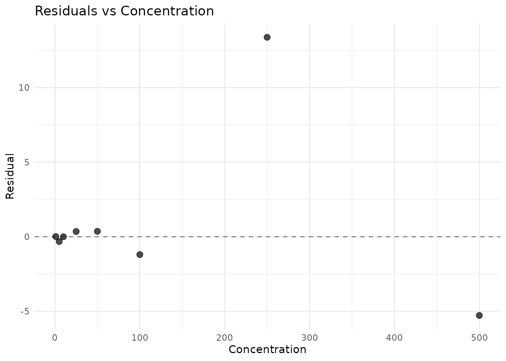
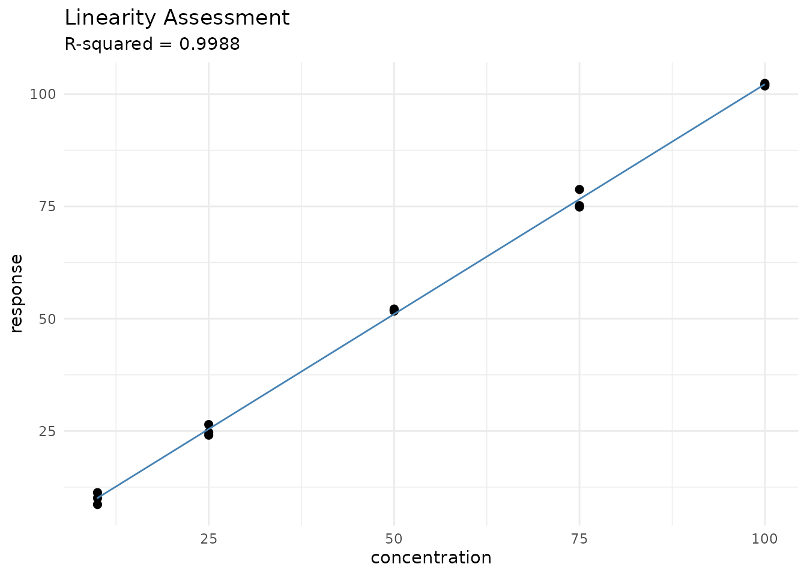
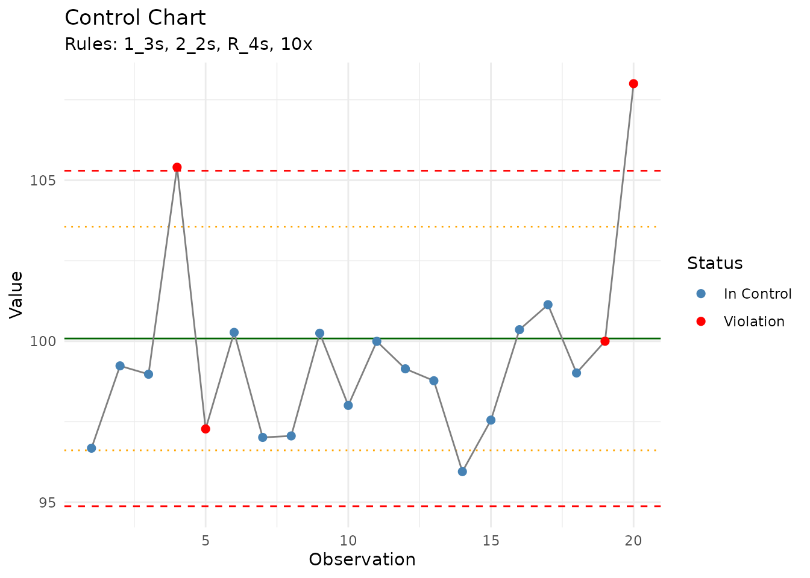
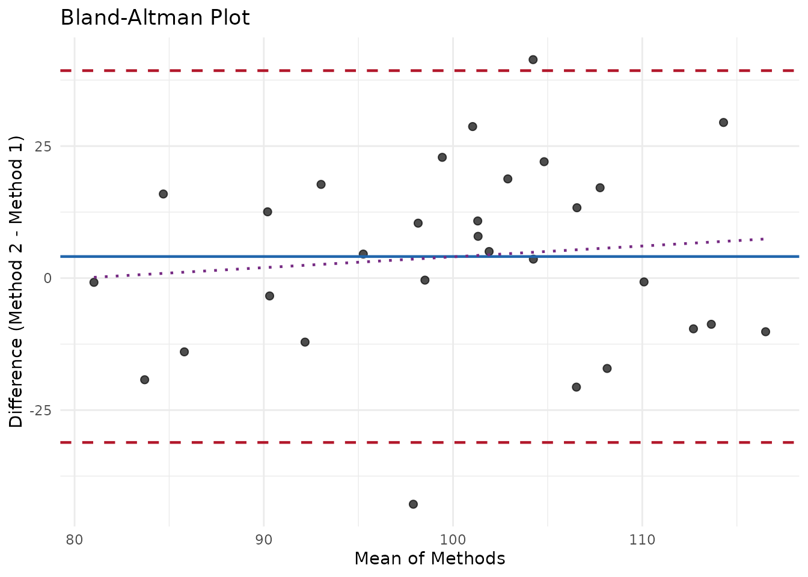
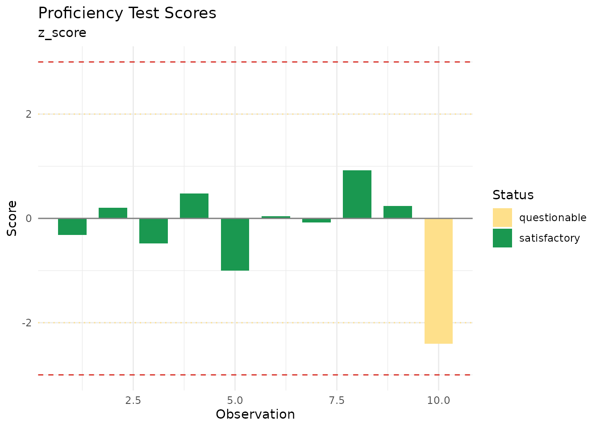
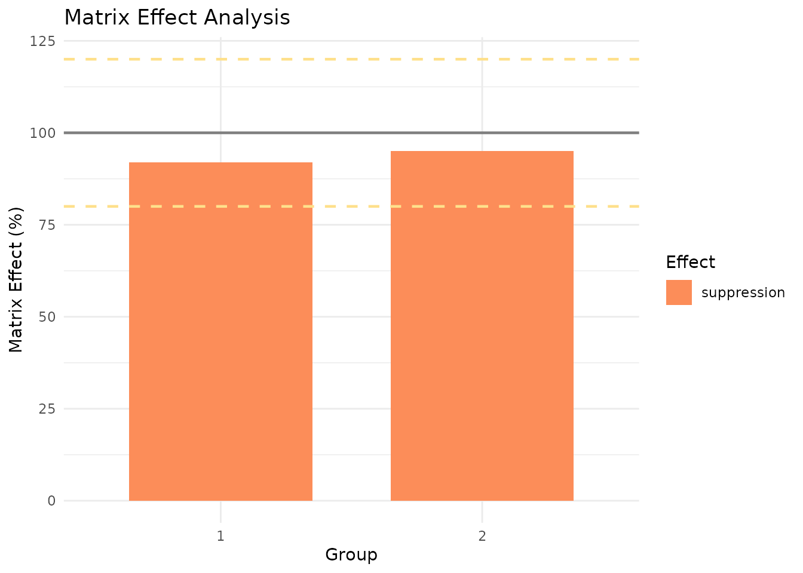

# Analytical Method Validation

``` r
library(measure)
library(dplyr)
library(ggplot2)
```

## Overview

The `measure` package provides a comprehensive suite of functions for
analytical method validation. These functions are designed to be
compatible with regulatory frameworks including: - **ICH Q2(R2)**:
Validation of Analytical Procedures - **ISO/IEC 17025**: General
requirements for testing and calibration laboratories - **USP
\<1225\>**: Validation of Compendial Procedures - **ICH M10**:
Bioanalytical Method Validation (for applicable workflows)

This vignette demonstrates key validation workflows including
calibration, precision, accuracy, uncertainty, and quality control.

## Calibration Curves

### Fitting Calibration Curves

The
[`measure_calibration_fit()`](https://jameshwade.github.io/measure/dev/reference/measure_calibration_fit.md)
function fits weighted or unweighted calibration curves with
comprehensive diagnostics.

``` r
# Create calibration data
set.seed(42)
cal_data <- data.frame(
  nominal_conc = c(1, 5, 10, 25, 50, 100, 250, 500),
  response = c(1, 5, 10, 25, 50, 100, 250, 500) * 1.05 +
             rnorm(8, sd = c(0.1, 0.3, 0.5, 1, 2, 4, 10, 20))
)

# Fit with 1/x^2 weighting (common for bioanalytical methods)
cal <- measure_calibration_fit(
  cal_data,
  response ~ nominal_conc,
  weights = "1/x2"
)

print(cal)
#> <measure_calibration>
#>   Model: linear
#>   Weighting: 1/x2
#>   Formula: response ~ nominal_conc
#>   N points: 8
#>   R²: 0.9989
```

### Visualizing the Calibration

``` r
autoplot(cal, type = "curve")
```


### Checking Residuals

``` r
autoplot(cal, type = "residuals")
```



### Predicting Unknown Concentrations

``` r
unknowns <- data.frame(
  sample_id = c("Sample_1", "Sample_2", "Sample_3"),
  response = c(52.3, 125.8, 280.5)
)

predictions <- measure_calibration_predict(
  cal,
  newdata = unknowns,
  interval = "confidence"
)

cbind(unknowns, predictions)
#>   sample_id response .pred_conc .pred_lower .pred_upper
#> 1  Sample_1     52.3    49.3896    49.30708    49.47213
#> 2  Sample_2    125.8   118.9571   118.87457   119.03962
#> 3  Sample_3    280.5   265.3801   265.29758   265.46263
```

### Calibration Verification

Verify that the calibration remains valid using QC samples:

``` r
qc_data <- data.frame(
  sample_id = c("QC_Low", "QC_Mid", "QC_High"),
  nominal_conc = c(3, 75, 400),
  response = c(3.1, 77.5, 395.2)
)

verification <- measure_calibration_verify(cal, qc_data)
print(verification)
#> 
#> ── Calibration Verification ────────────────────────────────────────────────────
#> ✔ Overall: PASS (3/3 samples within 15%)
#> 
#> ── Sample Results ──
#> 
#> # A tibble: 3 × 8
#>   sample_id nominal_conc response predicted_conc accuracy_pct deviation_pct
#>   <chr>            <dbl>    <dbl>          <dbl>        <dbl>         <dbl>
#> 1 QC_Low               3      3.1           2.82         94.1         -5.93
#> 2 QC_Mid              75     77.5          73.2          97.7         -2.34
#> 3 QC_High            400    395.          374.           93.5         -6.51
#> # ℹ 2 more variables: acceptance_limit <dbl>, pass <lgl>
```

## Limits of Detection and Quantitation

### Multiple Methods

`measure` supports multiple approaches for calculating LOD/LOQ:

``` r
# Blank-based approach (3σ/10σ)
blank_data <- data.frame(
  sample_type = rep("blank", 10),
  response = rnorm(10, mean = 0.5, sd = 0.08)
)

lod_result <- measure_lod(
  blank_data,
  "response",
  method = "blank_sd",
  calibration = cal
)
print(lod_result)
#> <measure_lod>
#>   Value: 0.8726
#>   Method: blank_sd
#>   k: 3
#>   Uncertainty: 0.1142
#>   Parameters:
#>     blank_mean: 0.5115
#>     blank_sd: 0.1203
#>     n_blanks: 10

# Or calculate both together
lod_loq <- measure_lod_loq(
  blank_data,
  "response",
  method = "blank_sd",
  calibration = cal
)
tidy(lod_loq)
#> # A tibble: 2 × 5
#>   limit_type value method       k uncertainty
#>   <chr>      <dbl> <chr>    <dbl>       <dbl>
#> 1 LOD        0.873 blank_sd     3       0.114
#> 2 LOQ        1.72  blank_sd    10       0.381
```

## Precision Studies

### Repeatability (Within-Run Precision)

``` r
# Data from replicate measurements
repeat_data <- data.frame(
  sample_id = rep(c("Low", "Mid", "High"), each = 6),
  concentration = c(
    rnorm(6, 10, 0.5),
    rnorm(6, 100, 4),
    rnorm(6, 500, 18)
  )
)

repeatability <- measure_repeatability(
  repeat_data,
  "concentration",
  group_col = "sample_id"
)
print(repeatability)
#> measure_precision: repeatability 
#> ──────────────────────────────────────────────────────────────────────────────── 
#> 
#> Group: Low 
#>   n = 6 
#>   Mean = 9.82 
#>   SD = 0.7645 
#>   CV = 7.8 %
#>   95% CI: [9.017, 10.62]
#> 
#> Group: Mid 
#>   n = 6 
#>   Mean = 99.51 
#>   SD = 4.893 
#>   CV = 4.9 %
#>   95% CI: [94.37, 104.6]
#> 
#> Group: High 
#>   n = 6 
#>   Mean = 501.1 
#>   SD = 18.58 
#>   CV = 3.7 %
#>   95% CI: [481.6, 520.6]
```

### Intermediate Precision

``` r
# Data from multiple days
ip_data <- data.frame(
  day = rep(1:3, each = 6),
  analyst = rep(c("A", "A", "A", "B", "B", "B"), 3),
  concentration = 100 +
    rep(c(-2, 0, 2), each = 6) +  # Day effect
    rep(c(-1, 1), 9) +            # Analyst effect
    rnorm(18, sd = 3)             # Residual
)

ip_result <- measure_intermediate_precision(
  ip_data,
  "concentration",
  factors = c("day", "analyst")
)
print(ip_result)
#> measure_precision: intermediate 
#> ──────────────────────────────────────────────────────────────────────────────── 
#> 
#> Variance Components:
#>   day: 15.78 (57%)
#>   analyst: 3.82 (14%)
#>   Residual: 8.135 (29%)
#> 
#> CV by component:
#>   day: 4%
#>   analyst: 2%
#>   Residual: 2.9%
```

### Gage R&R Analysis

For measurement system analysis:

``` r
# Gage R&R data
grr_data <- data.frame(
  part = rep(1:5, each = 6),
  operator = rep(rep(c("Op1", "Op2"), each = 3), 5),
  measurement = c(
    # Part 1
    10.1, 10.2, 10.0, 10.3, 10.1, 10.2,
    # Part 2
    20.2, 20.1, 20.3, 20.0, 20.2, 20.1,
    # Part 3
    15.1, 15.0, 15.2, 15.3, 15.1, 15.0,
    # Part 4
    25.0, 25.1, 24.9, 25.2, 25.0, 25.1,
    # Part 5
    30.1, 30.2, 30.0, 30.1, 30.0, 30.2
  )
)

grr_result <- measure_gage_rr(
  grr_data,
  "measurement",
  part_col = "part",
  operator_col = "operator"
)
print(grr_result)
#> measure_gage_rr: Measurement System Analysis
#> ──────────────────────────────────────────────────────────────────────────────── 
#> 
#> Study design:
#>   Parts: 5 
#>   Operators: 2 
#>   Replicates: 3 
#> 
#> Variance Components:
#>   Repeatability: 0.01133 (0.02% contribution)
#>   Reproducibility: 0 (0% contribution)
#>   Total R&R: 0.01133 (0.02% contribution)
#>   Part-to-Part: 62.08 (100% contribution)
#> 
#> % Study Variation:
#>   Repeatability: 1%
#>   Reproducibility: 0%
#>   Total R&R: 1%
#>   Part-to-Part: 100%
#> 
#> Number of Distinct Categories (ndc): 104 
#> 
#> Assessment:
#>   Measurement system is ACCEPTABLE (%R&R < 10%)
```

## Accuracy Assessment

### Bias and Recovery

``` r
accuracy_data <- data.frame(
  level = rep(c("Low", "Mid", "High"), each = 5),
  measured = c(
    rnorm(5, 10.2, 0.3),   # Low level, slight positive bias
    rnorm(5, 100, 2.5),    # Mid level, no bias
    rnorm(5, 498, 8)       # High level, slight negative bias
  ),
  reference = rep(c(10, 100, 500), each = 5)
)

accuracy <- measure_accuracy(
  accuracy_data,
  "measured",
  "reference",
  group_col = "level"
)
print(accuracy)
#> measure_accuracy
#> ──────────────────────────────────────────────────────────────────────────────── 
#> 
#> Group: Low 
#>   n = 5 
#>   Mean measured = 10.09 
#>   Mean reference = 10 
#>   Bias = 0.08854 ( 0.89 %)
#>   Recovery = 101 %
#>   Recovery 95% CI: [95%, 106%]
#> 
#> Group: Mid 
#>   n = 5 
#>   Mean measured = 101 
#>   Mean reference = 100 
#>   Bias = 1.042 ( 1 %)
#>   Recovery = 101 %
#>   Recovery 95% CI: [99%, 103%]
#> 
#> Group: High 
#>   n = 5 
#>   Mean measured = 502.6 
#>   Mean reference = 500 
#>   Bias = 2.593 ( 0.52 %)
#>   Recovery = 101 %
#>   Recovery 95% CI: [99%, 102%]
```

### Linearity Assessment

``` r
linearity_data <- data.frame(
  concentration = rep(c(10, 25, 50, 75, 100), each = 3),
  response = rep(c(10, 25, 50, 75, 100), each = 3) * 1.02 +
             rnorm(15, sd = 1.5)
)

linearity <- measure_linearity(
  linearity_data,
  "concentration",
  "response"
)
print(linearity)
#> measure_linearity
#> ──────────────────────────────────────────────────────────────────────────────── 
#> 
#> Data:
#>   n = 15 ( 5 levels )
#>   Range: 10 - 100 
#> 
#> Regression:
#>   Slope = 1.023 
#>     95% CI: [1.003, 1.044]
#>   Intercept = -0.1535 
#>     95% CI: [-1.436, 1.129]
#> 
#> Fit Quality:
#>   R-squared = 0.99884 
#>   Adj. R-squared = 0.99875 
#>   Residual SD = 1.222 
#>   Residual CV = 2.3 %
#> 
#> Lack-of-Fit Test:
#>   F = 0.649 
#>   p-value = 0.6015 
#>   Result: Not significant (linearity acceptable)

# Plot with fit line
autoplot(linearity, type = "fit")
```



## Uncertainty Budgets

### ISO GUM Uncertainty

Create uncertainty budgets following the GUM (Guide to the Expression of
Uncertainty in Measurement):

``` r
# Define uncertainty components
components <- list(
  uncertainty_component(
    name = "Repeatability",
    type = "A",
    value = 0.5,
    df = 9
  ),
  uncertainty_component(
    name = "Calibration",
    type = "B",
    value = 0.3,
    distribution = "normal"
  ),
  uncertainty_component(
    name = "Reference Standard",
    type = "B",
    value = 0.1,
    distribution = "rectangular"
  ),
  uncertainty_component(
    name = "Temperature",
    type = "B",
    value = 0.2,
    sensitivity = 0.5  # Sensitivity coefficient
  )
)

budget <- measure_uncertainty_budget(.list = components)
print(budget)
#> <measure_uncertainty_budget>
#>   Components: 4 (1 Type A, 3 Type B)
#>   Combined u: 0.6
#>   Effective df: 19
#>   Coverage k: 2
#>   Expanded U: 1.2
```

### Visualizing Uncertainty Contributions

``` r
autoplot(budget)
```


## Control Charts

### Setting Up Control Limits

``` r
# Historical QC data
qc_history <- data.frame(
  run_order = 1:30,
  qc_value = rnorm(30, mean = 100, sd = 2)
)

limits <- measure_control_limits(qc_history, "qc_value")
print(limits)
#> measure_control_limits: shewhart chart
#> ──────────────────────────────────────────────────────────────────────────────── 
#> 
#>   n = 30 
#>   Center = 100.1 
#>   Sigma = 1.737 
#>   UCL (+3s) = 105.3 
#>   UWL (+2s) = 103.6 
#>   LWL (-2s) = 96.61 
#>   LCL (-3s) = 94.88
```

### Monitoring with Westgard Rules

``` r
# New run data including potential out-of-control point
new_run <- data.frame(
  run_order = 1:20,
  qc_value = c(rnorm(19, 100, 2), 108)  # Last point is high
)

chart <- measure_control_chart(
  new_run,
  "qc_value",
  "run_order",
  limits = limits,
  rules = c("1_3s", "2_2s", "R_4s", "10x")
)
print(chart)
#> measure_control_chart
#> ──────────────────────────────────────────────────────────────────────────────── 
#> 
#> Observations: 20 
#> Rules applied: 1_3s, 2_2s, R_4s, 10x 
#> Violations detected: 4 
#> 
#> Status: OUT OF CONTROL
#> 
#> Violation summary:
#> # A tibble: 4 × 3
#>   run_order qc_value violation
#>       <int>    <dbl> <chr>    
#> 1         4    105.  1:3s R:4s
#> 2         5     97.3 R:4s     
#> 3        19    100.  R:4s     
#> 4        20    108   1:3s R:4s
```

``` r
autoplot(chart)
```



## Acceptance Criteria

### Defining Criteria

``` r
# Create custom criteria
my_criteria <- measure_criteria(
  criterion("cv", "<=", 15, description = "Precision CV"),
  criterion("bias_pct", "between", c(-10, 10), description = "Bias"),
  criterion("recovery", "between", c(85, 115), description = "Recovery %")
)
print(my_criteria)
#> <measure_criteria> with 3 criteria
#>   • Precision CV
#>   • Bias
#>   • Recovery %
```

### Using Preset Criteria

``` r
# ICH Q2 presets
ich_criteria <- criteria_ich_q2()
print(ich_criteria)
#> <measure_criteria> with 4 criteria
#>   • Repeatability RSD <= 2%
#>   • Intermediate precision RSD <= 5%
#>   • Recovery 98-102%
#>   • R² >= 0.999

# Bioanalytical presets
bio_criteria <- criteria_bioanalytical()
print(bio_criteria)
#> <measure_criteria> with 5 criteria
#>   • QC CV <= 15%
#>   • Calibration CV <= 20%
#>   • R² >= 0.99
#>   • Recovery 80-120%
#>   • Bias within +/-15%
```

### Assessing Results

``` r
# Sample results to assess (single summary values per criterion)
# For example, from a method validation summary
results <- list(
  cv = 5.2,          # Overall precision CV
  bias_pct = 1.3,    # Overall bias
  recovery = 101.3   # Mean recovery
)

assessment <- measure_assess(results, my_criteria)
print(assessment)
#> <measure_assessment> [PASS]
#>   3 passed, 0 failed
#> 
#>   ✓ cv: 5.2 (<= 15)
#>   ✓ bias_pct: 1.3 (between [-10, 10])
#>   ✓ recovery: 101.3 (between [85, 115])

# Check if all criteria passed
all_pass(assessment)
#> [1] TRUE
```

## Method Comparison

When validating a new method, you often need to compare it against a
reference or existing method. The `measure` package provides several
approaches for method comparison studies.

### Bland-Altman Analysis

Bland-Altman plots show the agreement between two methods by plotting
differences against means:

``` r
# Paired measurements from two methods
comparison_data <- data.frame(
  sample_id = 1:30,
  method_A = rnorm(30, mean = 100, sd = 15),
  method_B = rnorm(30, mean = 102, sd = 16)
)

ba <- measure_bland_altman(
  comparison_data,
  method1_col = "method_A",
  method2_col = "method_B",
  regression = "linear"  # Test for proportional bias
)
print(ba)
#> measure_bland_altman
#> ──────────────────────────────────────────────────────────────────────────────── 
#> 
#> Bias Statistics:
#>   n = 30 
#>   Mean bias = 4.083 
#>   SD of differences = 17.97 
#>   95% CI for bias: [-2.625, 10.79]
#> 
#> Limits of Agreement:
#>   Lower LOA = -31.13 (95% CI: [ -42.75 ,  -19.51 ])
#>   Upper LOA = 39.3 (95% CI: [ 27.68 ,  50.92 ])
#>   LOA Width = 70.43 
#> 
#> Proportional Bias Test:
#>   Slope = 0.2046 
#>   p-value = 0.57 
#>   Result: No significant proportional bias
```

``` r
autoplot(ba)
#> `geom_smooth()` using formula = 'y ~ x'
```



### Regression Methods

For method comparison regression, use Deming or Passing-Bablok
regression which account for error in both methods:

``` r
# Method comparison with known measurement error
deming_data <- data.frame(
  reference = c(5, 10, 25, 50, 100, 200, 400),
  test_method = c(5.2, 10.3, 25.8, 51.2, 101.5, 203.1, 408.2)
)

deming <- measure_deming_regression(
  deming_data,
  method1_col = "reference",
  method2_col = "test_method",
  bootstrap = TRUE,
  bootstrap_n = 500
)
#> Using default error ratio of 1. Provide `error_ratio` or SDs for more accurate
#> results.
print(deming)
#> measure_deming_regression
#> ──────────────────────────────────────────────────────────────────────────────── 
#> 
#> Coefficients:
#> # A tibble: 2 × 4
#>   term      estimate ci_lower ci_upper
#>   <chr>        <dbl>    <dbl>    <dbl>
#> 1 intercept -0.00414   -0.325    0.437
#> 2 slope      1.02       1.01     1.02 
#> 
#> Statistics:
#>   n = 7 
#>   Error ratio = 1 
#>   RMSE = 0.4087 
#>   R² = 1 
#> 
#> (Fitted using mcr package)

# Check if methods are equivalent
glance(deming)
#> # A tibble: 1 × 6
#>   intercept slope intercept_ci_includes_0 slope_ci_includes_1 r_squared  rmse
#>       <dbl> <dbl> <lgl>                   <lgl>                   <dbl> <dbl>
#> 1  -0.00414  1.02 TRUE                    FALSE                   1.000 0.409
```

For Passing-Bablok regression (non-parametric), install the `mcr`
package:

``` r
# Requires: install.packages("mcr")
pb <- measure_passing_bablok(
  deming_data,
  method1_col = "reference",
  method2_col = "test_method"
)
print(pb)
```

### Proficiency Testing

Evaluate laboratory performance in proficiency testing programs:

``` r
# PT results from multiple labs
pt_data <- data.frame(
  lab_id = paste0("Lab_", 1:10),
  measured = c(99.2, 100.5, 98.8, 101.2, 97.5, 100.1, 99.8, 102.3, 100.6, 94.0),
  assigned = rep(100, 10),
  uncertainty = c(1.5, 2.0, 1.8, 1.6, 2.2, 1.9, 1.7, 2.1, 1.5, 2.0)
)

# z-scores with known sigma
z_scores <- measure_proficiency_score(
  pt_data,
  measured_col = "measured",
  reference_col = "assigned",
  score_type = "z_score",
  sigma = 2.5
)
print(z_scores)
#> measure_proficiency_score
#> ──────────────────────────────────────────────────────────────────────────────── 
#> 
#> Score Type: z_score 
#> Sigma: 2.5 
#> 
#> Results (n = 10 ):
#>   Satisfactory (|z| ≤ 2): 9 ( 90 %)
#>   Questionable (2 < |z| ≤ 3): 1 
#>   Unsatisfactory (|z| > 3): 0 
#> 
#> Score Statistics:
#>   Mean score: -0.24 
#>   SD score: 0.925 
#>   Max |score|: 2.4
```

``` r
autoplot(z_scores)
```



## Matrix Effects

Matrix effects (ion suppression/enhancement) must be evaluated in
LC-MS/MS and similar methods.

### Evaluating Matrix Effects

``` r
# Post-extraction spike experiment
me_data <- data.frame(
  sample_type = rep(c("matrix", "neat"), each = 6),
  matrix_lot = rep(c("Lot1", "Lot2", "Lot3"), 4),
  concentration = rep(c("low", "high"), each = 3, times = 2),
  response = c(
    # Matrix samples (some suppression)
    9200, 9500, 8900, 47500, 48200, 46800,
    # Neat samples
    10000, 10000, 10000, 50000, 50000, 50000
  )
)

me <- measure_matrix_effect(
  me_data,
  response_col = "response",
  sample_type_col = "sample_type",
  matrix_level = "matrix",
  neat_level = "neat",
  concentration_col = "concentration"
)
print(me)
#> measure_matrix_effect
#> ──────────────────────────────────────────────────────────────────────────────── 
#> 
#> Overall Matrix Effect Summary:
#>   Groups evaluated: 2 
#>   Mean ME: 94 %
#>   SD ME: 2 %
#>   CV ME: 2 %
#>   Range: 92 - 95 %
#> 
#> Effect Classification:
#>   Ion suppression (ME < 100%): 2 
#>   Ion enhancement (ME > 100%): 0 
#>   Acceptable (80-120%): 2 / 2
```

``` r
autoplot(me, type = "bar")
```



### Standard Addition Correction

When matrix effects vary between samples, standard addition provides
sample-specific correction:

``` r
library(recipes)

# Standard addition data
sa_data <- data.frame(
  sample_id = rep(c("Sample1", "Sample2"), each = 4),
  addition = rep(c(0, 10, 20, 30), 2),
  response = c(
    150, 250, 350, 450,  # Sample 1
    250, 350, 450, 550   # Sample 2
  )
)

rec <- recipe(~ ., data = sa_data) |>
  step_measure_standard_addition(
    response,
    addition_col = "addition",
    sample_id_col = "sample_id"
  ) |>
  prep()

# Original concentrations calculated via extrapolation
bake(rec, new_data = NULL)
```

## Sample Preparation QC

Recipe steps for quality control during sample preparation.

### Dilution Factor Correction

Back-calculate concentrations for diluted samples:

``` r
library(recipes)

dilution_data <- data.frame(
  sample_id = paste0("S", 1:5),
  dilution_factor = c(1, 2, 5, 10, 1),
  analyte = c(50, 45, 42, 48, 51)  # Measured after dilution
)

rec <- recipe(~ ., data = dilution_data) |>
  update_role(sample_id, new_role = "id") |>
  step_measure_dilution_correct(
    analyte,
    dilution_col = "dilution_factor",
    operation = "multiply"
  ) |>
  prep()

# Back-calculated original concentrations
bake(rec, new_data = NULL)
#> # A tibble: 5 × 3
#>   sample_id dilution_factor analyte
#>   <chr>               <dbl>   <dbl>
#> 1 S1                      1      50
#> 2 S2                      2      90
#> 3 S3                      5     210
#> 4 S4                     10     480
#> 5 S5                      1      51
```

### Surrogate Recovery

Monitor extraction efficiency with surrogate standards:

``` r
qc_data <- data.frame(
  sample_id = paste0("QC", 1:6),
  surrogate = c(95, 105, 88, 112, 75, 132)  # Expected = 100
)

rec <- recipe(~ ., data = qc_data) |>
  update_role(sample_id, new_role = "id") |>
  step_measure_surrogate_recovery(
    surrogate,
    expected_value = 100,
    action = "flag",
    min_recovery = 80,
    max_recovery = 120
  ) |>
  prep()

# Flag samples outside recovery limits
bake(rec, new_data = NULL)
#> # A tibble: 6 × 3
#>   sample_id surrogate .surrogate_pass
#>   <chr>         <dbl> <lgl>          
#> 1 QC1              95 TRUE           
#> 2 QC2             105 TRUE           
#> 3 QC3              88 TRUE           
#> 4 QC4             112 TRUE           
#> 5 QC5              75 FALSE          
#> 6 QC6             132 FALSE
```

## Drift Correction

### Detecting Drift

``` r
# Data with drift
drift_data <- data.frame(
  sample_type = rep("qc", 20),
  run_order = 1:20,
  feature1 = 100 + (1:20) * 0.8 + rnorm(20, sd = 2),  # Has drift

  feature2 = 100 + rnorm(20, sd = 2)                   # No drift
)

drift_result <- measure_detect_drift(
  drift_data,
  features = c("feature1", "feature2"),
  qc_type = "qc"
)
print(drift_result)
#> # A tibble: 2 × 5
#>   feature    slope slope_pvalue percent_change significant
#>   <chr>      <dbl>        <dbl>          <dbl> <lgl>      
#> 1 feature1  0.630     0.0000148         11.1   TRUE       
#> 2 feature2 -0.0351    0.634             -0.662 FALSE
```

### Correcting Drift

``` r
library(recipes)

# Using QC-LOESS correction in a recipe
rec <- recipe(~ ., data = drift_data) |>
  step_measure_drift_qc_loess(
    feature1, feature2,
    qc_type = "qc"
  ) |>
  prep()

corrected <- bake(rec, new_data = NULL)
```

## Validation Reports

Once you’ve completed your validation studies, you can compile all
results into a reproducible validation report using
[`measure_validation_report()`](https://jameshwade.github.io/measure/dev/reference/measure_validation_report.md).
The package provides templates following regulatory frameworks like ICH
Q2(R2) and USP \<1225\>. \### Creating a Validation Report

``` r
# Gather validation results (using objects from above)
report <- measure_validation_report(
  # Metadata
  title = "HPLC-UV Method Validation Report",
  method_name = "Compound X Assay",
  method_description = "Reversed-phase HPLC with UV detection at 254 nm",
  analyst = "J. Smith",
  reviewer = "A. Jones",
  lab = "Analytical Development",
  instrument = "Agilent 1260 Infinity II",


  # Validation sections (results from earlier in this vignette)
  calibration = cal,
  lod_loq = lod_loq,
  accuracy = accuracy,
  precision = list(repeatability = repeatability, intermediate = ip_result),
  linearity = linearity,
  range = list(lower = 1, upper = 500, units = "ng/mL"),
  uncertainty = budget,

  # Text sections
  specificity = "No interfering peaks observed at the analyte retention time when analyzing blank matrix samples.",
  robustness = list(
    factors = c("Flow rate (±0.1 mL/min)", "Column temperature (±5°C)", "Mobile phase pH (±0.2)"),
    conclusion = "Method showed acceptable robustness within tested parameter ranges."
  ),

  # Conclusions
  conclusions = list(
    summary = "The analytical method meets all acceptance criteria for precision, accuracy, and linearity.",
    recommendations = c(
      "Method is suitable for intended use",
      "Revalidate if significant changes are made to instrumentation or reagents"
    )
  ),

  # References
  references = c(
    "ICH Q2(R2) Validation of Analytical Procedures (2023)",
    "USP <1225> Validation of Compendial Procedures"
  )
)

print(report)
#> 
#> ── Validation Report ───────────────────────────────────────────────────────────
#> Title: HPLC-UV Method Validation Report
#> Method: Compound X Assay
#> Analyst: J. Smith
#> Lab: Analytical Development
#> Date: 2025-12-31
#> 
#> ── Validation Sections ──
#> 
#> ℹ Calibration
#> ℹ LOD/LOQ
#> ℹ Accuracy
#> ℹ Precision
#> ℹ Linearity
#> ℹ Range
#> ℹ Specificity/Selectivity
#> ℹ Robustness
#> ℹ Measurement Uncertainty
#> 
#> ── Conclusions ──
#> 
#> The analytical method meets all acceptance criteria for precision, accuracy,
#> and linearity.
#> 
#> ── Provenance ──
#> 
#> Generated: 2025-12-31 23:17:44.888548
#> R version: 4.5.2
#> measure version: 0.0.1.9001
#> 
#> ℹ Use `render_validation_report()` to generate document
```

### Inspecting Report Sections

``` r
# Check which sections are included
summary(report)
#> 
#> ── Validation Report Summary ───────────────────────────────────────────────────
#> Method: Compound X Assay
#> Date: 2025-12-31
#> 
#> # A tibble: 9 × 4
#>   section                 status n_results notes             
#>   <chr>                   <chr>      <int> <chr>             
#> 1 Calibration             info           8 ""                
#> 2 LOD/LOQ                 info          NA "Method: blank_sd"
#> 3 Accuracy                info           3 ""                
#> 4 Precision               info          NA ""                
#> 5 Linearity               info          NA ""                
#> 6 Range                   info          NA ""                
#> 7 Specificity/Selectivity info          NA ""                
#> 8 Robustness              info          NA ""                
#> 9 Measurement Uncertainty info          NA ""
#> 
#> ✔ All sections meet acceptance criteria

# Access specific sections
has_validation_section(report, "calibration")
#> [1] TRUE
has_validation_section(report, "stability")  # Not included
#> [1] FALSE

# Get section data
get_validation_section(report, "range")
#> $lower
#> [1] 1
#> 
#> $upper
#> [1] 500
#> 
#> $units
#> [1] "ng/mL"
```

### Adding Custom Sections

You can add additional sections after report creation:

``` r
# Add a stability section later
report <- add_validation_section(
  report,
  "stability",
  list(
    description = "Short-term stability at room temperature",
    results = data.frame(
      timepoint = c("0h", "4h", "8h", "24h"),
      recovery_pct = c(100, 99.5, 98.8, 97.2)
    ),
    conclusion = "Sample is stable for 24 hours at room temperature."
  )
)

has_validation_section(report, "stability")
#> [1] TRUE
```

### Tidy Output

Extract all results as a tidy tibble for further analysis:

``` r
tidy(report)
#> # A tibble: 10 × 41
#>    section              term  estimate std_error statistic   p_value group     n
#>    <chr>                <chr>    <dbl>     <dbl>     <dbl>     <dbl> <chr> <int>
#>  1 Calibration          (Int…    0.119    0.0395      3.00  2.39e- 2 NA       NA
#>  2 Calibration          nomi…    1.06     0.0143     73.8   4.16e-10 NA       NA
#>  3 Accuracy             NA      NA       NA          NA    NA        Low       5
#>  4 Accuracy             NA      NA       NA          NA    NA        Mid       5
#>  5 Accuracy             NA      NA       NA          NA    NA        High      5
#>  6 Linearity            NA      NA       NA          NA    NA        NA       15
#>  7 Measurement Uncerta… NA      NA       NA          NA    NA        NA       NA
#>  8 Measurement Uncerta… NA      NA       NA          NA    NA        NA       NA
#>  9 Measurement Uncerta… NA      NA       NA          NA    NA        NA       NA
#> 10 Measurement Uncerta… NA      NA       NA          NA    NA        NA       NA
#> # ℹ 33 more variables: mean_measured <dbl>, mean_reference <dbl>, bias <dbl>,
#> #   bias_pct <dbl>, mean_recovery <dbl>, sd_recovery <dbl>, cv_recovery <dbl>,
#> #   recovery_ci_lower <dbl>, recovery_ci_upper <dbl>, n_levels <int>,
#> #   range_min <dbl>, range_max <dbl>, slope <dbl>, slope_ci_lower <dbl>,
#> #   slope_ci_upper <dbl>, intercept <dbl>, intercept_ci_lower <dbl>,
#> #   intercept_ci_upper <dbl>, r_squared <dbl>, adj_r_squared <dbl>,
#> #   residual_sd <dbl>, residual_cv <dbl>, lof_f <dbl>, lof_p <dbl>, …
```

### Rendering Reports

To render a validation report to HTML or PDF, use
[`render_validation_report()`](https://jameshwade.github.io/measure/dev/reference/render_validation_report.md).
Two templates are provided:

- **ICH Q2(R2)**: Organized by validation characteristics (specificity,
  linearity, range, accuracy, precision, etc.)
- **USP \<1225\>**: Organized by procedure category (I, II, III, IV)

``` r
# Render to HTML using ICH Q2 template (default)
render_validation_report(
  report,
  output_file = "validation_report.html",
  template = "ich_q2"
)

# Render to PDF using USP <1225> template
render_validation_report(
  report,
  output_file = "validation_report.pdf",
  output_format = "pdf",
  template = "usp_1225"
)

# Use a custom Quarto template
render_validation_report(
  report,
  output_file = "custom_report.html",
  template_path = "path/to/custom_template.qmd"
)
```

The rendered report includes:

- **Header**: Method name, date, analyst, reviewer, lab, instrument
- **Table of Contents**: Auto-generated from sections
- **Validation Sections**: Each with formatted tables and plots
- **Provenance**: R version, package versions, timestamp for
  reproducibility

## Summary

The `measure` package provides a complete toolkit for analytical method
validation:

| Category               | Key Functions                                                                                                                                                                                                                                                                                                                                                                                                                                                                                         |
|------------------------|-------------------------------------------------------------------------------------------------------------------------------------------------------------------------------------------------------------------------------------------------------------------------------------------------------------------------------------------------------------------------------------------------------------------------------------------------------------------------------------------------------|
| **Calibration**        | [`measure_calibration_fit()`](https://jameshwade.github.io/measure/dev/reference/measure_calibration_fit.md), [`measure_calibration_predict()`](https://jameshwade.github.io/measure/dev/reference/measure_calibration_predict.md), [`measure_calibration_verify()`](https://jameshwade.github.io/measure/dev/reference/measure_calibration_verify.md)                                                                                                                                                |
| **LOD/LOQ**            | [`measure_lod()`](https://jameshwade.github.io/measure/dev/reference/measure_lod.md), [`measure_loq()`](https://jameshwade.github.io/measure/dev/reference/measure_loq.md), [`measure_lod_loq()`](https://jameshwade.github.io/measure/dev/reference/measure_lod_loq.md)                                                                                                                                                                                                                              |
| **Precision**          | [`measure_repeatability()`](https://jameshwade.github.io/measure/dev/reference/measure_repeatability.md), [`measure_intermediate_precision()`](https://jameshwade.github.io/measure/dev/reference/measure_intermediate_precision.md), [`measure_gage_rr()`](https://jameshwade.github.io/measure/dev/reference/measure_gage_rr.md)                                                                                                                                                                    |
| **Accuracy**           | [`measure_accuracy()`](https://jameshwade.github.io/measure/dev/reference/measure_accuracy.md), [`measure_linearity()`](https://jameshwade.github.io/measure/dev/reference/measure_linearity.md), [`measure_carryover()`](https://jameshwade.github.io/measure/dev/reference/measure_carryover.md)                                                                                                                                                                                                    |
| **Method Comparison**  | [`measure_bland_altman()`](https://jameshwade.github.io/measure/dev/reference/measure_bland_altman.md), [`measure_deming_regression()`](https://jameshwade.github.io/measure/dev/reference/measure_deming_regression.md), [`measure_passing_bablok()`](https://jameshwade.github.io/measure/dev/reference/measure_passing_bablok.md), [`measure_proficiency_score()`](https://jameshwade.github.io/measure/dev/reference/measure_proficiency_score.md)                                                |
| **Matrix Effects**     | [`measure_matrix_effect()`](https://jameshwade.github.io/measure/dev/reference/measure_matrix_effect.md), [`step_measure_standard_addition()`](https://jameshwade.github.io/measure/dev/reference/step_measure_standard_addition.md)                                                                                                                                                                                                                                                                  |
| **Sample Prep QC**     | [`step_measure_dilution_correct()`](https://jameshwade.github.io/measure/dev/reference/step_measure_dilution_correct.md), [`step_measure_surrogate_recovery()`](https://jameshwade.github.io/measure/dev/reference/step_measure_surrogate_recovery.md)                                                                                                                                                                                                                                                |
| **Uncertainty**        | [`measure_uncertainty_budget()`](https://jameshwade.github.io/measure/dev/reference/measure_uncertainty_budget.md), [`measure_uncertainty()`](https://jameshwade.github.io/measure/dev/reference/measure_uncertainty.md)                                                                                                                                                                                                                                                                              |
| **Control Charts**     | [`measure_control_limits()`](https://jameshwade.github.io/measure/dev/reference/measure_control_limits.md), [`measure_control_chart()`](https://jameshwade.github.io/measure/dev/reference/measure_control_chart.md)                                                                                                                                                                                                                                                                                  |
| **Criteria**           | [`measure_criteria()`](https://jameshwade.github.io/measure/dev/reference/measure_criteria.md), [`measure_assess()`](https://jameshwade.github.io/measure/dev/reference/measure_assess.md), [`criteria_ich_q2()`](https://jameshwade.github.io/measure/dev/reference/criteria_presets.md), [`criteria_bland_altman()`](https://jameshwade.github.io/measure/dev/reference/criteria_presets.md), [`criteria_matrix_effects()`](https://jameshwade.github.io/measure/dev/reference/criteria_presets.md) |
| **Drift**              | [`measure_detect_drift()`](https://jameshwade.github.io/measure/dev/reference/measure_detect_drift.md), [`step_measure_drift_qc_loess()`](https://jameshwade.github.io/measure/dev/reference/step_measure_drift_qc_loess.md)                                                                                                                                                                                                                                                                          |
| **Validation Reports** | [`measure_validation_report()`](https://jameshwade.github.io/measure/dev/reference/measure_validation_report.md), [`render_validation_report()`](https://jameshwade.github.io/measure/dev/reference/render_validation_report.md)                                                                                                                                                                                                                                                                      |

All functions follow a consistent design philosophy: - **Tidy outputs**:
Results are tibbles with
[`tidy()`](https://generics.r-lib.org/reference/tidy.html),
[`glance()`](https://generics.r-lib.org/reference/glance.html), and
[`autoplot()`](https://ggplot2.tidyverse.org/reference/autoplot.html)
methods - **Transparent diagnostics**: No hidden decisions; all
parameters and flags are visible - **Regulatory compatibility**:
Designed with ICH, ISO, and FDA guidelines in mind - **Provenance
tracking**: Audit trails for outlier handling and data modifications

For more details on any function, see the package documentation with
`?function_name`.
